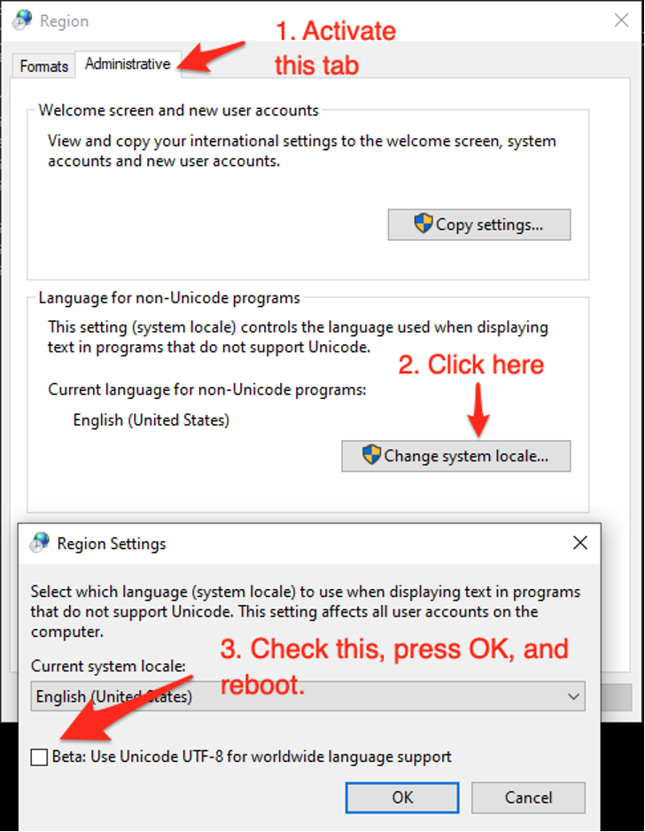

Common Errors
=============

``graphviz``
------------
When using :func:`diagram`, if you run into a ``graphviz`` error similar to:

   .. code:: bash

       FileNotFoundError: [Errno 2] No such file or directory: 'dot'


or

   .. code:: bash

       ExecutableNotFound: failed to execute ['dot', '-Kdot', '-Tpng'], make sure the Graphviz executables are on your systems' PATH


or if you cannot get any diagram at all. It is likely that your ``graphviz`` is not configured correctly.

.. note::
    For the case where you don't have any diagram, the ``biosteam.RAISE_GRAPHVIZ_EXCEPTION`` is set to ``False``, you can see the error by changing that to ``True``.

This `post <https://stackoverflow.com/questions/35064304/runtimeerror-make-sure-the-graphviz-executables-are-on-your-systems-path-aft>`_ provides a lot of useful information, and this normally can be solved by:

    .. code:: bash

       conda install graphviz # if you are using conda


or

    .. code:: bash

       brew install graphviz # if you are using brew


.. note::

    If you have already installed graphviz (both the actual software and the Python interface) but still getting the same error, your probably need to add the path of the graphviz software to your system path. To do that, you need to firstly locate where the graphviz software is, add the graphviz path to your system path (for Windows, the post above has instruction on how to add to your path; for macOS, you add ``export PATH="<REPLACE_WITH_GRAPHVIZ_PATH>:$PATH"`` to your shell profile).


``UnicodeDecodeError``
----------------------
When using non-English operating systems, you may run into errors similar to (cp949 is the case of Korean Windows):

   .. code:: bash

       UnicodeDecodeError: 'cp949' codec can't decode byte Oxe2 in position 3426: multibyte sequence


To fix this, Windows users can go to Control Panel -> Clock, Language, Region -> Change date, time, or number formats, then follow the steps below:




We are not sure if this error will appear for Mac users, but let us know if you run into this and we will be happy to help with troubleshooting!


Tips
====

Upgrade Python
--------------
``QSDsan`` is currently compatible with and tested for Python 3.7 and 3.8. However, with ```BioSTEAM`` moving to Python 3.8 <https://github.com/BioSTEAMDevelopmentGroup/biosteam/issues/56>`_, qsdsan may be only compatible with Python 3.8 and higher in the future. 

If you need to upgrade Python but having a lot of existing packages, creating a virtual environment may be the best way to avoid conflicts. If you are using ``conda``, its has related documentations on `Python upgrading <https://conda.io/projects/conda/en/latest/user-guide/tasks/manage-python.html>`_.