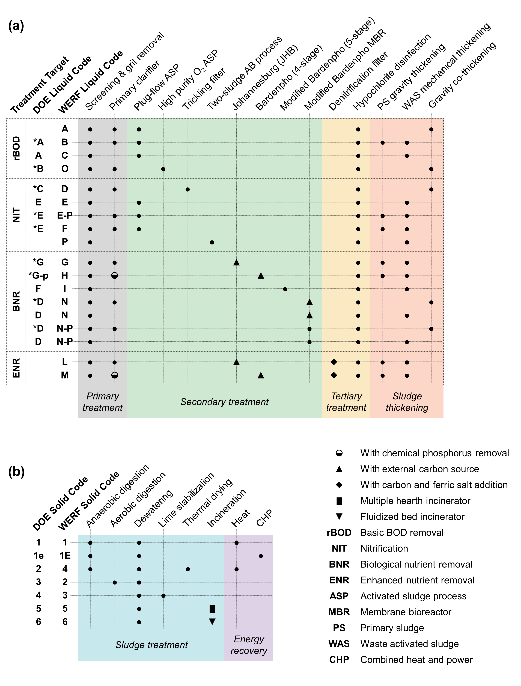

.. _systems:

Systems
=======

This page documents the systems that have been/is being developed using ``QSDsan`` with links to the source codes in GitHub and publications.

Benchmark Simulation Models
---------------------------
The Modelling and Integrated Assessment (MIA) Specialist Group of the International Water Association has established benchmark simulation models (BSMs) to provide a consistent environment for wastewater treatment plant (WWTP)/water resource recovery facility (WRRF) evaluation (see `BSM webpage <http://iwa-mia.org/benchmarking>`_ and `MATLAB implementation and report <https://github.com/wwtmodels/Benchmark-Simulation-Models>`_).

When publishing the paper that introduces QSDsan (`Li and Zhang`_ et al., 2022), we validated the process modeling and dynamic simulation capacities of QSDsan through BSM1 (`bsm1 EXPOsan module <https://github.com/QSD-Group/EXPOsan/tree/main/exposan/bsm1>`_, `bsm1 archived codes <https://pypi.org/project/exposan/1.1.4>`_). Work is currently underway to implement BSM2 in ``QSDsan``.

Water Resource Recovery Facilities
----------------------------------
Work is underway to model the 25 distinct Water Resource Recovery Facility (WRRF) configurations identified as “typical” across North America (`Tarallo <https://doi.org/10.2166/9781780407685>`_ et al., 2015; Zhang et al., *In Prep*, 2024).

Other Systems
-------------
A variety of other sanitation and resource recovery systems have been developed using QSDsan, including:

#. Non-sewered sanitation systems (NSSSs) including:

    * Biogenic Refinery

        - Publication: `Rowles <https://doi.org/10.1021/acsenvironau.2c00022>`_ et al., 2022
        - `biogenic_refinery EXPOsan module <https://github.com/QSD-Group/EXPOsan/tree/main/exposan/biogenic_refinery>`_
        - `biogenic_refinery archived codes <https://github.com/QSD-Group/EXPOsan/releases/tag/archive%2FBR_OmniProcessor>`_

    * Bwaise

        - Publication: `Trimmer <https://pubs.acs.org/doi/10.1021/acs.est.0c03296>`_ et al., 2020; `Li and Zhang`_ et al., 2022
        - `bwaise EXPOsan module <https://github.com/QSD-Group/EXPOsan/tree/main/exposan/bwaise>`_
        - `bwaise Trimmer et al archived codes <https://github.com/QSD-Group/Bwaise-sanitation-alternatives>`_; `bwaise Li and Zhang et al archived codes <https://pypi.org/project/exposan/1.1.4>`_

    * Eco-San: `eco_san EXPOsan module <https://github.com/QSD-Group/EXPOsan/tree/main/exposan/eco_san>`_

    * NEWgenerator (under NDA)

        - Publication: `Watabe <https://doi.org/10.1021/acsenvironau.3c00001>`_ et al., 2023
        - `new_generator EXPOsan module <https://github.com/QSD-Group/EXPOsan-private/tree/main/exposan/new_generator>`_
        - `new_generator archived codes <https://github.com/QSD-Group/EXPOsan-private/tree/newgen/exposan/newgen>`_

    * Reclaimer: `reclaimer EXPOsan module <https://github.com/QSD-Group/EXPOsan/tree/main/exposan/reclaimer>`_

    * SCG Zyclonic (under NDA): `scg_zyclonic EXPOsan module <https://github.com/QSD-Group/EXPOsan-private/tree/main/exposan/scg_zyclonic>`_

#. Conventional activated sludge process

    * Publication: `Shoener <https://pubs.rsc.org/en/content/articlelanding/2016/ee/c5ee03715h>`_ et al., 2016
    * `cas EXPOsan module <https://github.com/QSD-Group/EXPOsan/tree/main/exposan/cas>`_
    * `cas archived codes <https://github.com/QSD-Group/AnMBR>`_

#. Hydrothermal systems for fuel and fertilizer production from wet organic wastes
    
    * Publication: `Feng <https://pubs.acs.org/doi/10.1021/acs.est.3c07394>`_ et al., 2024.
    * `htl EXPOsan module <https://github.com/QSD-Group/EXPOsan/tree/main/exposan/htl>`_

#. Modular encapsulated two-stage anaerobic biological (METAB) system
    
    * Publication: `Zhang <https://doi.org/10.1021/acs.est.4c05389>`_ et al., 2024.
    * `metab EXPOsan module <https://github.com/QSD-Group/EXPOsan/tree/main/exposan/metab>`_

#. EcoRecover system: microalgae-based tertiary P recovery process
    
    * Manuscript: Kim et al., Development and validation of a Phototrophic-Mixotrophic Process Model (PM2) and a process simulator for microalgae-based wastewater treatment, In Prep.
    * `pm2_ecorecover EXPOsan module <https://github.com/QSD-Group/EXPOsan/tree/main/exposan/pm2_ecorecover>`_

**Notes:**
    - "Under NDA" indicates that the system is under non-disclosure agreement with the technology design team and unfortunately we are not able to share the codes in full at this stage. The source link code will lead to a private repository that only individuals who have signed the NDA can access.
    - "Archived codes" are the codes used when the linked literature is published.

.. Links
.. _Li and Zhang: https://doi.org/10.1039/d2ew00455k