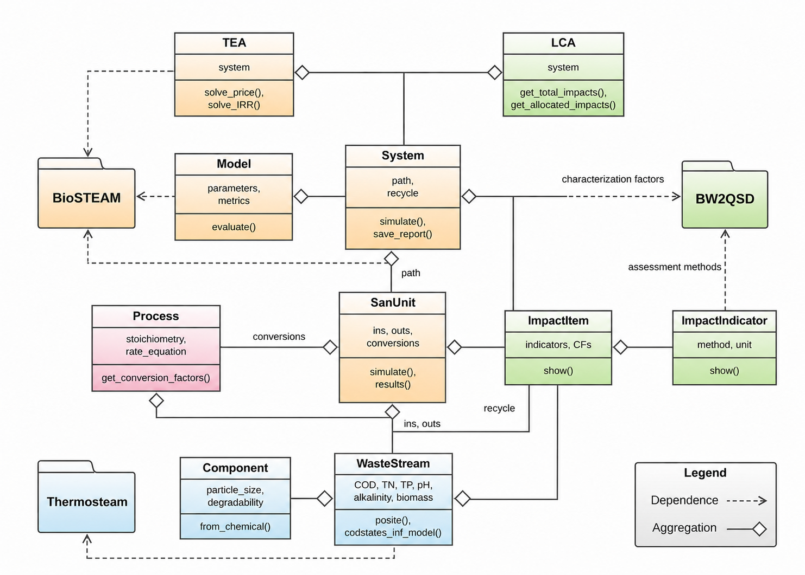

.. _api:

API
===

The UML below shows the structure and core Python classes implemented in ``QSDsan``. Each class is represented by a box containing the class name (bold, top part of the box) with select data (middle part of the box) and method (end with parentheses, bottom part of the box) attributes. The ``Component`` and ``WasteStream`` classes in blue are inherited from the ``Chemical`` and ``Stream`` classes in `Thermosteam <https://github.com/BioSTEAMDevelopmentGroup/thermosteam>`_ with the addition of wastewater-related attributes (note that BioSTEAM also expose these classes as ``bst.Chemical`` and ``bst.Stream``). The `Process` class in red enables dynamic simulation of Component objects’ transformation during kinetic processes (e.g., degradation of substrates). The ``SanUnit``, ``System``, ``TEA``, and ``Model`` classes in yellow are inherited from `BioSTEAM <https://github.com/BioSTEAMDevelopmentGroup/biosteam>`_ with added capacities for dynamic simulation and handling of construction inventories. Green boxes including ``ImpactItem``, ``ImpactIndicator``, and ``LCA`` are implemented in ``QSDsan`` to enable LCA functionalities. 

   Simplified unified modeling language (UML) diagram of ``QSDsan``

See the following sections for detailed documentation of each class and its attributes and methods.

.. toctree::
   :maxdepth: 1

   major_classes/index
   process_models/index
   equipments/index
   unit_operations/index
   statistics
   utility_functions/index
