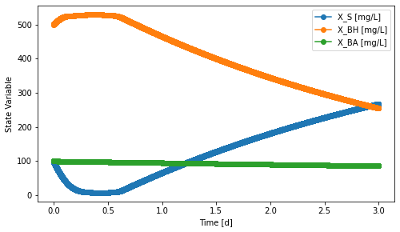

Suspended Growth Bioreactors
============================

CSTR
----
.. autoclass:: qsdsan.sanunits.CSTR
   :members:

BatchExperiment
---------------
.. autoclass:: qsdsan.sanunits.BatchExperiment
   :members:

Example
^^^^^^^
.. code:: python

        import qsdsan.processes as pc, qsdsan.sanunits as su
        from qsdsan import System
        cmps = pc.create_asm1_cmps()
        asm1 = pc.ASM1()
        BE = su.BatchExperiment('E1', model=asm1)
        BE.set_init_conc(S_S=5, X_S=100, X_BH=500, X_BA=100, X_P=100, S_O=8,
                         S_NO=20, S_NH=2, S_ND=1, X_ND=1, S_ALK=7*12)
        sys = System('sys', path=(BE,))
        sys.set_dynamic_tracker(BE)
        sys.simulate(t_span=(0, 3))
        BE.scope.plot_time_series(('X_BH', 'X_BA', 'X_S'))

SBR
---
.. autoclass:: qsdsan.sanunits.SBR
   :members: