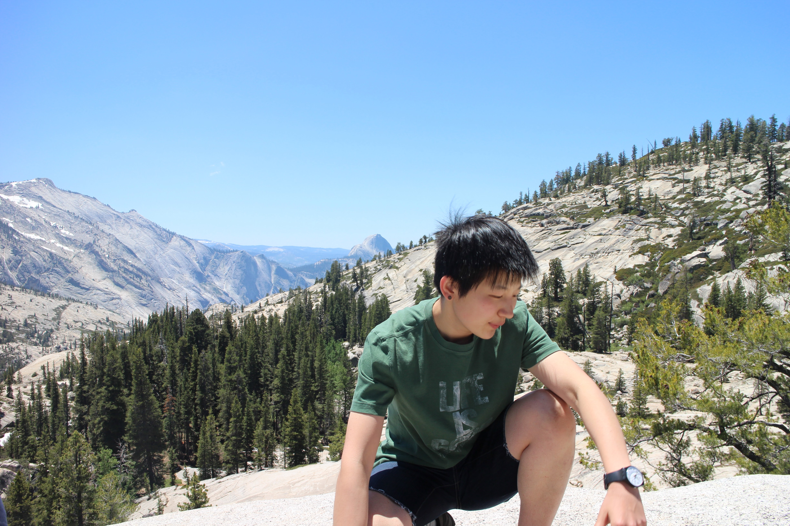

=======================
Yalin Li (creator/lead)
=======================

   
   Oh the mountains and I love them.

**Email:** `work <mailto:yalinli2@illinois.edu>`_; `personal <mailto:mailto.yalin.li@gmail.com>`_

**Webpage:** `professional <http://yalinli2.github.io/webpage/>`_

This page is primarily about my aspirations for ``QSDsan``. For information related to my research/teaching interests and other professional activities, please check out my `webpage <http://yalinli2.github.io/webpage>`_ (and feel free to check out the `source code <http://github.com/yalinli2/webpage>`_ and build your own one).

I'm the creator, lead developer, and current maintainer of ``QSDsan``. I am a research scientist at the `University of Illinois Urbana-Champaign (UIUC) <http://illinois.edu>`_. I am affiliated with the `Institute of Sustainability, Energy, and Environment (iSEE) <https://sustainability.illinois.edu>`_ and the `Center for Advanced Bioenergy and Bioproducts Innovation (CABBI) <https://cabbi.bio>`_.

My background is in experimentation where I investigated multiple thermochemical and catalytic technologies for renewable products from biomass and wastewater (still missing the experiments and my beloved reactors), but I transitioned after graduation as I wanted to look at the big-picture implications through quantitative sustainable design (QSD). Unbeknownst to me, I would go on a fantastic journey as I advance the methodology of QSD and develop tools to for its application in research and education.

Education
---------
- Ph.D., Environmental Engineering, Colorado School of Mines, 2019 (where the mountains are)
- M.S., Environmental Engineering, University of Illinois at Urbana-Champaign, 2015 (where the corns are)
- B.Eng., Environmental Engineering, Tongji University, 2014 (the Magic City)

My hope for QSDsan
------------------
When I finished my Ph.D., all I know about coding was from an entry-level, mandatoroy CS course in the freshman year of my undergraduate and several lines of basic VBA in Excel. I was supposed to design and assess biorefineries with a still-at-the-early-stage `BioSTEAM <https://biosteam.readthedocs.io/en/latest/index.html>`_. The idea of learning a programming language (even it was as beginner-friendly as Python) and using it to build tools was daunting, and I could hardly understand anything in Python's official documentation.

But I struggled through that period (thank you all the good-hearted people on `stackoverflow <https://stackoverflow.com/>`_), and I began to see the power of programming language, how it could be used to design systems and perform sustainability analyses in ways that I had never seen before. I wanted something like ``BioSTEAM``, but closer to my experimental background of water/wastewater treatment and resource recovery, and I am lucky enough to have talented friends/colleagues working with me and incredibly supportive advisors, so that was the start of ``QSDsan``.

At the beginning, ``QSDsan`` was just about research, about how we can leverage QSD to prioritize technology advancement and inform decision-making. But the more I work on ``QSDsan`` and reflect on my experiences and the evolution of research methods and topics (e.g., sustainability analyses were hardly a thing decades ago, but now evidence of advancement on sustainability metrics are required for manuscripts to be considered for top-tier journals), as well as pedagogical approahces (e.g., active learning) and education systems (e.g., MOOC), I see great potential in tools like ``QSDsan`` to be used by people outside of the narrow research circle. It could be used to introduce concepts such as acid-base chemistry, to demonstrate how to design an anaerobic reactor, to illustrate how the deployment location of a technology would affect its sustainability. I am fascinated by these possibilities and I hope I can be a part to make them become reality.

Why I enjoy research
--------------------
I quoted this as a closing remark for my Ph.D. defense, still (and I sincerely hope forever) close and dear to my heart:

   | I look up at the starry, starry sky
   | which is so deep and vast
   | the never-ending truth
   | inspires me to follow and quest

   | -- **Jiabao Wen**
   | *For Centennial Anniversary of Tongji University*

To ruin everything (and show my peculiar taste of humor), this is a traditional dish of Cornwell, England, called stargazy pie (picture from `Wikipedia <https://en.wikipedia.org/wiki/Stargazy_pie>`_):

.. figure:: https://upload.wikimedia.org/wikipedia/commons/thumb/2/23/StargazyPie.jpg/2560px-StargazyPie.jpg
   :width: 50%
   :align: center

| 

What I do for fun
-----------------
- I enjoy every outdoor activities (that do not involving getting >50% of your body wet), but hiking so far is my favorite, I've only done a couple of 14ers during my time in Colorado, but I would put all of them on my bucket list.
- I also like to build things (had quite some fun building the hydrothermal reactors when doing my Ph.D.), probably have spent too much time looking at DIY house videos.
- Coding (not just for research, but for fun as well) is becoming my most liked sedentary activity, learning new programming languages is always frustrating and rewarding.

Professional
------------
If you want to check out my publications, the most up-to-date list is on `Google Scholar <https://scholar.google.com/citations?user=5Zv3mM0AAAAJ&hl=en>`_. For my other repositories, `GitHub <https://github.com/yalinli2>`_ would be the go-to place. You can also check out my complete `CV <https://drive.google.com/file/d/1XxD9vS4LtoyfvWILSEbQZ6toQdKhBdt4/view?usp=sharing>`_ to know about my other professional activities (conference presentations, teaching, service, etc.).