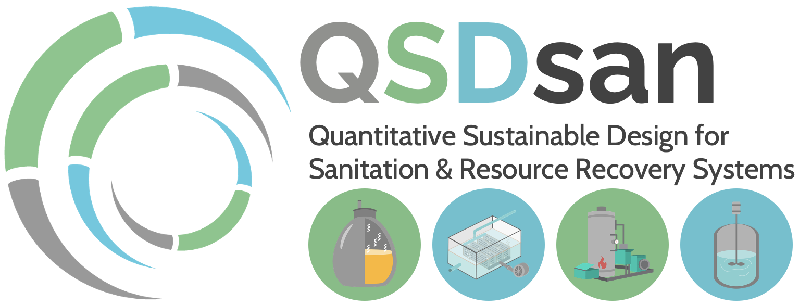

QSDsan: Quantitative Sustainable Design for sanitation and resource recovery systems
====================================================================================

What is ``QSDsan``?
-------------------
``QSDsan`` is an open-source, community-led platform for the quantitative sustainable design (QSD) of sanitation and resource recovery systems. It is one of a series of platforms that are being developed for the execution of QSD - a methodology for the research, design, and deployment of technologies and inform decision-making. [1]_ It leverages the structure and modules developed in the `BioSTEAM <https://github.com/BioSTEAMDevelopmentGroup/biosteam>`_ platform [2]_ with additional functions tailored to sanitation processes.

As an open-source and impact-driven platform, QSDsan aims to identify configuration combinations, systematically probe interdependencies across technologies, and identify key sensitivities to contextual assumptions through the use of quantitative sustainable design methods (techno-economic analysis and life cycle assessment and under uncertainty). 

All systems developed with ``QSDsan`` are included in the package `EXPOsan <https://github.com/QSD-Group/EXPOsan>`_ - exposition of sanitation and resource recovery systems.

To capitalize, or not to capitalize?
^^^^^^^^^^^^^^^^^^^^^^^^^^^^^^^^^^^^
That is a good question. We prefer to use the capitalized version (e.g., ``QSDsan`` instead of ``qsdsan``) because:

- It refers to the platform, not just the core package (i.e., it includes the entire ecosystem that supports the core package).
- We style the name to convey the name's meaning (e.g., the "QSD" part stands for "quantitative sustainable design").

But names of the actual packages are all in lower cases per `PEP-8 <https://www.python.org/dev/peps/pep-0008/#package-and-module-names>`_:

   *Modules should have short, all-lowercase names. Underscores can be used in the module name if it improves readability. Python packages should also have short, all-lowercase names, although the use of underscores is discouraged.*

Installation
------------
You can download the package from `PyPI <https://pypi.org/project/qsdsan/>`_.

If you use pip:

.. code:: bash

    pip install qsdsan

Note that development of this package is currently under initial stage with limited backward compatibility, please feel free to `submit an issue <https://github.com/QSD-Group/QSDsan/issues>`_ for any questions regarding package upgrading.

If you prefer the most recent version on GitHub, please follow the steps in the `Contributing to QSDsan <https://qsdsan.readthedocs.io/en/latest/CONTRIBUTING.html>`_ section of the documentation.

Getting Started
---------------

Follow the tutorial to get started!

.. toctree::
   :maxdepth: 1
   :caption: Tutorial

   tutorials/Component_and_WasteStream
   tutorials/SanUnit_and_System
   tutorials/TEA_and_LCA

How does ``QSDsan`` work?
-------------------------
.. figure:: https://lucid.app/publicSegments/view/c8de361f-7292-47e3-8870-d6f668691728/image.png

   Simplified unified modeling language (UML) diagram of ``QSDsan``

The core package ``QSDsan`` follows the structure of `biosteam <https://github.com/BioSTEAMDevelopmentGroup/biosteam>`_, a rapid and agile package for the design, simulation, and techno-economic analysis of biorefineries under uncertainty, but ``QSDsan`` is enhanced with features geared toward quantitative sustainable design of sanitation systems.

Work is also in progress to develop the package ``DMsan`` and connect ``QSDsan`` to ``DMsan`` for decision-making under different contexts.

The above Unified Modeling Language (UML) diagram of the package shows the relationship between ``QSDsan`` and its dependencies.

In particular, ``QSDsan`` introduces:

- :class:`~.Component`, a subclass of :class:`thermosteam.Chemical`, instance of this class does not necessarily corresponds to a specific chemical, but represents commonly used/modeled component such as biodegradable colloidal substrate.
- :class:`~.SanStream` and :class:`~.WasteStream`. :class:`~.SanStream` is a sublcass of :class:`thermosteam.Stream` that has an additional attribute ``impact_item`` for life cycle assessment. :class:`~.WasteStream` is a subclass of :class:`~.SanStream` with additional composite properties such as chemical oxygen demand (COD) that are widely used in sanitation systems.
- :class:`~.Process`, a new class that describes a certain biological, chemical, or physical process in a unit operation, it is similar in concept with :class:`thermosteam.Reaction`, but has unique features and utilities.

.. toctree::
   :maxdepth: 1
   :caption: API

   Component
   Construction
   Equipment
   ImpactIndicator
   ImpactItem
   LCA
   Process
   Streams
   SanUnit
   SimpleTEA
   Transportation
   equipments/equipments
   processes/processes
   sanunits/sanunits
   stats

About the developers
--------------------
Development and maintenance of the platform is supported by the Quantitative Sustainable Design Group led by members of the `Guest Group <http://engineeringforsustainability.com/>`_ at the `University of Illinois Urbana-Champaign (UIUC) <https://illinois.edu/>`_. Core contributors are listed below, please refer to the `author page <https://qsdsan.readthedocs.io/en/latest/AUTHORS.html>`_ for the full list of authors.

**Lead developers:**
   - `Yalin Li <zoe.yalin.li@gmail.com>`_
   - `Joy Cheung <joycheung1994@gmail.com>`_
   - `Stetson Rowles <lsr@illinois.edu>`_

**Project conception & funding support:**
   - `Jeremy Guest <jsguest@illinois.edu>`_

**Special acknowledgement:**
   - Yoel Cortés-Peña for helping many of the ``QSDsan`` members get started on Python and package development.

Join the community
------------------
We would like to build an open and welcoming community, you can always post issues on our `GitHub homepage <https://github.com/QSD-Group/QSDsan/issues>`_ or contact any of the Quantitative Sustainable Design Group memebers. We are always excited to have new members in our team.

If you would like to contribute, please follow our contribution guide, thank you for making ``QSDsan`` better!

.. toctree::
   :maxdepth: 1
   :caption: Contributions

   AUTHORS
   CODE_OF_CONDUCT
   CONTRIBUTING
   for_developers/Tutorial_Template

``QSDsan`` is and will stay open source under University of Illinois/NCSA Open Source License. Any third-party packages copied from ``QSDsan`` must be strictly open-source (not copy-left nor open-access). Please refer to `LICENSE <https://github.com/QSD-Group/QSDsan/blob/master/LICENSE.txt>`_ and `CONTRIBUTION <https://qsdsan.readthedocs.io/en/latest/CONTRIBUTING.html>`_ for details.

More resources
--------------
.. toctree::
   :maxdepth: 1
   :caption: FAQ

   FAQ.rst

Additionally, to get the full value of ``QSDsan``, we highly recommend reading through the documents of these packages:

- `biosteam docs <https://biosteam.readthedocs.io/en/latest/index.html>`_
- `thermosteam docs <https://thermosteam.readthedocs.io/en/latest/index.html>`_
- `chemicals docs <https://chemicals.readthedocs.io/en/latest/>`_ (the thermodynamic property package for thermosteam)

.. toctree::
   :maxdepth: 1
   :caption: What's new

   CHANGELOG

References
----------
.. [1] Li, Y.; Hand, S.; Trimmer, J. T.; Byrne, D. M.; Chambers, K. G.; Lohman, H. A. C.; Shi, R.; Zhang, X.; Cook, S. M.; Guest, J. S. Quantitative Sustainable Design (QSD): A Methodology for the Prioritization of Research, Development, and Deployment of Technologies. In Prep. 2021.

.. [2] Cortés-Peña, Y.; Kumar, D.; Singh, V.; Guest, J. S. BioSTEAM: A Fast and Flexible Platform for the Design, Simulation, and Techno-Economic Analysis of Biorefineries under Uncertainty. ACS Sustainable Chem. Eng. 2020, 8 (8), 3302–3310. https://doi.org/10.1021/acssuschemeng.9b07040.

Indices and tables
==================

* :ref:`genindex`
* :ref:`modindex`
* :ref:`search`
