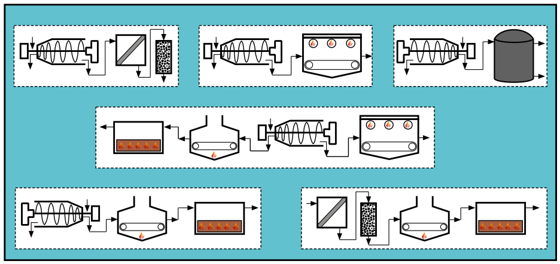
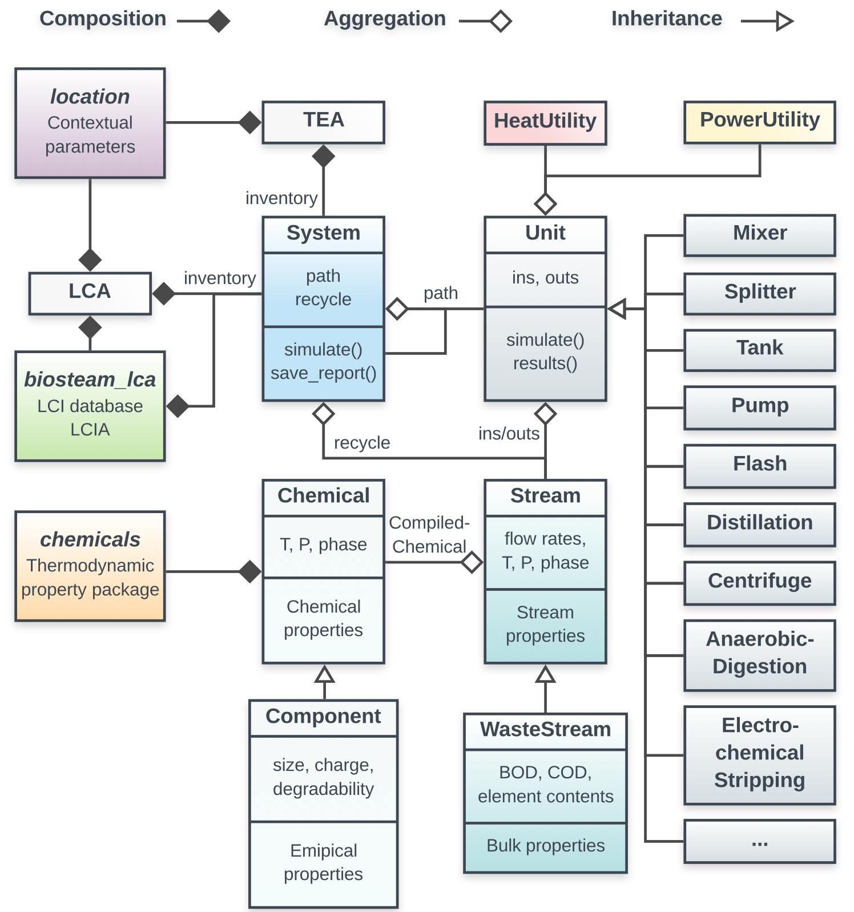

QSDsan: Quantitative Sustainable Design for sanitation and resource recovery systems
====================================================================================

   
   Collage of sanitation units inclucded in QSDsan

What is QSDsan?
----------------------------

**QSDsan** is a package for the quantitative sustainable design of sanitation and resource recovery systems leveraging the structure and modules developed in BioSTEAM [1]_. As an open-source and impact-driven platform, QSDsan aims to identify configuration combinations, systematically probe interdependencies across technologies, and identify key sensitivities to contextual assumptions through the use of quantitative sustainable design methods (techno-economic analysis and life cycle assessment and under uncertainty). 

All systems developed with QSDsan will be included in another repository in the future.

Getting Started
---------------
First install the package at `PyPI <https://pypi.org/>`_. If you use pip, simply ``pip install qsdsan``.

Follow the tutorial to get started!

.. toctree::
   :maxdepth: 1
   :caption: Tutorial

   tutorial/make_a_simple_System
   tutorial/define_Component_and_WasteStream
   tutorial/create_a_new_SanUnit
   tutorial/TEA_and_LCA

How does QSDsan work?
---------------------
.. https://lucid.app/publicSegments/view/ac755b6d-1bd6-464c-8e47-9e21e762d888/image.png # needs updating

QSDsan follows the structure of `BioSTEAM <https://github.com/BioSTEAMDevelopmentGroup/biosteam>`_, a fast and flexible package for the design, simulation, and techno-economic analysis of biorefineries under uncertainty, but QSDsan is enhanced with features geared toward quantitative sustainable design of sanitation systems.

The above Unified Modeling Language (UML) diagram of the package shows the relationship between QSDsan and its dependencies `biosteam <https://github.com/BioSTEAMDevelopmentGroup/biosteam>`_, `thermosteam <https://github.com/BioSTEAMDevelopmentGroup/thermosteam>`_, and `chemicals <https://github.com/CalebBell/chemicals>`_.

In particular, QSDsan introduces:
 - ``Component``, a subclass of ``Chemical`` in thermosteam, instance of this class does not necessarily corresponds to a specific chemical, but represents commonly used/modeled component such as biodegradable colloidal substrate.

 - ``WasteStream``, a sublcass of ``Stream`` in thermosteam, instance of this class has additional composite properties such as chemical oxygen demand (COD) that are widely used in sanitation systems.

 - ``Process``, a new class that describes a certain biological, chemical, or physical process in a unit operation, it has some similarities with the ``reaction`` class in thermosteam, but has unique features and utilities.

.. toctree::
   :maxdepth: 2
   :caption: API

   Component
   Components
   Construction
   ImpactIndicator
   ImpactItem
   LCA
   SanUnit
   sanunits/sanunits
   SimpleTEA
   Transportation
   WasteStream
.. Process # TO BE ADDED

More resources
--------------
To get the full value of QSDsan, we highly recommend reading through the documents of these packages:
 - `biosteam docs <https://biosteam.readthedocs.io/en/latest/index.html>`_
 - `thermosteam docs <https://thermosteam.readthedocs.io/en/latest/index.html>`_
 - `chemicals docs <https://chemicals.readthedocs.io/en/latest/>`_

About the developers
--------------------
Development and maintenance of the package is supported by the Quantitative Sustainable Design Group led by members of the `Guest Group <http://engineeringforsustainability.com/>`_ at the `University of Illinois Urbana-Champaign (UIUC) <https://illinois.edu/>`_.

**Code development**
 - `Yalin Li <zoe.yalin.li@gmail.com>`_
 - Joy Cheung

**Unit design**
 - `Yalin Li <zoe.yalin.li@gmail.com>`_
 - Joy Cheung
 - Stetson Rowles

**Project conception & funding support**
 - `Jeremy Guest <jsguest@illinois.edu>`_

Join the community
------------------
We would like to build an open and welcoming community, you can always post issues on our GitHub homepage or contact any of the Quantitative Sustainable Design Group memebers. If you would like to contribute, please follow our contribution guide:

.. toctree::
   :maxdepth: 1
   :caption: How to contribute?

   for_developers/contributing
   for_developers/code_of_conduct
   for_developers/tutorial_template

   
QSDsan is and will stay open source under University of Illinois/NCSA Open Source License, please refer to the `LICENSE <https://github.com/QSD-Group/QSDsan/blob/master/LICENSE.txt>`_ for details.

References
----------
.. [1] Cortes-Peña, Y.; Kumar, D.; Singh, V.; Guest, J. S. BioSTEAM: A Fast and Flexible Platform for the Design, Simulation, and Techno-Economic Analysis of Biorefineries under Uncertainty. ACS Sustainable Chem. Eng. 2020. https://doi.org/10.1021/acssuschemeng.9b07040.

Indices and tables
==================

* :ref:`genindex`
* :ref:`modindex`
* :ref:`search`
