stats
=====

``QSDsan`` has many functions uncertainty analysis visualization and sensitivity analysis/visualization.

Uncertainties
-------------
.. automethod:: qsdsan.stats.plot_uncertainties

Examples
^^^^^^^^

Box plot
********
.. code:: bash

    from qsdsan import stats as s
    from exposan.systems import bwaise as bw

    modelA = bw.modelA

    analyses = bw.analyses

    # Run Monte Carlo uncertainty analysis and get Spearman rank correlations,
    # here we use a small sample size for demonstrative purpose
    spearman_rho, fig, ax, all_params = analyses.run_plot_spearman(modelA, N=100)

    # Look at the key metrics (net cost/emissions and total COD/N/P/K recoveries)
    key_metrics = analyses.key_metrics

    # Oritentation is inferred from the data input
    fig, ax = s.plot_uncertainties(modelA, x_axis=key_metrics, kind='box')

    # Trim figure
    fig.subplots_adjust(bottom=0.25)
    for label in ax.get_xticklabels():
        label.set_rotation(45)

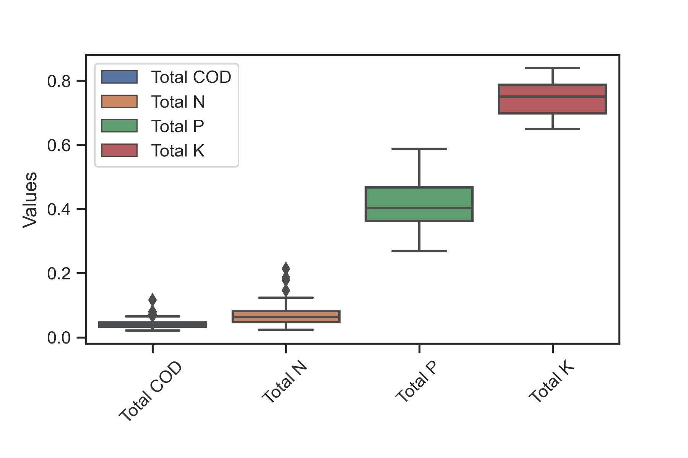

Histogram plot
**************
.. code:: bash
	
	# Kernel density curve can be added to the histogram,
	# with a log scale, we can have all metric results in the same plot
	fig, ax = s.plot_uncertainties(modelA, y_axis=key_metrics, kind='hist',
	                               center_kws={'kde':True, 'log_scale': 10})

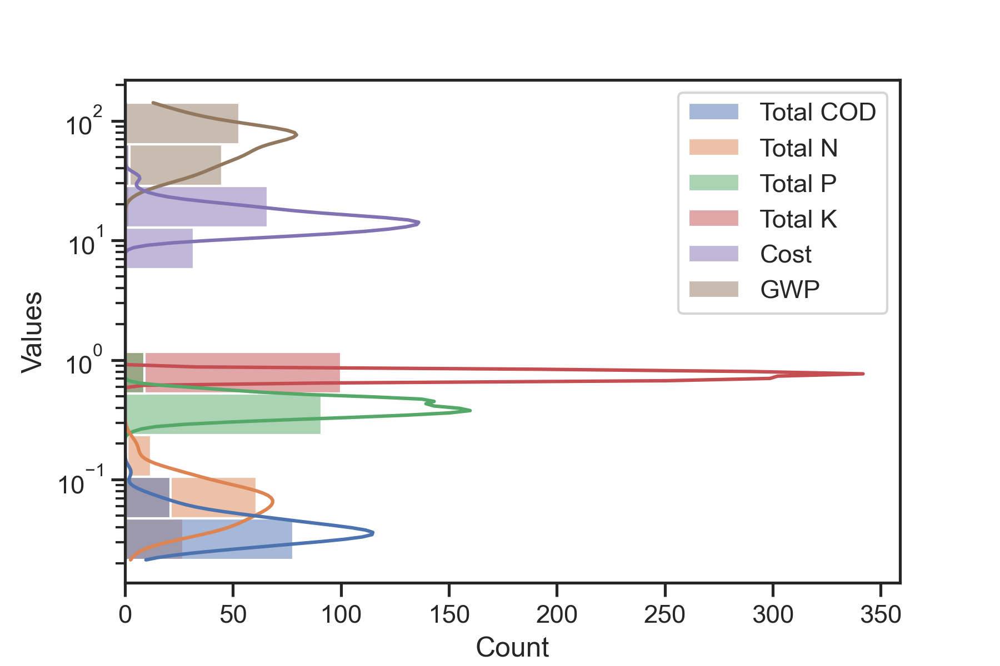

.. code:: bash
	
	# We can also have 2D histogram plot
	fig, axes = s.plot_uncertainties(modelA, x_axis=key_metrics[0],
	                                 y_axis=key_metrics[1], kind='hist-box')

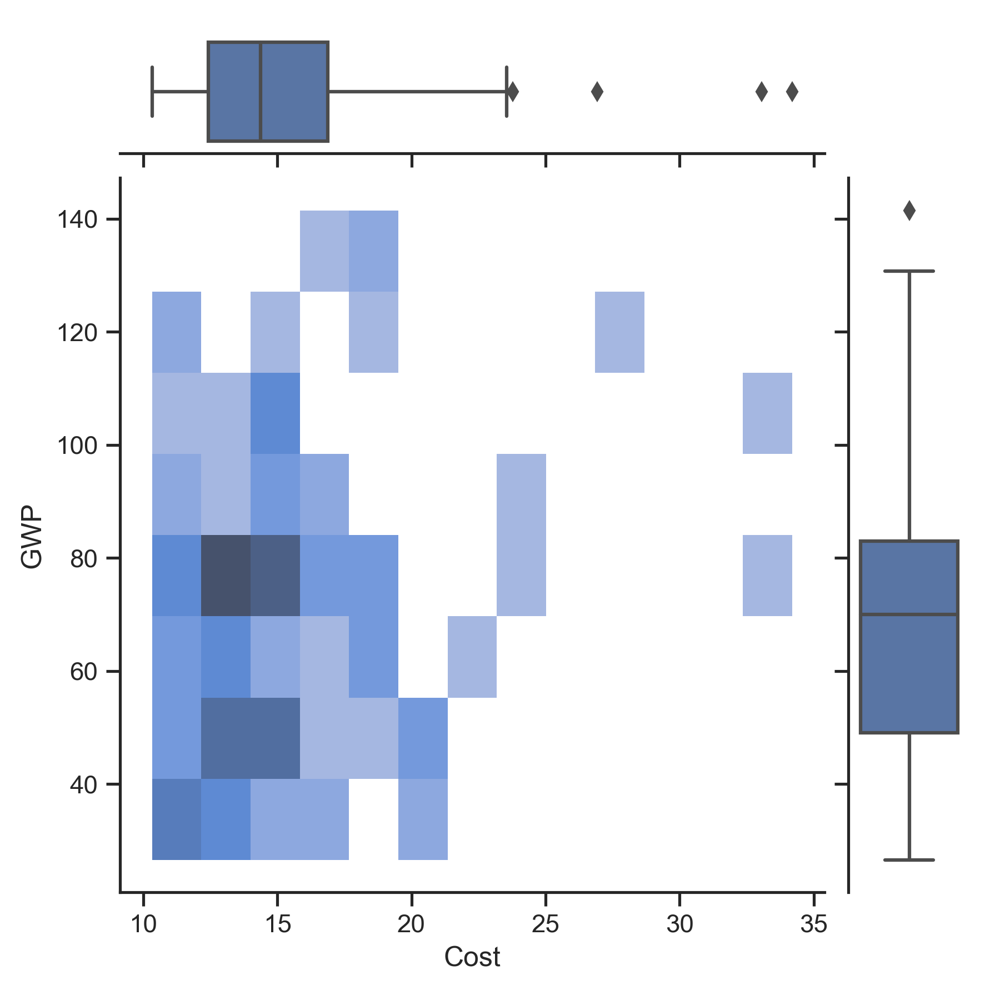

Kernel density plots
********************
.. code:: bash
	
	# Similar to histogram plots, kernel density plots can be 1D
	fig, ax = s.plot_uncertainties(modelA, x_axis=key_metrics, kind='kde',
	                               center_kws={'fill': True, 'log_scale': 2})
	plot_uncer_kde.png	                              

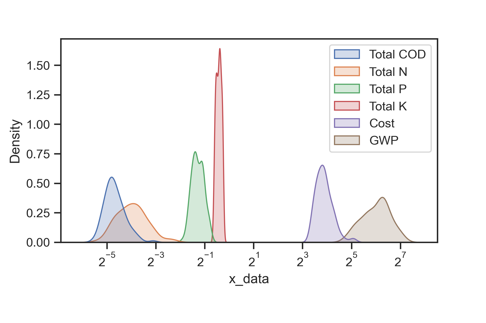

.. code:: bash
	
	# Or 2D with different kinds of margins
	fig, axes = s.plot_uncertainties(modelA, x_axis=key_metrics[0],
	                                 y_axis=key_metrics[1], kind='kde-kde',
	                                 margin_kws={'fill': True})

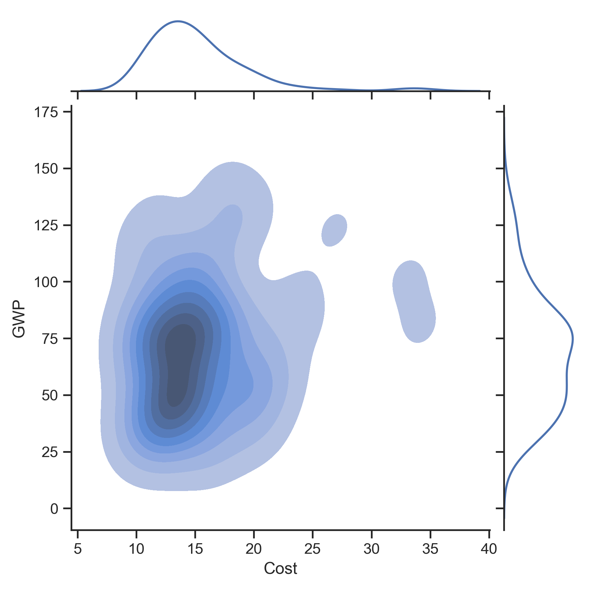

.. code:: bash
	
	fig, axes = s.plot_uncertainties(modelA, x_axis=key_metrics[0],
	                                 y_axis=key_metrics[1], kind='kde-hist',
	                                 center_kws={'fill': True},
	                                 margin_kws={'kde': True, 'fill': False})

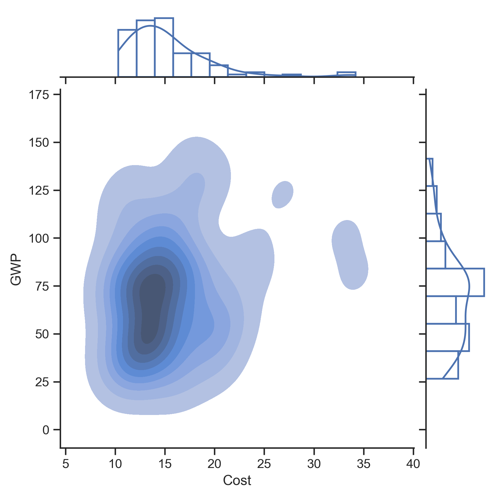

Correlations
------------
.. automethod:: qsdsan.stats.get_correlations
.. automethod:: qsdsan.stats.plot_correlations

Examples
^^^^^^^^

Bar plot for single metric
**************************
.. code:: bash

	fig, ax = s.plot_correlations(spearman_rho, parameters=modelA.get_parameters(),
	                              metrics=key_metrics[0])
	
	fig.subplots_adjust(left=0.25)

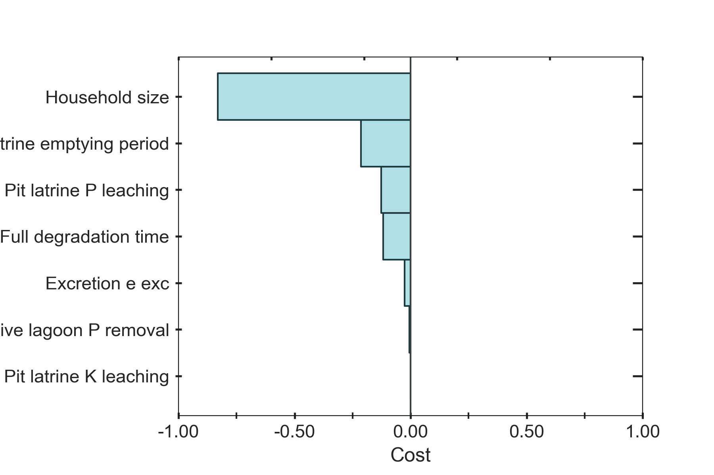

Bubble plot for multiple metrics
********************************
.. code:: bash

	fig, ax = s.plot_correlations(spearman_rho, parameters=modelA.get_parameters(),
	                              metrics=key_metrics)

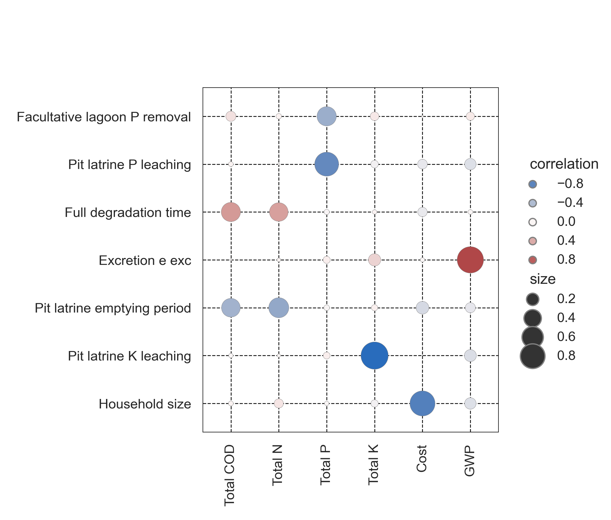

Input and sample preparation
----------------------------
.. automethod:: qsdsan.stats.define_inputs
.. automethod:: qsdsan.stats.generate_samples

Morris
------
.. automethod:: qsdsan.stats.morris_analysis
.. automethod:: qsdsan.stats.morris_till_convergence
.. automethod:: qsdsan.stats.plot_morris_results
.. automethod:: qsdsan.stats.plot_morris_convergence

Examples
^^^^^^^^

:math:`\sigma` vs. :math:`\mu^*`
********************************
.. code:: bash
	
	# Run Morris analysis without testing the convergence,
	# here we use a small sample size for demonstrative purpose
	morris_dct, fig, ax = analyses.run_plot_morris(modelA, 10, test_convergence=False)

	# Note that we can get the figure from the `run_plot_morris` plot,
	# but calling the actual plotting function is easier to customize
	# (e.g., set `label_kind`)
	fig, ax = s.plot_morris_results(morris_dct, key_metrics[0], label_kind='name')
	fig.subplots_adjust(bottom=0.25)

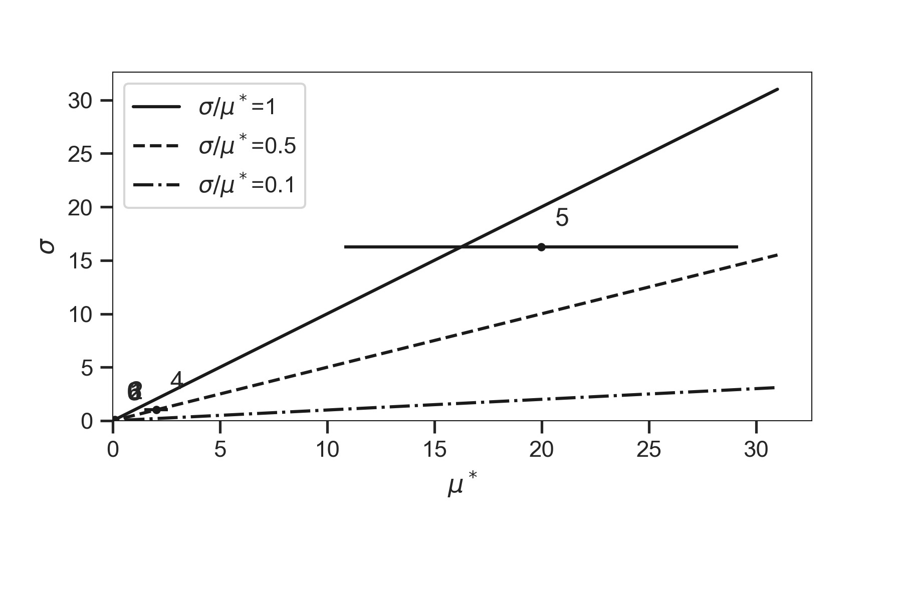

Line plot with error bands for evolutionary of :math:`\mu^*`
************************************************************
.. code:: bash
	
	# Test if mu_star can converge within 100 trajectories
	# (spoiler: it cannot, and you will get a message prompt) 
	morris_dct_conv, fig, ax = analyses.run_plot_morris(modelA, 100, test_convergence=True)

	# Look at mu_star values for two parameters
	fig, ax = s.plot_morris_convergence(morris_dct_conv,
	                                    parameters=modelA.get_parameters()[0:2],
	                                    metric=key_metrics[0], plot_rank=False)

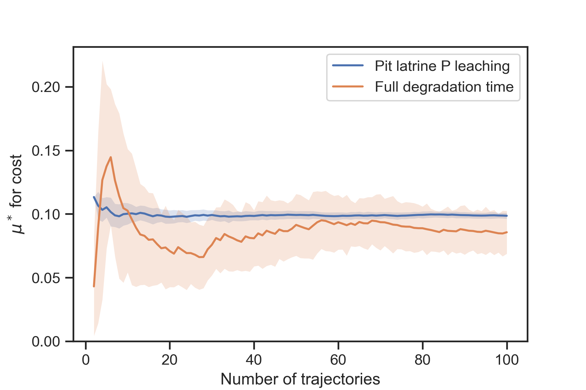

Line plot for evolutionary of :math:`\mu^*` rank
************************************************
.. code:: bash
	
	# Look at ranks of mu_star values for all parameters
	fig, ax = s.plot_morris_convergence(morris_dct_conv,
	                                    parameters=modelA.get_parameters(),
	                                    metric=key_metrics[0], plot_rank=True)

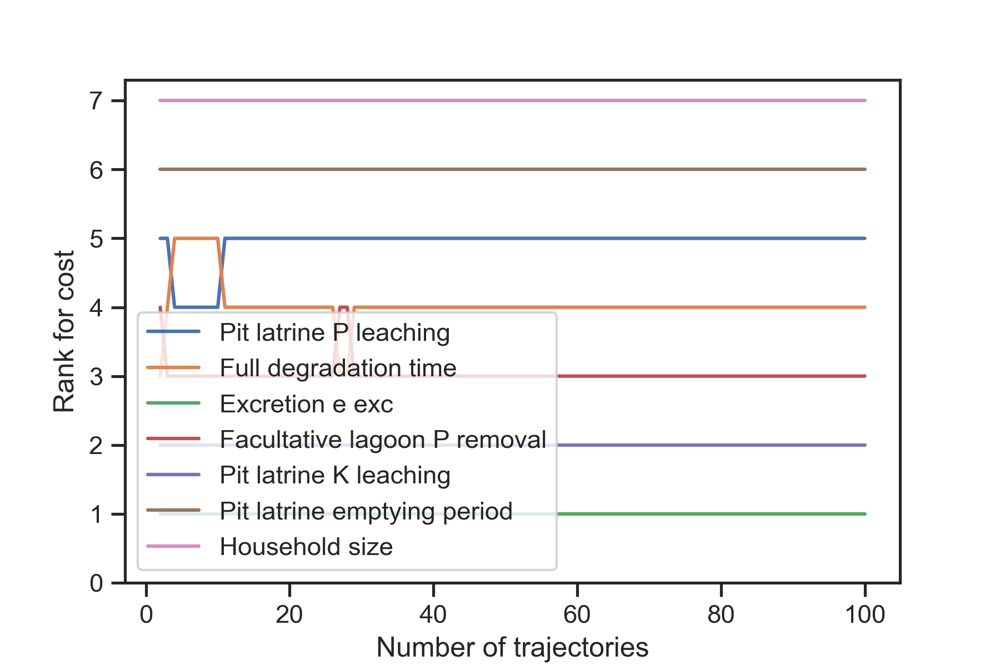

FAST
------
.. automethod:: qsdsan.stats.fast_analysis
.. automethod:: qsdsan.stats.plot_fast_results

Examples
^^^^^^^^

Bar plot for FAST
*****************
.. code:: bash
	
	# Total and main effects from FAST analysis,
	# here we use a small sample size for demonstrative purpose
	fast_dct, fig, ax = analyses.run_plot_fast(modelA, 'FAST', 100, M=4)
	
	fig.subplots_adjust(left=0.25)

.. figure:: ./images/stats/plot_fast.png

Bar plot for RBD-FAST
*********************
.. code:: bash
	
	# Main effects from RBD-FAST analysis,
	# here we use a small sample size for demonstrative purpose
	rbd_dct, fig, ax = analyses.run_plot_fast(modelA, 'RBD', 100, M=10)
	
	fig.subplots_adjust(left=0.25)

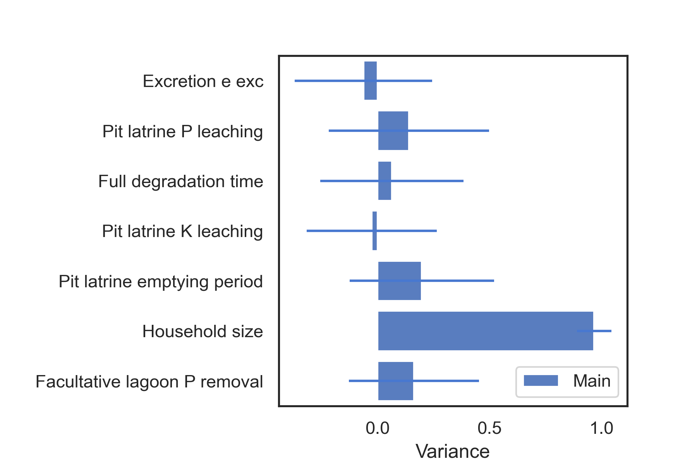

Sobol
-----
.. automethod:: qsdsan.stats.sobol_analysis
.. automethod:: qsdsan.stats.plot_sobol_results

Examples
^^^^^^^^

Bar plot for total and main effects
***********************************
.. code:: bash
	
	# Run Sobol analysis, here we use a small sample size for demonstrative purpose
	sobol_dct, fig, ax = analyses.run_plot_sobol(modelA, 10, file_prefix='')
	
	fig, ax = s.plot_sobol_results(sobol_dct, metric=key_metrics[0], kind='STS1')
	
	fig.subplots_adjust(left=0.25, top=0.95)

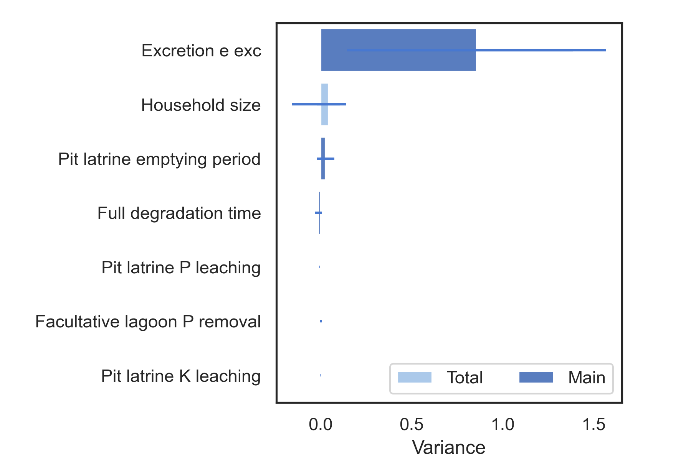

Heat map for total and second-order effects
*******************************************
.. code:: bash
	
	fig, ax = s.plot_sobol_results(sobol_dct, metric=key_metrics[0], kind='STS2',
	                               plot_in_diagonal='ST')
	
	for label in ax.get_xticklabels():
	    label.set_rotation(45)
	
	fig.subplots_adjust(left=0.25, bottom=0.3)

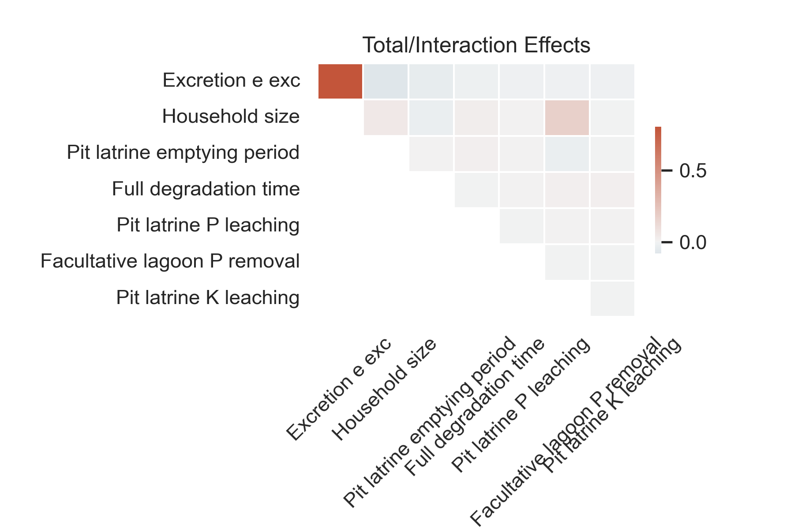

Bar plot and heat map for total, main, and second-order effects
***************************************************************
.. code:: bash
	
	fig, ax = s.plot_sobol_results(sobol_dct, metric=key_metrics[0], kind='all')

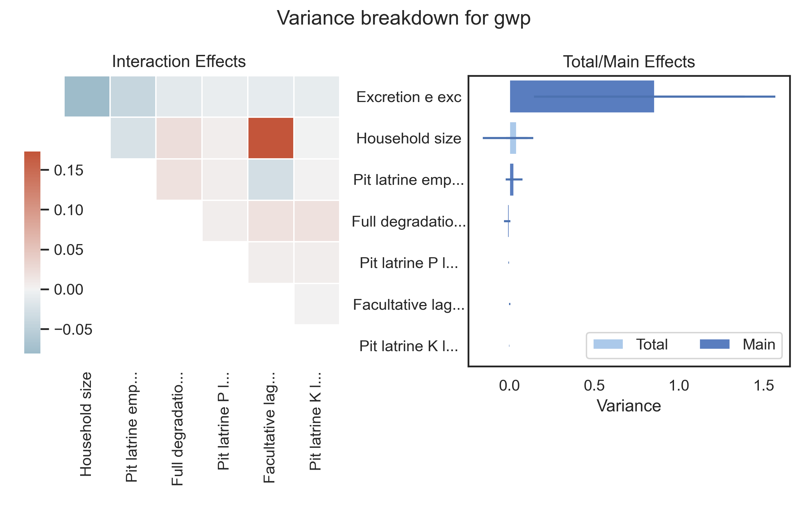

