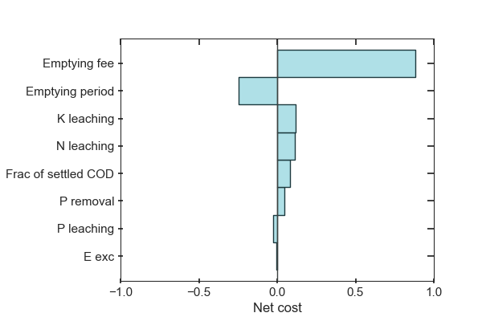
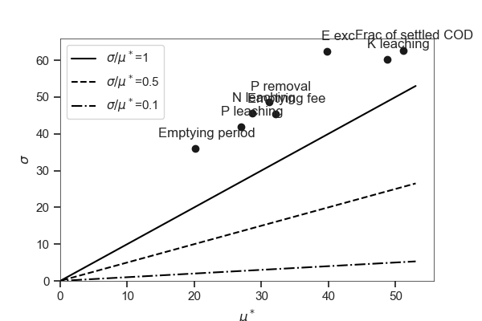
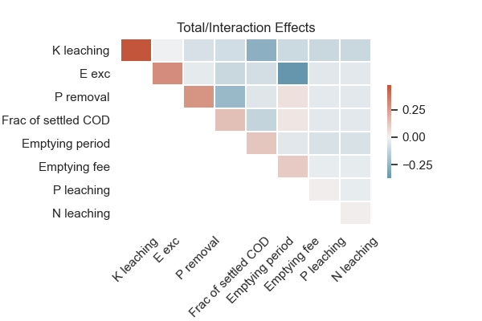
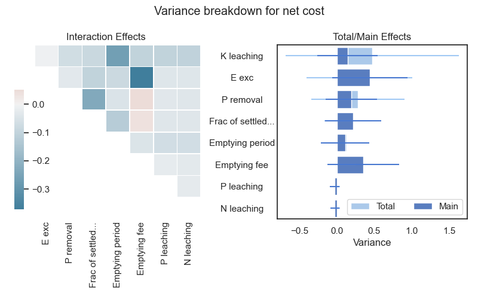

stats
=====

Uncertainties and Correlations
------------------------------
.. automethod:: qsdsan.stats.get_correlations
.. automethod:: qsdsan.stats.plot_uncertainties
.. automethod:: qsdsan.stats.plot_correlations

Examples
^^^^^^^^

Box plot for uncertainties
**************************
.. code:: bash

    from qsdsan import stats as s
	from qsdsan.systems import bwaise as bw

	modelA = bw.modelA
	analyses = bw.analyses

	# Run Monte Carlo uncertainty analysis and get Spearman rank correlations,
	# here we use a small sample size for demonstrative purpose
	spearman_rho, fig, ax, all_params = analyses.run_plot_spearman(modelA, N=100)

	# Box plot for the uncertain analysis
	key_metrics = analyses.key_metrics
	fig, ax = s.plot_uncertainties(modelA, metrics=key_metrics)

	# Trim figure
	fig.subplots_adjust(bottom=0.25)
	for label in ax.get_xticklabels():
	    label.set_rotation(45)

Bar plot for single metric
**************************
.. code:: bash

	fig, ax = s.plot_correlations(spearman_rho, parameters=modelA.get_parameters(),
	                              metrics=key_metrics[0])
	
	fig.subplots_adjust(left=0.25)

Bubble plot for multiple metrics
********************************
.. code:: bash

	fig, ax = s.plot_correlations(spearman_rho, parameters=modelA.get_parameters(),
	                              metrics=key_metrics)

.. figure:: ./images/plot_corr_bubble.png

Input and sample preparation
----------------------------
.. automethod:: qsdsan.stats.define_inputs
.. automethod:: qsdsan.stats.generate_samples

Morris
------
.. automethod:: qsdsan.stats.morris_analysis
.. automethod:: qsdsan.stats.morris_till_convergence
.. automethod:: qsdsan.stats.plot_morris_results
.. automethod:: qsdsan.stats.plot_morris_convergence

Examples
^^^^^^^^

:math:`\sigma` vs. :math:`\mu^*`
********************************
.. code:: bash
	
	# Run Morris analysis without testing the convergence,
	# here we use a small sample size for demonstrative purpose
	morris_dct, fig, ax = analyses.run_plot_morris(modelA, 10, test_convergence=False)

	fig, ax = s.plot_morris_results(morris_dct, key_metrics[0], label_kind='name')

Line plot with error bands for evolutionary of :math:`\mu^*`
************************************************************
.. code:: bash
	
	# Test if :math:`\mu^*` can converge within 100 trajectories
	# (spoiler: it cannot, and ``QSDsan`` will print a message) 
	morris_dct_conv, fig, ax = analyses.run_plot_morris(modelA, 100, test_convergence=True)

	# Look at :math:`\mu^*` values for two parameters
	fig, ax = s.plot_morris_convergence(morris_dct_conv,
	                                    parameters=modelA.get_parameters()[0:2],
	                                    metric=key_metrics[0], plot_rank=False)

.. figure:: ./images/plot_morris_conv.png

Line plot for evolutionary of :math:`\mu^*` rank
************************************************
.. code:: bash
	
	# Look at ranks of :math:`\mu^*` values for all parameters
	fig, ax = s.plot_morris_convergence(morris_dct_conv,
	                                    parameters=modelA.get_parameters(),
	                                    metric=key_metrics[0], plot_rank=True)

.. figure:: ./images/plot_morris_conv_rank.png

Sobol
-----
.. automethod:: qsdsan.stats.sobol_analysis
.. automethod:: qsdsan.stats.plot_sobol_results

Examples
^^^^^^^^

Bar plot for total and main effects
***********************************
.. code:: bash
	
	# Run Sobol analysis, here we use a small sample size for demonstrative purpose
	sobol_dct, fig, ax = analyses.run_plot_sobol(modelA, 10, file_prefix='')
	
	fig, ax = s.plot_sobol_results(sobol_dct, metric=key_metrics[0], kind='STS1')
	
	fig.subplots_adjust(left=0.25, top=0.95)

.. figure:: ./images/plot_sobol_sts1.png

Heat map for total and second-order effects
*******************************************
.. code:: bash
	
	fig, ax = s.plot_sobol_results(sobol_dct, metric=key_metrics[0], kind='STS2',
	                               plot_in_diagonal='ST')
	
	for label in ax.get_xticklabels():
	    label.set_rotation(45)
	
	fig.subplots_adjust(left=0.25, bottom=0.3)

Bar plot and heat map for total, main, and second-order effects
***************************************************************
.. code:: bash
	
	fig, ax = s.plot_sobol_results(sobol_dct, metric=key_metrics[0], kind='all')

