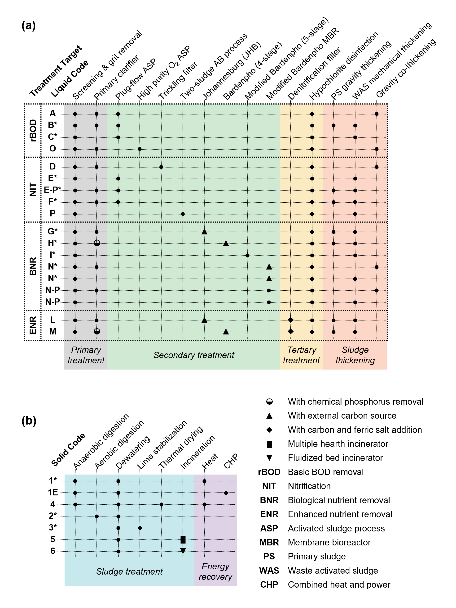
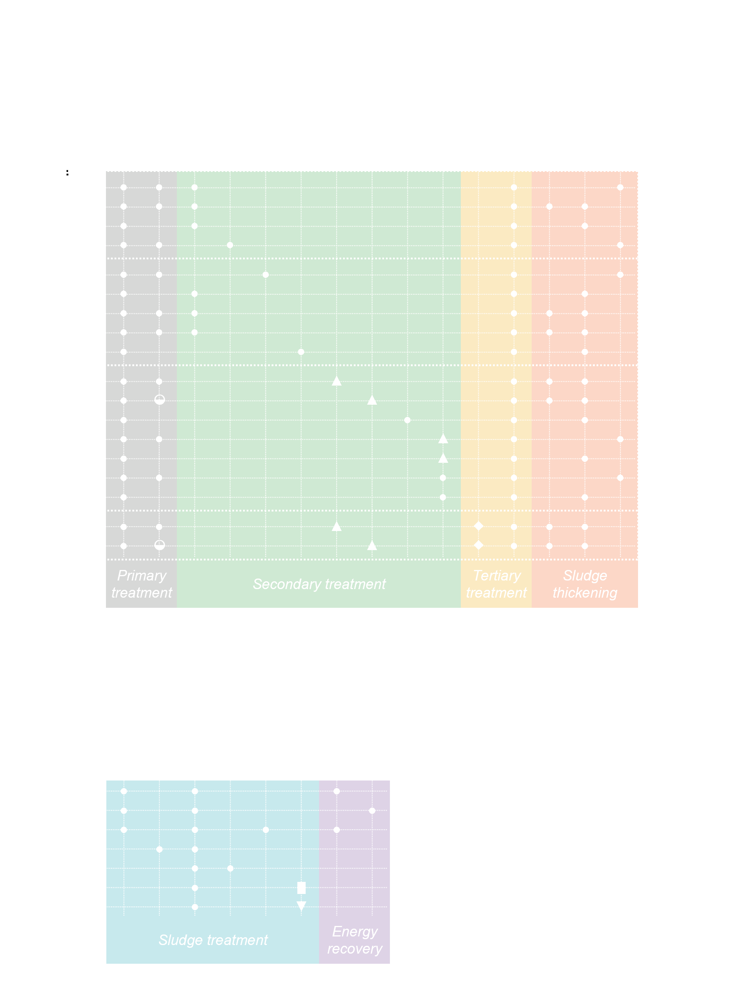

.. _wrrf_interactive:

WERF Benchmark WRRF Configurations
====================================

Process flow diagrams for all 18 water resource recovery facility (WRRF)
configurations as described in In Zhang et al., 2026 [1]_. These configurations were based on the net-zero energy solutions for WRRFs report by the Water Environment Research Foundation (WERF, now a part of the Water Research Foundation, WRF) [2]_.

Source codes for these configurations can be found in the `werf EXPOsan module <https://github.com/QSD-Group/EXPOsan/tree/main/exposan/werf>`_.

To create any of the system configurations, use the following code, replacing ``B1`` with the desired configuration code (e.g., ``B2``, ``C3``, etc.). 

.. code-block:: python

   from exposan.werf import create_system

   B1 = create_system('B1')
   B1.simulate(method='BDF', t_span=(0, 400))
   B1.diagram(file='B1', format='html')

Valid configuration codes are: B1, B2, B3, C1, C2, C3, E2, E2P, F1, G1, G2, G3, H1, I1, I2, I3, N1, N2.

   Distinguishing features of benchmark WRRF configurations. A WRRF configuration is referred to as a unique combination of a liquid code (a) and a solid code (b) as defined in [2]_. Configurations followed by a star (\*) are implemented in ``EXPOsan``.

.. raw:: html

   

Reading the Diagrams
--------------------

Every diagram uses the same convention: liquid train across the top with the
bioreactor zones in the middle, mixed-liquor recycles (MLR) above the zones,
return activated sludge (RAS) below them; solids train across the middle;
reject water (centrate + thickener supernatants) returned to the head of the
plant along the bottom.

``PC`` Primary clarifier · ``SC`` Secondary clarifier · ``DW`` Dewatering 

``GT`` Gravity thickener · ``MT`` Mechanical thickener · ``MBR`` Membrane bioreactor

``AD`` Anaerobic digester · ``AED`` Aerobic digester 

``RWW`` Raw wastewater · ``ML`` Mixed liquor

``PE`` Primary effluent · ``PS`` Primary sludge 

``SE`` Secondary effluent · ``WAS`` Waste activated sludge

The configurations are categorized based on their treatment goals:
  * rBOD for basic BOD removal (r for readily): B (with primary clarifier) and C (without primary clarifier) series.
  * NIT for nitrification: E (aerobic digestion) and F series (anaerobic digestion).
  * BNR for biological nutrient removal: G (Johannesburg), H (4-stage Bardenpho+chemicals), I (5-stage Bardenpho), N (5-stage Bardenpho+MBR) series.

.. raw:: html

   

     

       <a class="wrrf-nav-series" href="#b-series-rbod-with-primary-clarifier">B &nbsp;·&nbsp; rBOD with primary clarifier</a>
       
         <a href="#B1" title="rBOD · Primary clarifier · 6-zone aerobic ASP · Anaerobic digestion">B1</a>
         <a href="#B2" title="rBOD · Primary clarifier · 6-zone aerobic ASP · Aerobic digestion">B2</a>
         <a href="#B3" title="rBOD · Primary clarifier · 6-zone aerobic ASP · No digestion">B3</a>
       
     

     

       <a class="wrrf-nav-series" href="#c-series-rbod-without-primary-clarifier">C &nbsp;·&nbsp; rBOD, no primary clarifier</a>
       
         <a href="#C1" title="rBOD · No primary clarifier · 6-zone aerobic ASP · Anaerobic digestion">C1</a>
         <a href="#C2" title="rBOD · No primary clarifier · 6-zone aerobic ASP · Aerobic digestion">C2</a>
         <a href="#C3" title="rBOD · No primary clarifier · 6-zone aerobic ASP · No digestion">C3</a>
       
     

     

       <a class="wrrf-nav-series" href="#e-series-nit-with-aerobic-digestion">E &nbsp;·&nbsp; NIT, aerobic digestion</a>
       
         <a href="#E2"  title="NIT · No primary clarifier · Nitrifying ASP · Aerobic digestion">E2</a>
         <a href="#E2P" title="NIT · Primary clarifier (prime variant) · Nitrifying ASP · Aerobic digestion">E2P</a>
       
     

     

       <a class="wrrf-nav-series" href="#f-series-nit-with-anaerobic-digestion">F &nbsp;·&nbsp; NIT, anaerobic digestion</a>
       
         <a href="#F1" title="NIT · Primary clarifier · Nitrifying ASP · Anaerobic digestion">F1</a>
       
     

     

       <a class="wrrf-nav-series" href="#g-series-bnr-with-johannesburg-process">G &nbsp;·&nbsp; BNR, Johannesburg</a>
       
         <a href="#G1" title="BNR · Primary clarifier · Johannesburg step-fed · Anaerobic digestion">G1</a>
         <a href="#G2" title="BNR · Primary clarifier · Johannesburg step-fed · Aerobic digestion">G2</a>
         <a href="#G3" title="BNR · Primary clarifier · Johannesburg step-fed · No digestion">G3</a>
       
     

     

       <a class="wrrf-nav-series" href="#h-series-bnr-with-chemical-p-removal">H &nbsp;·&nbsp; BNR, chemical P removal</a>
       
         <a href="#H1" title="BNR · Primary clarifier + chemical P removal · Modified 5-stage Bardenpho · Anaerobic digestion">H1</a>
       
     

     

       <a class="wrrf-nav-series" href="#i-series-bnr-with-5-stage-bardenpho">I &nbsp;·&nbsp; BNR, 5-stage Bardenpho</a>
       
         <a href="#I1" title="BNR · No primary clarifier · 5-stage Bardenpho · Anaerobic digestion">I1</a>
         <a href="#I2" title="BNR · No primary clarifier · 5-stage Bardenpho · Aerobic digestion">I2</a>
         <a href="#I3" title="BNR · No primary clarifier · 5-stage Bardenpho · No digestion">I3</a>
       
     

     

       <a class="wrrf-nav-series" href="#n-series-bnr-with-mbr">N &nbsp;·&nbsp; BNR + MBR</a>
       
         <a href="#N1" title="BNR · Primary clarifier · 5-stage Bardenpho + MBR · Anaerobic digestion">N1</a>
         <a href="#N2" title="BNR · No primary clarifier · 5-stage Bardenpho + MBR · Aerobic digestion">N2</a>
       
     

   

B Series: rBOD with Primary Clarifier
-------------------------------------

Conventional six-zone aerobic activated sludge with short SRT (~2 d) — only BOD
removal, nitrifiers wash out. The three B variants differ only in the solids
train (AD, AED, or no digestion).

.. raw:: html

   

   <svg xmlns="http://www.w3.org/2000/svg" viewBox="0 0 1200 800" width="1200" height="800">

   <defs>
     <marker id="arr-main" viewBox="0 0 10 10" refX="9" refY="5" markerWidth="6" markerHeight="6" orient="auto-start-reverse">
       <path d="M0,0 L10,5 L0,10 z" fill="#1a1a1a"/></marker>
     <marker id="arr-recycle" viewBox="0 0 10 10" refX="9" refY="5" markerWidth="6" markerHeight="6" orient="auto-start-reverse">
       <path d="M0,0 L10,5 L0,10 z" fill="#c2272d"/></marker>
     <marker id="arr-sludge" viewBox="0 0 10 10" refX="9" refY="5" markerWidth="6" markerHeight="6" orient="auto-start-reverse">
       <path d="M0,0 L10,5 L0,10 z" fill="#7a5a30"/></marker>
     <marker id="arr-gas" viewBox="0 0 10 10" refX="9" refY="5" markerWidth="6" markerHeight="6" orient="auto-start-reverse">
       <path d="M0,0 L10,5 L0,10 z" fill="#6b4a8a"/></marker>
     <marker id="arr-dose" viewBox="0 0 10 10" refX="9" refY="5" markerWidth="6" markerHeight="6" orient="auto-start-reverse">
       <path d="M0,0 L10,5 L0,10 z" fill="#d97a4a"/></marker>
   </defs>
   <rect class="bg" width="1200" height="800"/><text x="36" y="38" class="title">B1</text><text x="36" y="78" class="subtitle">rBOD · Primary clarifier · 6-zone aerobic ASP · Anaerobic digestion</text><text x="600.0" y="190" class="section">LIQUID TREATMENT</text><line x1="60" y1="233.0" x2="118" y2="233.0" class="mainflow" marker-end="url(#arr-main)"/><text x="60" y="224.0" class="streamlabel" text-anchor="start">RWW</text><polygon points="118,205 182,205 175,261 125,261" class="clarifier"/><text x="150.0" y="238.0" class="zonelabel-d">PC</text><line x1="182" y1="233.0" x2="210" y2="233.0" class="mainflow" marker-end="url(#arr-main)"/><text x="196.0" y="225.0" class="streamlabel" text-anchor="middle">PE</text><rect x="210" y="205" width="56" height="56" class="aerobic" rx="2"/><text x="238.0" y="237.0" class="zonelabel">O1</text><circle cx="230.0" cy="253" r="1.5" fill="#fff" opacity="0.85"/><circle cx="238.0" cy="253" r="1.5" fill="#fff" opacity="0.85"/><circle cx="246.0" cy="253" r="1.5" fill="#fff" opacity="0.85"/><rect x="266" y="205" width="56" height="56" class="aerobic" rx="2"/><text x="294.0" y="237.0" class="zonelabel">O2</text><circle cx="286.0" cy="253" r="1.5" fill="#fff" opacity="0.85"/><circle cx="294.0" cy="253" r="1.5" fill="#fff" opacity="0.85"/><circle cx="302.0" cy="253" r="1.5" fill="#fff" opacity="0.85"/><rect x="322" y="205" width="56" height="56" class="aerobic" rx="2"/><text x="350.0" y="237.0" class="zonelabel">O3</text><circle cx="342.0" cy="253" r="1.5" fill="#fff" opacity="0.85"/><circle cx="350.0" cy="253" r="1.5" fill="#fff" opacity="0.85"/><circle cx="358.0" cy="253" r="1.5" fill="#fff" opacity="0.85"/><rect x="378" y="205" width="56" height="56" class="aerobic" rx="2"/><text x="406.0" y="237.0" class="zonelabel">O4</text><circle cx="398.0" cy="253" r="1.5" fill="#fff" opacity="0.85"/><circle cx="406.0" cy="253" r="1.5" fill="#fff" opacity="0.85"/><circle cx="414.0" cy="253" r="1.5" fill="#fff" opacity="0.85"/><rect x="434" y="205" width="56" height="56" class="aerobic" rx="2"/><text x="462.0" y="237.0" class="zonelabel">O5</text><circle cx="454.0" cy="253" r="1.5" fill="#fff" opacity="0.85"/><circle cx="462.0" cy="253" r="1.5" fill="#fff" opacity="0.85"/><circle cx="470.0" cy="253" r="1.5" fill="#fff" opacity="0.85"/><rect x="490" y="205" width="56" height="56" class="aerobic" rx="2"/><text x="518.0" y="237.0" class="zonelabel">O6</text><circle cx="510.0" cy="253" r="1.5" fill="#fff" opacity="0.85"/><circle cx="518.0" cy="253" r="1.5" fill="#fff" opacity="0.85"/><circle cx="526.0" cy="253" r="1.5" fill="#fff" opacity="0.85"/><line x1="546" y1="233.0" x2="586" y2="233.0" class="mainflow" marker-end="url(#arr-main)"/><text x="566.0" y="225.0" class="streamlabel" text-anchor="middle">ML</text><polygon points="586,205 650,205 643,261 593,261" class="clarifier"/><text x="618.0" y="238.0" class="zonelabel-d">SC</text><line x1="650" y1="233.0" x2="1164" y2="233.0" class="mainflow" marker-end="url(#arr-main)"/><text x="955.0" y="225.0" class="streamlabel" text-anchor="middle">Effluent</text><path d="M 600 261 L 600 320 L 218 320 L 218 261" class="recycle" marker-end="url(#arr-recycle)"/><text x="409.0" y="315" class="streamlabel" text-anchor="middle">RAS (return activated sludge)</text><line x1="150.0" y1="261" x2="150.0" y2="420" class="sludge" marker-end="url(#arr-sludge)"/><text x="142.0" y="275" class="streamlabel" text-anchor="end">PS</text><line x1="636" y1="261" x2="636" y2="420" class="sludge" marker-end="url(#arr-sludge)"/><text x="644" y="275" class="streamlabel" text-anchor="start">WAS</text><text x="600.0" y="392" class="section">SOLIDS TREATMENT</text><polygon points="319.0,470 375.0,470 369.0,526 325.0,526" class="thickener"/><text x="347.0" y="503.0" class="zonelabel-d">GT</text><polygon points="485.0,470 541.0,470 535.0,526 491.0,526" class="thickener"/><text x="513.0" y="503.0" class="zonelabel-d">MT</text><path d="M651.0,480 Q651.0,470 683.0,470 Q715.0,470 715.0,480 L715.0,526 L651.0,526 z" class="digester-an"/><text x="683.0" y="503.0" class="zonelabel">AD</text><line x1="683.0" y1="468" x2="683.0" y2="448" class="gas" marker-end="url(#arr-gas)"/><text x="688.0" y="445" class="streamlabel" fill="#6b4a8a">biogas</text><rect x="825.0" y="470" width="56" height="56" class="dw" rx="2"/><text x="853.0" y="503.0" class="zonelabel-d">DW</text><line x1="375.0" y1="498.0" x2="485.0" y2="498.0" class="sludge" marker-end="url(#arr-sludge)"/><line x1="541.0" y1="498.0" x2="651.0" y2="498.0" class="sludge" marker-end="url(#arr-sludge)"/><line x1="715.0" y1="498.0" x2="825.0" y2="498.0" class="sludge" marker-end="url(#arr-sludge)"/><line x1="150.0" y1="420" x2="347.0" y2="420" class="sludge" marker-end="url(#arr-sludge)"/><line x1="347.0" y1="420" x2="347.0" y2="470" class="sludge" marker-end="url(#arr-sludge)"/><line x1="636" y1="420" x2="513.0" y2="420" class="sludge" marker-end="url(#arr-sludge)"/><line x1="513.0" y1="420" x2="513.0" y2="470" class="sludge" marker-end="url(#arr-sludge)"/><line x1="881.0" y1="498.0" x2="1152" y2="498.0" class="sludge" marker-end="url(#arr-sludge)"/><text x="1016.5" y="491.0" class="streamlabel" text-anchor="middle">sludge cake</text><line x1="347.0" y1="526" x2="347.0" y2="600" class="recycle"/><line x1="513.0" y1="526" x2="513.0" y2="600" class="recycle"/><line x1="853.0" y1="526" x2="853.0" y2="600" class="recycle"/><line x1="347.0" y1="600" x2="853.0" y2="600" class="recycle"/><line x1="347.0" y1="600" x2="50" y2="600" class="recycle"/><text x="600.0" y="594" class="streamlabel" text-anchor="middle">reject water (centrate + thickener supernatant)</text><line x1="50" y1="600" x2="50" y2="255.0" class="recycle"/><line x1="50" y1="255.0" x2="116" y2="255.0" class="recycle" marker-end="url(#arr-recycle)"/><line x1="112" y1="255.0" x2="112" y2="236.0" class="recycle"/><line x1="112" y1="236.0" x2="116" y2="236.0" class="recycle" marker-end="url(#arr-recycle)"/><g transform="translate(36,630)">
      <rect x="0" y="0" width="14" height="10" class="anaerobic" rx="1.5"/><text x="19" y="9" class="streamlabel">Anaerobic</text>
      <rect x="149" y="0" width="14" height="10" class="anoxic" rx="1.5"/><text x="168" y="9" class="streamlabel">Anoxic</text>
      <rect x="260" y="0" width="14" height="10" class="aerobic" rx="1.5"/><text x="279" y="9" class="streamlabel">Aerobic</text>
      <rect x="371" y="0" width="14" height="10" class="clarifier" rx="1.5"/><text x="390" y="9" class="streamlabel">Clarifier</text>
      <rect x="515" y="0" width="14" height="10" class="digester-an" rx="1.5"/><text x="534" y="9" class="streamlabel">Anaerobic dig. (AD)</text>
      <rect x="759" y="0" width="14" height="10" class="digester-ae" rx="1.5"/><text x="778" y="9" class="streamlabel">Aerobic dig. (AED)</text>
      <rect x="0" y="30" width="14" height="10" class="thickener" rx="1.5"/><text x="19" y="39" class="streamlabel">Thickener</text>
      <rect x="149" y="30" width="14" height="10" class="dw" rx="1.5"/><text x="168" y="39" class="streamlabel">Dewatering</text>
      <rect x="306" y="30" width="14" height="10" class="mbr" rx="1.5"/><text x="325" y="39" class="streamlabel">Membrane (MBR)</text>
      <rect x="500" y="30" width="14" height="10" class="chem" rx="1.5"/><text x="519" y="39" class="streamlabel">Chemical dose</text>
      <line x1="0" y1="70" x2="24" y2="70" class="mainflow" marker-end="url(#arr-main)"/><text x="30" y="74" class="streamlabel">Main flow</text>
      <line x1="145" y1="70" x2="169" y2="70" class="recycle" marker-end="url(#arr-recycle)"/><text x="175" y="74" class="streamlabel">Recycle</text>
      <line x1="273" y1="70" x2="297" y2="70" class="sludge" marker-end="url(#arr-sludge)"/><text x="303" y="74" class="streamlabel">Sludge</text>
      <line x1="395" y1="70" x2="419" y2="70" class="gas" marker-end="url(#arr-gas)"/><text x="425" y="74" class="streamlabel">Biogas</text>
      <line x1="517" y1="70" x2="541" y2="70" class="dose" marker-end="url(#arr-dose)"/><text x="547" y="74" class="streamlabel">Chemical addition</text>
      </g></svg>
   

   

   

.. raw:: html

   

   <svg xmlns="http://www.w3.org/2000/svg" viewBox="0 0 1200 800" width="1200" height="800">

   <defs>
     <marker id="arr-main" viewBox="0 0 10 10" refX="9" refY="5" markerWidth="6" markerHeight="6" orient="auto-start-reverse">
       <path d="M0,0 L10,5 L0,10 z" fill="#1a1a1a"/></marker>
     <marker id="arr-recycle" viewBox="0 0 10 10" refX="9" refY="5" markerWidth="6" markerHeight="6" orient="auto-start-reverse">
       <path d="M0,0 L10,5 L0,10 z" fill="#c2272d"/></marker>
     <marker id="arr-sludge" viewBox="0 0 10 10" refX="9" refY="5" markerWidth="6" markerHeight="6" orient="auto-start-reverse">
       <path d="M0,0 L10,5 L0,10 z" fill="#7a5a30"/></marker>
     <marker id="arr-gas" viewBox="0 0 10 10" refX="9" refY="5" markerWidth="6" markerHeight="6" orient="auto-start-reverse">
       <path d="M0,0 L10,5 L0,10 z" fill="#6b4a8a"/></marker>
     <marker id="arr-dose" viewBox="0 0 10 10" refX="9" refY="5" markerWidth="6" markerHeight="6" orient="auto-start-reverse">
       <path d="M0,0 L10,5 L0,10 z" fill="#d97a4a"/></marker>
   </defs>
   <rect class="bg" width="1200" height="800"/><text x="36" y="38" class="title">B2</text><text x="36" y="78" class="subtitle">rBOD · Primary clarifier · 6-zone aerobic ASP · Aerobic digestion</text><text x="600.0" y="190" class="section">LIQUID TREATMENT</text><line x1="60" y1="233.0" x2="118" y2="233.0" class="mainflow" marker-end="url(#arr-main)"/><text x="60" y="224.0" class="streamlabel" text-anchor="start">RWW</text><polygon points="118,205 182,205 175,261 125,261" class="clarifier"/><text x="150.0" y="238.0" class="zonelabel-d">PC</text><line x1="182" y1="233.0" x2="210" y2="233.0" class="mainflow" marker-end="url(#arr-main)"/><text x="196.0" y="225.0" class="streamlabel" text-anchor="middle">PE</text><rect x="210" y="205" width="56" height="56" class="aerobic" rx="2"/><text x="238.0" y="237.0" class="zonelabel">O1</text><circle cx="230.0" cy="253" r="1.5" fill="#fff" opacity="0.85"/><circle cx="238.0" cy="253" r="1.5" fill="#fff" opacity="0.85"/><circle cx="246.0" cy="253" r="1.5" fill="#fff" opacity="0.85"/><rect x="266" y="205" width="56" height="56" class="aerobic" rx="2"/><text x="294.0" y="237.0" class="zonelabel">O2</text><circle cx="286.0" cy="253" r="1.5" fill="#fff" opacity="0.85"/><circle cx="294.0" cy="253" r="1.5" fill="#fff" opacity="0.85"/><circle cx="302.0" cy="253" r="1.5" fill="#fff" opacity="0.85"/><rect x="322" y="205" width="56" height="56" class="aerobic" rx="2"/><text x="350.0" y="237.0" class="zonelabel">O3</text><circle cx="342.0" cy="253" r="1.5" fill="#fff" opacity="0.85"/><circle cx="350.0" cy="253" r="1.5" fill="#fff" opacity="0.85"/><circle cx="358.0" cy="253" r="1.5" fill="#fff" opacity="0.85"/><rect x="378" y="205" width="56" height="56" class="aerobic" rx="2"/><text x="406.0" y="237.0" class="zonelabel">O4</text><circle cx="398.0" cy="253" r="1.5" fill="#fff" opacity="0.85"/><circle cx="406.0" cy="253" r="1.5" fill="#fff" opacity="0.85"/><circle cx="414.0" cy="253" r="1.5" fill="#fff" opacity="0.85"/><rect x="434" y="205" width="56" height="56" class="aerobic" rx="2"/><text x="462.0" y="237.0" class="zonelabel">O5</text><circle cx="454.0" cy="253" r="1.5" fill="#fff" opacity="0.85"/><circle cx="462.0" cy="253" r="1.5" fill="#fff" opacity="0.85"/><circle cx="470.0" cy="253" r="1.5" fill="#fff" opacity="0.85"/><rect x="490" y="205" width="56" height="56" class="aerobic" rx="2"/><text x="518.0" y="237.0" class="zonelabel">O6</text><circle cx="510.0" cy="253" r="1.5" fill="#fff" opacity="0.85"/><circle cx="518.0" cy="253" r="1.5" fill="#fff" opacity="0.85"/><circle cx="526.0" cy="253" r="1.5" fill="#fff" opacity="0.85"/><line x1="546" y1="233.0" x2="586" y2="233.0" class="mainflow" marker-end="url(#arr-main)"/><text x="566.0" y="225.0" class="streamlabel" text-anchor="middle">ML</text><polygon points="586,205 650,205 643,261 593,261" class="clarifier"/><text x="618.0" y="238.0" class="zonelabel-d">SC</text><line x1="650" y1="233.0" x2="1164" y2="233.0" class="mainflow" marker-end="url(#arr-main)"/><text x="955.0" y="225.0" class="streamlabel" text-anchor="middle">Effluent</text><path d="M 600 261 L 600 320 L 218 320 L 218 261" class="recycle" marker-end="url(#arr-recycle)"/><text x="409.0" y="315" class="streamlabel" text-anchor="middle">RAS</text><line x1="150.0" y1="261" x2="150.0" y2="420" class="sludge" marker-end="url(#arr-sludge)"/><text x="142.0" y="275" class="streamlabel" text-anchor="end">PS</text><line x1="636" y1="261" x2="636" y2="420" class="sludge" marker-end="url(#arr-sludge)"/><text x="644" y="275" class="streamlabel" text-anchor="start">WAS</text><text x="600.0" y="392" class="section">SOLIDS TREATMENT</text><polygon points="319.0,470 375.0,470 369.0,526 325.0,526" class="thickener"/><text x="347.0" y="503.0" class="zonelabel-d">GT</text><polygon points="485.0,470 541.0,470 535.0,526 491.0,526" class="thickener"/><text x="513.0" y="503.0" class="zonelabel-d">MT</text><rect x="651.0" y="470" width="64" height="56" class="digester-ae" rx="3"/><text x="683.0" y="503.0" class="zonelabel">AED</text><circle cx="671.0" cy="517" r="1.5" fill="#fff" opacity="0.85"/><circle cx="679.0" cy="517" r="1.5" fill="#fff" opacity="0.85"/><circle cx="687.0" cy="517" r="1.5" fill="#fff" opacity="0.85"/><circle cx="695.0" cy="517" r="1.5" fill="#fff" opacity="0.85"/><rect x="825.0" y="470" width="56" height="56" class="dw" rx="2"/><text x="853.0" y="503.0" class="zonelabel-d">DW</text><line x1="541.0" y1="498.0" x2="651.0" y2="498.0" class="sludge" marker-end="url(#arr-sludge)"/><path d="M 375 498 L 375 456 L 651 456 L 651 492" class="sludge" marker-end="url(#arr-sludge)"/><line x1="715.0" y1="498.0" x2="825.0" y2="498.0" class="sludge" marker-end="url(#arr-sludge)"/><line x1="150.0" y1="420" x2="347.0" y2="420" class="sludge" marker-end="url(#arr-sludge)"/><line x1="347.0" y1="420" x2="347.0" y2="470" class="sludge" marker-end="url(#arr-sludge)"/><line x1="636" y1="420" x2="513.0" y2="420" class="sludge" marker-end="url(#arr-sludge)"/><line x1="513.0" y1="420" x2="513.0" y2="470" class="sludge" marker-end="url(#arr-sludge)"/><line x1="881.0" y1="498.0" x2="1152" y2="498.0" class="sludge" marker-end="url(#arr-sludge)"/><text x="1016.5" y="491.0" class="streamlabel" text-anchor="middle">sludge cake</text><line x1="347.0" y1="526" x2="347.0" y2="600" class="recycle"/><line x1="513.0" y1="526" x2="513.0" y2="600" class="recycle"/><line x1="853.0" y1="526" x2="853.0" y2="600" class="recycle"/><line x1="347.0" y1="600" x2="853.0" y2="600" class="recycle"/><line x1="347.0" y1="600" x2="50" y2="600" class="recycle"/><text x="600.0" y="594" class="streamlabel" text-anchor="middle">reject water (centrate + thickener supernatant)</text><line x1="50" y1="600" x2="50" y2="255.0" class="recycle"/><line x1="50" y1="255.0" x2="116" y2="255.0" class="recycle" marker-end="url(#arr-recycle)"/><line x1="112" y1="255.0" x2="112" y2="236.0" class="recycle"/><line x1="112" y1="236.0" x2="116" y2="236.0" class="recycle" marker-end="url(#arr-recycle)"/><g transform="translate(36,630)">
   <rect x="0" y="0" width="14" height="10" class="anaerobic" rx="1.5"/><text x="19" y="9" class="streamlabel">Anaerobic</text>
   <rect x="149" y="0" width="14" height="10" class="anoxic" rx="1.5"/><text x="168" y="9" class="streamlabel">Anoxic</text>
   <rect x="260" y="0" width="14" height="10" class="aerobic" rx="1.5"/><text x="279" y="9" class="streamlabel">Aerobic</text>
   <rect x="371" y="0" width="14" height="10" class="clarifier" rx="1.5"/><text x="390" y="9" class="streamlabel">Clarifier</text>
   <rect x="515" y="0" width="14" height="10" class="digester-an" rx="1.5"/><text x="534" y="9" class="streamlabel">Anaerobic dig. (AD)</text>
   <rect x="759" y="0" width="14" height="10" class="digester-ae" rx="1.5"/><text x="778" y="9" class="streamlabel">Aerobic dig. (AED)</text>
   <rect x="0" y="30" width="14" height="10" class="thickener" rx="1.5"/><text x="19" y="39" class="streamlabel">Thickener</text>
   <rect x="149" y="30" width="14" height="10" class="dw" rx="1.5"/><text x="168" y="39" class="streamlabel">Dewatering</text>
   <rect x="306" y="30" width="14" height="10" class="mbr" rx="1.5"/><text x="325" y="39" class="streamlabel">Membrane (MBR)</text>
   <rect x="500" y="30" width="14" height="10" class="chem" rx="1.5"/><text x="519" y="39" class="streamlabel">Chemical dose</text>
   <line x1="0" y1="70" x2="24" y2="70" class="mainflow" marker-end="url(#arr-main)"/><text x="30" y="74" class="streamlabel">Main flow</text>
   <line x1="145" y1="70" x2="169" y2="70" class="recycle" marker-end="url(#arr-recycle)"/><text x="175" y="74" class="streamlabel">Recycle</text>
   <line x1="273" y1="70" x2="297" y2="70" class="sludge" marker-end="url(#arr-sludge)"/><text x="303" y="74" class="streamlabel">Sludge</text>
   <line x1="395" y1="70" x2="419" y2="70" class="gas" marker-end="url(#arr-gas)"/><text x="425" y="74" class="streamlabel">Biogas</text>
   <line x1="517" y1="70" x2="541" y2="70" class="dose" marker-end="url(#arr-dose)"/><text x="547" y="74" class="streamlabel">Chemical addition</text>
   </g></svg>
   

.. raw:: html

   

   <svg xmlns="http://www.w3.org/2000/svg" viewBox="0 0 1200 800" width="1200" height="800">

   <defs>
     <marker id="arr-main" viewBox="0 0 10 10" refX="9" refY="5" markerWidth="6" markerHeight="6" orient="auto-start-reverse">
       <path d="M0,0 L10,5 L0,10 z" fill="#1a1a1a"/></marker>
     <marker id="arr-recycle" viewBox="0 0 10 10" refX="9" refY="5" markerWidth="6" markerHeight="6" orient="auto-start-reverse">
       <path d="M0,0 L10,5 L0,10 z" fill="#c2272d"/></marker>
     <marker id="arr-sludge" viewBox="0 0 10 10" refX="9" refY="5" markerWidth="6" markerHeight="6" orient="auto-start-reverse">
       <path d="M0,0 L10,5 L0,10 z" fill="#7a5a30"/></marker>
     <marker id="arr-gas" viewBox="0 0 10 10" refX="9" refY="5" markerWidth="6" markerHeight="6" orient="auto-start-reverse">
       <path d="M0,0 L10,5 L0,10 z" fill="#6b4a8a"/></marker>
     <marker id="arr-dose" viewBox="0 0 10 10" refX="9" refY="5" markerWidth="6" markerHeight="6" orient="auto-start-reverse">
       <path d="M0,0 L10,5 L0,10 z" fill="#d97a4a"/></marker>
   </defs>
   <rect class="bg" width="1200" height="800"/><text x="36" y="38" class="title">B3</text><text x="36" y="78" class="subtitle">rBOD · Primary clarifier · 6-zone aerobic ASP · No digestion (thickening + dewatering only)</text><text x="600.0" y="190" class="section">LIQUID TREATMENT</text><line x1="60" y1="233.0" x2="118" y2="233.0" class="mainflow" marker-end="url(#arr-main)"/><text x="60" y="224.0" class="streamlabel" text-anchor="start">RWW</text><polygon points="118,205 182,205 175,261 125,261" class="clarifier"/><text x="150.0" y="238.0" class="zonelabel-d">PC</text><line x1="182" y1="233.0" x2="210" y2="233.0" class="mainflow" marker-end="url(#arr-main)"/><text x="196.0" y="225.0" class="streamlabel" text-anchor="middle">PE</text><rect x="210" y="205" width="56" height="56" class="aerobic" rx="2"/><text x="238.0" y="237.0" class="zonelabel">O1</text><circle cx="230.0" cy="253" r="1.5" fill="#fff" opacity="0.85"/><circle cx="238.0" cy="253" r="1.5" fill="#fff" opacity="0.85"/><circle cx="246.0" cy="253" r="1.5" fill="#fff" opacity="0.85"/><rect x="266" y="205" width="56" height="56" class="aerobic" rx="2"/><text x="294.0" y="237.0" class="zonelabel">O2</text><circle cx="286.0" cy="253" r="1.5" fill="#fff" opacity="0.85"/><circle cx="294.0" cy="253" r="1.5" fill="#fff" opacity="0.85"/><circle cx="302.0" cy="253" r="1.5" fill="#fff" opacity="0.85"/><rect x="322" y="205" width="56" height="56" class="aerobic" rx="2"/><text x="350.0" y="237.0" class="zonelabel">O3</text><circle cx="342.0" cy="253" r="1.5" fill="#fff" opacity="0.85"/><circle cx="350.0" cy="253" r="1.5" fill="#fff" opacity="0.85"/><circle cx="358.0" cy="253" r="1.5" fill="#fff" opacity="0.85"/><rect x="378" y="205" width="56" height="56" class="aerobic" rx="2"/><text x="406.0" y="237.0" class="zonelabel">O4</text><circle cx="398.0" cy="253" r="1.5" fill="#fff" opacity="0.85"/><circle cx="406.0" cy="253" r="1.5" fill="#fff" opacity="0.85"/><circle cx="414.0" cy="253" r="1.5" fill="#fff" opacity="0.85"/><rect x="434" y="205" width="56" height="56" class="aerobic" rx="2"/><text x="462.0" y="237.0" class="zonelabel">O5</text><circle cx="454.0" cy="253" r="1.5" fill="#fff" opacity="0.85"/><circle cx="462.0" cy="253" r="1.5" fill="#fff" opacity="0.85"/><circle cx="470.0" cy="253" r="1.5" fill="#fff" opacity="0.85"/><rect x="490" y="205" width="56" height="56" class="aerobic" rx="2"/><text x="518.0" y="237.0" class="zonelabel">O6</text><circle cx="510.0" cy="253" r="1.5" fill="#fff" opacity="0.85"/><circle cx="518.0" cy="253" r="1.5" fill="#fff" opacity="0.85"/><circle cx="526.0" cy="253" r="1.5" fill="#fff" opacity="0.85"/><line x1="546" y1="233.0" x2="586" y2="233.0" class="mainflow" marker-end="url(#arr-main)"/><text x="566.0" y="225.0" class="streamlabel" text-anchor="middle">ML</text><polygon points="586,205 650,205 643,261 593,261" class="clarifier"/><text x="618.0" y="238.0" class="zonelabel-d">SC</text><line x1="650" y1="233.0" x2="1164" y2="233.0" class="mainflow" marker-end="url(#arr-main)"/><text x="955.0" y="225.0" class="streamlabel" text-anchor="middle">Effluent</text><path d="M 600 261 L 600 320 L 218 320 L 218 261" class="recycle" marker-end="url(#arr-recycle)"/><text x="409.0" y="315" class="streamlabel" text-anchor="middle">RAS</text><line x1="150.0" y1="261" x2="150.0" y2="420" class="sludge" marker-end="url(#arr-sludge)"/><text x="142.0" y="275" class="streamlabel" text-anchor="end">PS</text><line x1="636" y1="261" x2="636" y2="420" class="sludge" marker-end="url(#arr-sludge)"/><text x="644" y="275" class="streamlabel" text-anchor="start">WAS</text><text x="600.0" y="392" class="section">SOLIDS TREATMENT</text><polygon points="406.0,470 462.0,470 456.0,526 412.0,526" class="thickener"/><text x="434.0" y="503.0" class="zonelabel-d">GT</text><polygon points="572.0,470 628.0,470 622.0,526 578.0,526" class="thickener"/><text x="600.0" y="503.0" class="zonelabel-d">MT</text><rect x="738.0" y="470" width="56" height="56" class="dw" rx="2"/><text x="766.0" y="503.0" class="zonelabel-d">DW</text><line x1="628.0" y1="498.0" x2="738.0" y2="498.0" class="sludge" marker-end="url(#arr-sludge)"/><path d="M 462 498 L 462 456 L 738 456 L 738 492" class="sludge" marker-end="url(#arr-sludge)"/><line x1="150.0" y1="420" x2="434.0" y2="420" class="sludge" marker-end="url(#arr-sludge)"/><line x1="434.0" y1="420" x2="434.0" y2="470" class="sludge" marker-end="url(#arr-sludge)"/><line x1="636" y1="420" x2="600.0" y2="420" class="sludge" marker-end="url(#arr-sludge)"/><line x1="600.0" y1="420" x2="600.0" y2="470" class="sludge" marker-end="url(#arr-sludge)"/><line x1="794.0" y1="498.0" x2="1152" y2="498.0" class="sludge" marker-end="url(#arr-sludge)"/><text x="973.0" y="491.0" class="streamlabel" text-anchor="middle">sludge cake</text><line x1="434.0" y1="526" x2="434.0" y2="600" class="recycle"/><line x1="600.0" y1="526" x2="600.0" y2="600" class="recycle"/><line x1="766.0" y1="526" x2="766.0" y2="600" class="recycle"/><line x1="434.0" y1="600" x2="766.0" y2="600" class="recycle"/><line x1="434.0" y1="600" x2="50" y2="600" class="recycle"/><text x="600.0" y="594" class="streamlabel" text-anchor="middle">reject water (centrate + thickener supernatant)</text><line x1="50" y1="600" x2="50" y2="255.0" class="recycle"/><line x1="50" y1="255.0" x2="116" y2="255.0" class="recycle" marker-end="url(#arr-recycle)"/><line x1="112" y1="255.0" x2="112" y2="236.0" class="recycle"/><line x1="112" y1="236.0" x2="116" y2="236.0" class="recycle" marker-end="url(#arr-recycle)"/><g transform="translate(36,630)">
   <rect x="0" y="0" width="14" height="10" class="anaerobic" rx="1.5"/><text x="19" y="9" class="streamlabel">Anaerobic</text>
   <rect x="149" y="0" width="14" height="10" class="anoxic" rx="1.5"/><text x="168" y="9" class="streamlabel">Anoxic</text>
   <rect x="260" y="0" width="14" height="10" class="aerobic" rx="1.5"/><text x="279" y="9" class="streamlabel">Aerobic</text>
   <rect x="371" y="0" width="14" height="10" class="clarifier" rx="1.5"/><text x="390" y="9" class="streamlabel">Clarifier</text>
   <rect x="515" y="0" width="14" height="10" class="digester-an" rx="1.5"/><text x="534" y="9" class="streamlabel">Anaerobic dig. (AD)</text>
   <rect x="759" y="0" width="14" height="10" class="digester-ae" rx="1.5"/><text x="778" y="9" class="streamlabel">Aerobic dig. (AED)</text>
   <rect x="0" y="30" width="14" height="10" class="thickener" rx="1.5"/><text x="19" y="39" class="streamlabel">Thickener</text>
   <rect x="149" y="30" width="14" height="10" class="dw" rx="1.5"/><text x="168" y="39" class="streamlabel">Dewatering</text>
   <rect x="306" y="30" width="14" height="10" class="mbr" rx="1.5"/><text x="325" y="39" class="streamlabel">Membrane (MBR)</text>
   <rect x="500" y="30" width="14" height="10" class="chem" rx="1.5"/><text x="519" y="39" class="streamlabel">Chemical dose</text>
   <line x1="0" y1="70" x2="24" y2="70" class="mainflow" marker-end="url(#arr-main)"/><text x="30" y="74" class="streamlabel">Main flow</text>
   <line x1="145" y1="70" x2="169" y2="70" class="recycle" marker-end="url(#arr-recycle)"/><text x="175" y="74" class="streamlabel">Recycle</text>
   <line x1="273" y1="70" x2="297" y2="70" class="sludge" marker-end="url(#arr-sludge)"/><text x="303" y="74" class="streamlabel">Sludge</text>
   <line x1="395" y1="70" x2="419" y2="70" class="gas" marker-end="url(#arr-gas)"/><text x="425" y="74" class="streamlabel">Biogas</text>
   <line x1="517" y1="70" x2="541" y2="70" class="dose" marker-end="url(#arr-dose)"/><text x="547" y="74" class="streamlabel">Chemical addition</text>
   </g></svg>
   

C Series: rBOD without Primary Clarifier
----------------------------------------
Same six-zone aerobic activated sludge as the B series but without primary clarification — all influent organics enter the bioreactor directly, increasing aeration demand. The three C variants differ only in the solids train (AD, AED, or no digestion).

.. raw:: html

   

   <svg xmlns="http://www.w3.org/2000/svg" viewBox="0 0 1200 800" width="1200" height="800">

   <defs>
     <marker id="arr-main" viewBox="0 0 10 10" refX="9" refY="5" markerWidth="6" markerHeight="6" orient="auto-start-reverse">
       <path d="M0,0 L10,5 L0,10 z" fill="#1a1a1a"/></marker>
     <marker id="arr-recycle" viewBox="0 0 10 10" refX="9" refY="5" markerWidth="6" markerHeight="6" orient="auto-start-reverse">
       <path d="M0,0 L10,5 L0,10 z" fill="#c2272d"/></marker>
     <marker id="arr-sludge" viewBox="0 0 10 10" refX="9" refY="5" markerWidth="6" markerHeight="6" orient="auto-start-reverse">
       <path d="M0,0 L10,5 L0,10 z" fill="#7a5a30"/></marker>
     <marker id="arr-gas" viewBox="0 0 10 10" refX="9" refY="5" markerWidth="6" markerHeight="6" orient="auto-start-reverse">
       <path d="M0,0 L10,5 L0,10 z" fill="#6b4a8a"/></marker>
     <marker id="arr-dose" viewBox="0 0 10 10" refX="9" refY="5" markerWidth="6" markerHeight="6" orient="auto-start-reverse">
       <path d="M0,0 L10,5 L0,10 z" fill="#d97a4a"/></marker>
   </defs>
   <rect class="bg" width="1200" height="800"/><text x="36" y="38" class="title">C1</text><text x="36" y="78" class="subtitle">rBOD · No primary clarifier · 6-zone aerobic ASP · Anaerobic digestion</text><text x="600.0" y="190" class="section">LIQUID TREATMENT</text><line x1="60" y1="233.0" x2="178" y2="233.0" class="mainflow" marker-end="url(#arr-main)"/><text x="60" y="224.0" class="streamlabel" text-anchor="start">RWW</text><rect x="178" y="205" width="56" height="56" class="aerobic" rx="2"/><text x="206.0" y="237.0" class="zonelabel">O1</text><circle cx="198.0" cy="253" r="1.5" fill="#fff" opacity="0.85"/><circle cx="206.0" cy="253" r="1.5" fill="#fff" opacity="0.85"/><circle cx="214.0" cy="253" r="1.5" fill="#fff" opacity="0.85"/><rect x="234" y="205" width="56" height="56" class="aerobic" rx="2"/><text x="262.0" y="237.0" class="zonelabel">O2</text><circle cx="254.0" cy="253" r="1.5" fill="#fff" opacity="0.85"/><circle cx="262.0" cy="253" r="1.5" fill="#fff" opacity="0.85"/><circle cx="270.0" cy="253" r="1.5" fill="#fff" opacity="0.85"/><rect x="290" y="205" width="56" height="56" class="aerobic" rx="2"/><text x="318.0" y="237.0" class="zonelabel">O3</text><circle cx="310.0" cy="253" r="1.5" fill="#fff" opacity="0.85"/><circle cx="318.0" cy="253" r="1.5" fill="#fff" opacity="0.85"/><circle cx="326.0" cy="253" r="1.5" fill="#fff" opacity="0.85"/><rect x="346" y="205" width="56" height="56" class="aerobic" rx="2"/><text x="374.0" y="237.0" class="zonelabel">O4</text><circle cx="366.0" cy="253" r="1.5" fill="#fff" opacity="0.85"/><circle cx="374.0" cy="253" r="1.5" fill="#fff" opacity="0.85"/><circle cx="382.0" cy="253" r="1.5" fill="#fff" opacity="0.85"/><rect x="402" y="205" width="56" height="56" class="aerobic" rx="2"/><text x="430.0" y="237.0" class="zonelabel">O5</text><circle cx="422.0" cy="253" r="1.5" fill="#fff" opacity="0.85"/><circle cx="430.0" cy="253" r="1.5" fill="#fff" opacity="0.85"/><circle cx="438.0" cy="253" r="1.5" fill="#fff" opacity="0.85"/><rect x="458" y="205" width="56" height="56" class="aerobic" rx="2"/><text x="486.0" y="237.0" class="zonelabel">O6</text><circle cx="478.0" cy="253" r="1.5" fill="#fff" opacity="0.85"/><circle cx="486.0" cy="253" r="1.5" fill="#fff" opacity="0.85"/><circle cx="494.0" cy="253" r="1.5" fill="#fff" opacity="0.85"/><line x1="514" y1="233.0" x2="554" y2="233.0" class="mainflow" marker-end="url(#arr-main)"/><text x="534.0" y="225.0" class="streamlabel" text-anchor="middle">ML</text><polygon points="554,205 618,205 611,261 561,261" class="clarifier"/><text x="586.0" y="238.0" class="zonelabel-d">SC</text><line x1="618" y1="233.0" x2="1164" y2="233.0" class="mainflow" marker-end="url(#arr-main)"/><text x="939.0" y="225.0" class="streamlabel" text-anchor="middle">Effluent</text><path d="M 568 261 L 568 320 L 186 320 L 186 261" class="recycle" marker-end="url(#arr-recycle)"/><text x="377.0" y="315" class="streamlabel" text-anchor="middle">RAS</text><line x1="604" y1="261" x2="604" y2="420" class="sludge" marker-end="url(#arr-sludge)"/><text x="612" y="275" class="streamlabel" text-anchor="start">WAS</text><text x="600.0" y="392" class="section">SOLIDS TREATMENT</text><polygon points="402.0,470 458.0,470 452.0,526 408.0,526" class="thickener"/><text x="430.0" y="503.0" class="zonelabel-d">MT</text><path d="M568.0,480 Q568.0,470 600.0,470 Q632.0,470 632.0,480 L632.0,526 L568.0,526 z" class="digester-an"/><text x="600.0" y="503.0" class="zonelabel">AD</text><line x1="600.0" y1="468" x2="600.0" y2="448" class="gas" marker-end="url(#arr-gas)"/><text x="605.0" y="445" class="streamlabel" fill="#6b4a8a">biogas</text><rect x="742.0" y="470" width="56" height="56" class="dw" rx="2"/><text x="770.0" y="503.0" class="zonelabel-d">DW</text><line x1="458.0" y1="498.0" x2="568.0" y2="498.0" class="sludge" marker-end="url(#arr-sludge)"/><line x1="632.0" y1="498.0" x2="742.0" y2="498.0" class="sludge" marker-end="url(#arr-sludge)"/><line x1="604" y1="420" x2="430.0" y2="420" class="sludge" marker-end="url(#arr-sludge)"/><line x1="430.0" y1="420" x2="430.0" y2="470" class="sludge" marker-end="url(#arr-sludge)"/><line x1="798.0" y1="498.0" x2="1152" y2="498.0" class="sludge" marker-end="url(#arr-sludge)"/><text x="975.0" y="491.0" class="streamlabel" text-anchor="middle">sludge cake</text><line x1="430.0" y1="526" x2="430.0" y2="600" class="recycle"/><line x1="770.0" y1="526" x2="770.0" y2="600" class="recycle"/><line x1="430.0" y1="600" x2="770.0" y2="600" class="recycle"/><line x1="430.0" y1="600" x2="50" y2="600" class="recycle"/><text x="600.0" y="594" class="streamlabel" text-anchor="middle">reject water (centrate + thickener supernatant)</text><line x1="50" y1="600" x2="50" y2="255.0" class="recycle"/><line x1="50" y1="255.0" x2="176" y2="255.0" class="recycle" marker-end="url(#arr-recycle)"/><line x1="172" y1="255.0" x2="172" y2="236.0" class="recycle"/><line x1="172" y1="236.0" x2="176" y2="236.0" class="recycle" marker-end="url(#arr-recycle)"/><g transform="translate(36,630)">
   <rect x="0" y="0" width="14" height="10" class="anaerobic" rx="1.5"/><text x="19" y="9" class="streamlabel">Anaerobic</text>
   <rect x="149" y="0" width="14" height="10" class="anoxic" rx="1.5"/><text x="168" y="9" class="streamlabel">Anoxic</text>
   <rect x="260" y="0" width="14" height="10" class="aerobic" rx="1.5"/><text x="279" y="9" class="streamlabel">Aerobic</text>
   <rect x="371" y="0" width="14" height="10" class="clarifier" rx="1.5"/><text x="390" y="9" class="streamlabel">Clarifier</text>
   <rect x="515" y="0" width="14" height="10" class="digester-an" rx="1.5"/><text x="534" y="9" class="streamlabel">Anaerobic dig. (AD)</text>
   <rect x="759" y="0" width="14" height="10" class="digester-ae" rx="1.5"/><text x="778" y="9" class="streamlabel">Aerobic dig. (AED)</text>
   <rect x="0" y="30" width="14" height="10" class="thickener" rx="1.5"/><text x="19" y="39" class="streamlabel">Thickener</text>
   <rect x="149" y="30" width="14" height="10" class="dw" rx="1.5"/><text x="168" y="39" class="streamlabel">Dewatering</text>
   <rect x="306" y="30" width="14" height="10" class="mbr" rx="1.5"/><text x="325" y="39" class="streamlabel">Membrane (MBR)</text>
   <rect x="500" y="30" width="14" height="10" class="chem" rx="1.5"/><text x="519" y="39" class="streamlabel">Chemical dose</text>
   <line x1="0" y1="70" x2="24" y2="70" class="mainflow" marker-end="url(#arr-main)"/><text x="30" y="74" class="streamlabel">Main flow</text>
   <line x1="145" y1="70" x2="169" y2="70" class="recycle" marker-end="url(#arr-recycle)"/><text x="175" y="74" class="streamlabel">Recycle</text>
   <line x1="273" y1="70" x2="297" y2="70" class="sludge" marker-end="url(#arr-sludge)"/><text x="303" y="74" class="streamlabel">Sludge</text>
   <line x1="395" y1="70" x2="419" y2="70" class="gas" marker-end="url(#arr-gas)"/><text x="425" y="74" class="streamlabel">Biogas</text>
   <line x1="517" y1="70" x2="541" y2="70" class="dose" marker-end="url(#arr-dose)"/><text x="547" y="74" class="streamlabel">Chemical addition</text>
   </g></svg>
   

.. raw:: html

   

   <svg xmlns="http://www.w3.org/2000/svg" viewBox="0 0 1200 800" width="1200" height="800">

   <defs>
     <marker id="arr-main" viewBox="0 0 10 10" refX="9" refY="5" markerWidth="6" markerHeight="6" orient="auto-start-reverse">
       <path d="M0,0 L10,5 L0,10 z" fill="#1a1a1a"/></marker>
     <marker id="arr-recycle" viewBox="0 0 10 10" refX="9" refY="5" markerWidth="6" markerHeight="6" orient="auto-start-reverse">
       <path d="M0,0 L10,5 L0,10 z" fill="#c2272d"/></marker>
     <marker id="arr-sludge" viewBox="0 0 10 10" refX="9" refY="5" markerWidth="6" markerHeight="6" orient="auto-start-reverse">
       <path d="M0,0 L10,5 L0,10 z" fill="#7a5a30"/></marker>
     <marker id="arr-gas" viewBox="0 0 10 10" refX="9" refY="5" markerWidth="6" markerHeight="6" orient="auto-start-reverse">
       <path d="M0,0 L10,5 L0,10 z" fill="#6b4a8a"/></marker>
     <marker id="arr-dose" viewBox="0 0 10 10" refX="9" refY="5" markerWidth="6" markerHeight="6" orient="auto-start-reverse">
       <path d="M0,0 L10,5 L0,10 z" fill="#d97a4a"/></marker>
   </defs>
   <rect class="bg" width="1200" height="800"/><text x="36" y="38" class="title">C2</text><text x="36" y="78" class="subtitle">rBOD · No primary clarifier · 6-zone aerobic ASP · Aerobic digestion</text><text x="600.0" y="190" class="section">LIQUID TREATMENT</text><line x1="60" y1="233.0" x2="178" y2="233.0" class="mainflow" marker-end="url(#arr-main)"/><text x="60" y="224.0" class="streamlabel" text-anchor="start">RWW</text><rect x="178" y="205" width="56" height="56" class="aerobic" rx="2"/><text x="206.0" y="237.0" class="zonelabel">O1</text><circle cx="198.0" cy="253" r="1.5" fill="#fff" opacity="0.85"/><circle cx="206.0" cy="253" r="1.5" fill="#fff" opacity="0.85"/><circle cx="214.0" cy="253" r="1.5" fill="#fff" opacity="0.85"/><rect x="234" y="205" width="56" height="56" class="aerobic" rx="2"/><text x="262.0" y="237.0" class="zonelabel">O2</text><circle cx="254.0" cy="253" r="1.5" fill="#fff" opacity="0.85"/><circle cx="262.0" cy="253" r="1.5" fill="#fff" opacity="0.85"/><circle cx="270.0" cy="253" r="1.5" fill="#fff" opacity="0.85"/><rect x="290" y="205" width="56" height="56" class="aerobic" rx="2"/><text x="318.0" y="237.0" class="zonelabel">O3</text><circle cx="310.0" cy="253" r="1.5" fill="#fff" opacity="0.85"/><circle cx="318.0" cy="253" r="1.5" fill="#fff" opacity="0.85"/><circle cx="326.0" cy="253" r="1.5" fill="#fff" opacity="0.85"/><rect x="346" y="205" width="56" height="56" class="aerobic" rx="2"/><text x="374.0" y="237.0" class="zonelabel">O4</text><circle cx="366.0" cy="253" r="1.5" fill="#fff" opacity="0.85"/><circle cx="374.0" cy="253" r="1.5" fill="#fff" opacity="0.85"/><circle cx="382.0" cy="253" r="1.5" fill="#fff" opacity="0.85"/><rect x="402" y="205" width="56" height="56" class="aerobic" rx="2"/><text x="430.0" y="237.0" class="zonelabel">O5</text><circle cx="422.0" cy="253" r="1.5" fill="#fff" opacity="0.85"/><circle cx="430.0" cy="253" r="1.5" fill="#fff" opacity="0.85"/><circle cx="438.0" cy="253" r="1.5" fill="#fff" opacity="0.85"/><rect x="458" y="205" width="56" height="56" class="aerobic" rx="2"/><text x="486.0" y="237.0" class="zonelabel">O6</text><circle cx="478.0" cy="253" r="1.5" fill="#fff" opacity="0.85"/><circle cx="486.0" cy="253" r="1.5" fill="#fff" opacity="0.85"/><circle cx="494.0" cy="253" r="1.5" fill="#fff" opacity="0.85"/><line x1="514" y1="233.0" x2="554" y2="233.0" class="mainflow" marker-end="url(#arr-main)"/><text x="534.0" y="225.0" class="streamlabel" text-anchor="middle">ML</text><polygon points="554,205 618,205 611,261 561,261" class="clarifier"/><text x="586.0" y="238.0" class="zonelabel-d">SC</text><line x1="618" y1="233.0" x2="1164" y2="233.0" class="mainflow" marker-end="url(#arr-main)"/><text x="939.0" y="225.0" class="streamlabel" text-anchor="middle">Effluent</text><path d="M 568 261 L 568 320 L 186 320 L 186 261" class="recycle" marker-end="url(#arr-recycle)"/><text x="377.0" y="315" class="streamlabel" text-anchor="middle">RAS</text><line x1="604" y1="261" x2="604" y2="420" class="sludge" marker-end="url(#arr-sludge)"/><text x="612" y="275" class="streamlabel" text-anchor="start">WAS</text><text x="600.0" y="392" class="section">SOLIDS TREATMENT</text><polygon points="402.0,470 458.0,470 452.0,526 408.0,526" class="thickener"/><text x="430.0" y="503.0" class="zonelabel-d">MT</text><rect x="568.0" y="470" width="64" height="56" class="digester-ae" rx="3"/><text x="600.0" y="503.0" class="zonelabel">AED</text><circle cx="588.0" cy="517" r="1.5" fill="#fff" opacity="0.85"/><circle cx="596.0" cy="517" r="1.5" fill="#fff" opacity="0.85"/><circle cx="604.0" cy="517" r="1.5" fill="#fff" opacity="0.85"/><circle cx="612.0" cy="517" r="1.5" fill="#fff" opacity="0.85"/><rect x="742.0" y="470" width="56" height="56" class="dw" rx="2"/><text x="770.0" y="503.0" class="zonelabel-d">DW</text><line x1="458.0" y1="498.0" x2="568.0" y2="498.0" class="sludge" marker-end="url(#arr-sludge)"/><line x1="632.0" y1="498.0" x2="742.0" y2="498.0" class="sludge" marker-end="url(#arr-sludge)"/><line x1="604" y1="420" x2="430.0" y2="420" class="sludge" marker-end="url(#arr-sludge)"/><line x1="430.0" y1="420" x2="430.0" y2="470" class="sludge" marker-end="url(#arr-sludge)"/><line x1="798.0" y1="498.0" x2="1152" y2="498.0" class="sludge" marker-end="url(#arr-sludge)"/><text x="975.0" y="491.0" class="streamlabel" text-anchor="middle">sludge cake</text><line x1="430.0" y1="526" x2="430.0" y2="600" class="recycle"/><line x1="770.0" y1="526" x2="770.0" y2="600" class="recycle"/><line x1="430.0" y1="600" x2="770.0" y2="600" class="recycle"/><line x1="430.0" y1="600" x2="50" y2="600" class="recycle"/><text x="600.0" y="594" class="streamlabel" text-anchor="middle">reject water (centrate + thickener supernatant)</text><line x1="50" y1="600" x2="50" y2="255.0" class="recycle"/><line x1="50" y1="255.0" x2="176" y2="255.0" class="recycle" marker-end="url(#arr-recycle)"/><line x1="172" y1="255.0" x2="172" y2="236.0" class="recycle"/><line x1="172" y1="236.0" x2="176" y2="236.0" class="recycle" marker-end="url(#arr-recycle)"/><g transform="translate(36,630)">
   <rect x="0" y="0" width="14" height="10" class="anaerobic" rx="1.5"/><text x="19" y="9" class="streamlabel">Anaerobic</text>
   <rect x="149" y="0" width="14" height="10" class="anoxic" rx="1.5"/><text x="168" y="9" class="streamlabel">Anoxic</text>
   <rect x="260" y="0" width="14" height="10" class="aerobic" rx="1.5"/><text x="279" y="9" class="streamlabel">Aerobic</text>
   <rect x="371" y="0" width="14" height="10" class="clarifier" rx="1.5"/><text x="390" y="9" class="streamlabel">Clarifier</text>
   <rect x="515" y="0" width="14" height="10" class="digester-an" rx="1.5"/><text x="534" y="9" class="streamlabel">Anaerobic dig. (AD)</text>
   <rect x="759" y="0" width="14" height="10" class="digester-ae" rx="1.5"/><text x="778" y="9" class="streamlabel">Aerobic dig. (AED)</text>
   <rect x="0" y="30" width="14" height="10" class="thickener" rx="1.5"/><text x="19" y="39" class="streamlabel">Thickener</text>
   <rect x="149" y="30" width="14" height="10" class="dw" rx="1.5"/><text x="168" y="39" class="streamlabel">Dewatering</text>
   <rect x="306" y="30" width="14" height="10" class="mbr" rx="1.5"/><text x="325" y="39" class="streamlabel">Membrane (MBR)</text>
   <rect x="500" y="30" width="14" height="10" class="chem" rx="1.5"/><text x="519" y="39" class="streamlabel">Chemical dose</text>
   <line x1="0" y1="70" x2="24" y2="70" class="mainflow" marker-end="url(#arr-main)"/><text x="30" y="74" class="streamlabel">Main flow</text>
   <line x1="145" y1="70" x2="169" y2="70" class="recycle" marker-end="url(#arr-recycle)"/><text x="175" y="74" class="streamlabel">Recycle</text>
   <line x1="273" y1="70" x2="297" y2="70" class="sludge" marker-end="url(#arr-sludge)"/><text x="303" y="74" class="streamlabel">Sludge</text>
   <line x1="395" y1="70" x2="419" y2="70" class="gas" marker-end="url(#arr-gas)"/><text x="425" y="74" class="streamlabel">Biogas</text>
   <line x1="517" y1="70" x2="541" y2="70" class="dose" marker-end="url(#arr-dose)"/><text x="547" y="74" class="streamlabel">Chemical addition</text>
   </g></svg>
   

.. raw:: html

   

   <svg xmlns="http://www.w3.org/2000/svg" viewBox="0 0 1200 800" width="1200" height="800">

   <defs>
     <marker id="arr-main" viewBox="0 0 10 10" refX="9" refY="5" markerWidth="6" markerHeight="6" orient="auto-start-reverse">
       <path d="M0,0 L10,5 L0,10 z" fill="#1a1a1a"/></marker>
     <marker id="arr-recycle" viewBox="0 0 10 10" refX="9" refY="5" markerWidth="6" markerHeight="6" orient="auto-start-reverse">
       <path d="M0,0 L10,5 L0,10 z" fill="#c2272d"/></marker>
     <marker id="arr-sludge" viewBox="0 0 10 10" refX="9" refY="5" markerWidth="6" markerHeight="6" orient="auto-start-reverse">
       <path d="M0,0 L10,5 L0,10 z" fill="#7a5a30"/></marker>
     <marker id="arr-gas" viewBox="0 0 10 10" refX="9" refY="5" markerWidth="6" markerHeight="6" orient="auto-start-reverse">
       <path d="M0,0 L10,5 L0,10 z" fill="#6b4a8a"/></marker>
     <marker id="arr-dose" viewBox="0 0 10 10" refX="9" refY="5" markerWidth="6" markerHeight="6" orient="auto-start-reverse">
       <path d="M0,0 L10,5 L0,10 z" fill="#d97a4a"/></marker>
   </defs>
   <rect class="bg" width="1200" height="800"/><text x="36" y="38" class="title">C3</text><text x="36" y="78" class="subtitle">rBOD · No primary clarifier · 6-zone aerobic ASP · No digestion (thickening + dewatering only)</text><text x="600.0" y="190" class="section">LIQUID TREATMENT</text><line x1="60" y1="233.0" x2="178" y2="233.0" class="mainflow" marker-end="url(#arr-main)"/><text x="60" y="224.0" class="streamlabel" text-anchor="start">RWW</text><rect x="178" y="205" width="56" height="56" class="aerobic" rx="2"/><text x="206.0" y="237.0" class="zonelabel">O1</text><circle cx="198.0" cy="253" r="1.5" fill="#fff" opacity="0.85"/><circle cx="206.0" cy="253" r="1.5" fill="#fff" opacity="0.85"/><circle cx="214.0" cy="253" r="1.5" fill="#fff" opacity="0.85"/><rect x="234" y="205" width="56" height="56" class="aerobic" rx="2"/><text x="262.0" y="237.0" class="zonelabel">O2</text><circle cx="254.0" cy="253" r="1.5" fill="#fff" opacity="0.85"/><circle cx="262.0" cy="253" r="1.5" fill="#fff" opacity="0.85"/><circle cx="270.0" cy="253" r="1.5" fill="#fff" opacity="0.85"/><rect x="290" y="205" width="56" height="56" class="aerobic" rx="2"/><text x="318.0" y="237.0" class="zonelabel">O3</text><circle cx="310.0" cy="253" r="1.5" fill="#fff" opacity="0.85"/><circle cx="318.0" cy="253" r="1.5" fill="#fff" opacity="0.85"/><circle cx="326.0" cy="253" r="1.5" fill="#fff" opacity="0.85"/><rect x="346" y="205" width="56" height="56" class="aerobic" rx="2"/><text x="374.0" y="237.0" class="zonelabel">O4</text><circle cx="366.0" cy="253" r="1.5" fill="#fff" opacity="0.85"/><circle cx="374.0" cy="253" r="1.5" fill="#fff" opacity="0.85"/><circle cx="382.0" cy="253" r="1.5" fill="#fff" opacity="0.85"/><rect x="402" y="205" width="56" height="56" class="aerobic" rx="2"/><text x="430.0" y="237.0" class="zonelabel">O5</text><circle cx="422.0" cy="253" r="1.5" fill="#fff" opacity="0.85"/><circle cx="430.0" cy="253" r="1.5" fill="#fff" opacity="0.85"/><circle cx="438.0" cy="253" r="1.5" fill="#fff" opacity="0.85"/><rect x="458" y="205" width="56" height="56" class="aerobic" rx="2"/><text x="486.0" y="237.0" class="zonelabel">O6</text><circle cx="478.0" cy="253" r="1.5" fill="#fff" opacity="0.85"/><circle cx="486.0" cy="253" r="1.5" fill="#fff" opacity="0.85"/><circle cx="494.0" cy="253" r="1.5" fill="#fff" opacity="0.85"/><line x1="514" y1="233.0" x2="554" y2="233.0" class="mainflow" marker-end="url(#arr-main)"/><text x="534.0" y="225.0" class="streamlabel" text-anchor="middle">ML</text><polygon points="554,205 618,205 611,261 561,261" class="clarifier"/><text x="586.0" y="238.0" class="zonelabel-d">SC</text><line x1="618" y1="233.0" x2="1164" y2="233.0" class="mainflow" marker-end="url(#arr-main)"/><text x="939.0" y="225.0" class="streamlabel" text-anchor="middle">Effluent</text><path d="M 568 261 L 568 320 L 186 320 L 186 261" class="recycle" marker-end="url(#arr-recycle)"/><text x="377.0" y="315" class="streamlabel" text-anchor="middle">RAS</text><line x1="604" y1="261" x2="604" y2="420" class="sludge" marker-end="url(#arr-sludge)"/><text x="612" y="275" class="streamlabel" text-anchor="start">WAS</text><text x="600.0" y="392" class="section">SOLIDS TREATMENT</text><polygon points="489.0,470 545.0,470 539.0,526 495.0,526" class="thickener"/><text x="517.0" y="503.0" class="zonelabel-d">MT</text><rect x="655.0" y="470" width="56" height="56" class="dw" rx="2"/><text x="683.0" y="503.0" class="zonelabel-d">DW</text><line x1="545.0" y1="498.0" x2="655.0" y2="498.0" class="sludge" marker-end="url(#arr-sludge)"/><line x1="604" y1="420" x2="517.0" y2="420" class="sludge" marker-end="url(#arr-sludge)"/><line x1="517.0" y1="420" x2="517.0" y2="470" class="sludge" marker-end="url(#arr-sludge)"/><line x1="711.0" y1="498.0" x2="1152" y2="498.0" class="sludge" marker-end="url(#arr-sludge)"/><text x="931.5" y="491.0" class="streamlabel" text-anchor="middle">sludge cake</text><line x1="517.0" y1="526" x2="517.0" y2="600" class="recycle"/><line x1="683.0" y1="526" x2="683.0" y2="600" class="recycle"/><line x1="517.0" y1="600" x2="683.0" y2="600" class="recycle"/><line x1="517.0" y1="600" x2="50" y2="600" class="recycle"/><text x="600.0" y="594" class="streamlabel" text-anchor="middle">reject water (centrate + thickener supernatant)</text><line x1="50" y1="600" x2="50" y2="255.0" class="recycle"/><line x1="50" y1="255.0" x2="176" y2="255.0" class="recycle" marker-end="url(#arr-recycle)"/><line x1="172" y1="255.0" x2="172" y2="236.0" class="recycle"/><line x1="172" y1="236.0" x2="176" y2="236.0" class="recycle" marker-end="url(#arr-recycle)"/><g transform="translate(36,630)">
   <rect x="0" y="0" width="14" height="10" class="anaerobic" rx="1.5"/><text x="19" y="9" class="streamlabel">Anaerobic</text>
   <rect x="149" y="0" width="14" height="10" class="anoxic" rx="1.5"/><text x="168" y="9" class="streamlabel">Anoxic</text>
   <rect x="260" y="0" width="14" height="10" class="aerobic" rx="1.5"/><text x="279" y="9" class="streamlabel">Aerobic</text>
   <rect x="371" y="0" width="14" height="10" class="clarifier" rx="1.5"/><text x="390" y="9" class="streamlabel">Clarifier</text>
   <rect x="515" y="0" width="14" height="10" class="digester-an" rx="1.5"/><text x="534" y="9" class="streamlabel">Anaerobic dig. (AD)</text>
   <rect x="759" y="0" width="14" height="10" class="digester-ae" rx="1.5"/><text x="778" y="9" class="streamlabel">Aerobic dig. (AED)</text>
   <rect x="0" y="30" width="14" height="10" class="thickener" rx="1.5"/><text x="19" y="39" class="streamlabel">Thickener</text>
   <rect x="149" y="30" width="14" height="10" class="dw" rx="1.5"/><text x="168" y="39" class="streamlabel">Dewatering</text>
   <rect x="306" y="30" width="14" height="10" class="mbr" rx="1.5"/><text x="325" y="39" class="streamlabel">Membrane (MBR)</text>
   <rect x="500" y="30" width="14" height="10" class="chem" rx="1.5"/><text x="519" y="39" class="streamlabel">Chemical dose</text>
   <line x1="0" y1="70" x2="24" y2="70" class="mainflow" marker-end="url(#arr-main)"/><text x="30" y="74" class="streamlabel">Main flow</text>
   <line x1="145" y1="70" x2="169" y2="70" class="recycle" marker-end="url(#arr-recycle)"/><text x="175" y="74" class="streamlabel">Recycle</text>
   <line x1="273" y1="70" x2="297" y2="70" class="sludge" marker-end="url(#arr-sludge)"/><text x="303" y="74" class="streamlabel">Sludge</text>
   <line x1="395" y1="70" x2="419" y2="70" class="gas" marker-end="url(#arr-gas)"/><text x="425" y="74" class="streamlabel">Biogas</text>
   <line x1="517" y1="70" x2="541" y2="70" class="dose" marker-end="url(#arr-dose)"/><text x="547" y="74" class="streamlabel">Chemical addition</text>
   </g></svg>
   

E Series: NIT with Aerobic Digestion
------------------------------------
Longer SRT (~6 d) retains nitrifiers for NH₄⁺ oxidation. E2-P adds primary clarification to the E2 liquid train.

.. raw:: html

   

   <svg xmlns="http://www.w3.org/2000/svg" viewBox="0 0 1200 800" width="1200" height="800">

   <defs>
     <marker id="arr-main" viewBox="0 0 10 10" refX="9" refY="5" markerWidth="6" markerHeight="6" orient="auto-start-reverse">
       <path d="M0,0 L10,5 L0,10 z" fill="#1a1a1a"/></marker>
     <marker id="arr-recycle" viewBox="0 0 10 10" refX="9" refY="5" markerWidth="6" markerHeight="6" orient="auto-start-reverse">
       <path d="M0,0 L10,5 L0,10 z" fill="#c2272d"/></marker>
     <marker id="arr-sludge" viewBox="0 0 10 10" refX="9" refY="5" markerWidth="6" markerHeight="6" orient="auto-start-reverse">
       <path d="M0,0 L10,5 L0,10 z" fill="#7a5a30"/></marker>
     <marker id="arr-gas" viewBox="0 0 10 10" refX="9" refY="5" markerWidth="6" markerHeight="6" orient="auto-start-reverse">
       <path d="M0,0 L10,5 L0,10 z" fill="#6b4a8a"/></marker>
     <marker id="arr-dose" viewBox="0 0 10 10" refX="9" refY="5" markerWidth="6" markerHeight="6" orient="auto-start-reverse">
       <path d="M0,0 L10,5 L0,10 z" fill="#d97a4a"/></marker>
   </defs>
   <rect class="bg" width="1200" height="800"/><text x="36" y="38" class="title">E2</text><text x="36" y="78" class="subtitle">NIT · No primary clarifier · Nitrifying ASP · Aerobic digestion</text><text x="600.0" y="190" class="section">LIQUID TREATMENT</text><line x1="60" y1="233.0" x2="178" y2="233.0" class="mainflow" marker-end="url(#arr-main)"/><text x="60" y="224.0" class="streamlabel" text-anchor="start">RWW</text><rect x="178" y="205" width="56" height="56" class="aerobic" rx="2"/><text x="206.0" y="237.0" class="zonelabel">O1</text><circle cx="198.0" cy="253" r="1.5" fill="#fff" opacity="0.85"/><circle cx="206.0" cy="253" r="1.5" fill="#fff" opacity="0.85"/><circle cx="214.0" cy="253" r="1.5" fill="#fff" opacity="0.85"/><rect x="234" y="205" width="56" height="56" class="aerobic" rx="2"/><text x="262.0" y="237.0" class="zonelabel">O2</text><circle cx="254.0" cy="253" r="1.5" fill="#fff" opacity="0.85"/><circle cx="262.0" cy="253" r="1.5" fill="#fff" opacity="0.85"/><circle cx="270.0" cy="253" r="1.5" fill="#fff" opacity="0.85"/><rect x="290" y="205" width="56" height="56" class="aerobic" rx="2"/><text x="318.0" y="237.0" class="zonelabel">O3</text><circle cx="310.0" cy="253" r="1.5" fill="#fff" opacity="0.85"/><circle cx="318.0" cy="253" r="1.5" fill="#fff" opacity="0.85"/><circle cx="326.0" cy="253" r="1.5" fill="#fff" opacity="0.85"/><rect x="346" y="205" width="56" height="56" class="aerobic" rx="2"/><text x="374.0" y="237.0" class="zonelabel">O4</text><circle cx="366.0" cy="253" r="1.5" fill="#fff" opacity="0.85"/><circle cx="374.0" cy="253" r="1.5" fill="#fff" opacity="0.85"/><circle cx="382.0" cy="253" r="1.5" fill="#fff" opacity="0.85"/><rect x="402" y="205" width="56" height="56" class="aerobic" rx="2"/><text x="430.0" y="237.0" class="zonelabel">O5</text><circle cx="422.0" cy="253" r="1.5" fill="#fff" opacity="0.85"/><circle cx="430.0" cy="253" r="1.5" fill="#fff" opacity="0.85"/><circle cx="438.0" cy="253" r="1.5" fill="#fff" opacity="0.85"/><rect x="458" y="205" width="56" height="56" class="aerobic" rx="2"/><text x="486.0" y="237.0" class="zonelabel">O6</text><circle cx="478.0" cy="253" r="1.5" fill="#fff" opacity="0.85"/><circle cx="486.0" cy="253" r="1.5" fill="#fff" opacity="0.85"/><circle cx="494.0" cy="253" r="1.5" fill="#fff" opacity="0.85"/><line x1="514" y1="233.0" x2="554" y2="233.0" class="mainflow" marker-end="url(#arr-main)"/><text x="534.0" y="225.0" class="streamlabel" text-anchor="middle">ML</text><polygon points="554,205 618,205 611,261 561,261" class="clarifier"/><text x="586.0" y="238.0" class="zonelabel-d">SC</text><line x1="618" y1="233.0" x2="1164" y2="233.0" class="mainflow" marker-end="url(#arr-main)"/><text x="939.0" y="225.0" class="streamlabel" text-anchor="middle">Effluent</text><path d="M 568 261 L 568 320 L 186 320 L 186 261" class="recycle" marker-end="url(#arr-recycle)"/><text x="377.0" y="315" class="streamlabel" text-anchor="middle">RAS</text><line x1="604" y1="261" x2="604" y2="420" class="sludge" marker-end="url(#arr-sludge)"/><text x="612" y="275" class="streamlabel" text-anchor="start">WAS</text><text x="600.0" y="392" class="section">SOLIDS TREATMENT</text><polygon points="402.0,470 458.0,470 452.0,526 408.0,526" class="thickener"/><text x="430.0" y="503.0" class="zonelabel-d">MT</text><rect x="568.0" y="470" width="64" height="56" class="digester-ae" rx="3"/><text x="600.0" y="503.0" class="zonelabel">AED</text><circle cx="588.0" cy="517" r="1.5" fill="#fff" opacity="0.85"/><circle cx="596.0" cy="517" r="1.5" fill="#fff" opacity="0.85"/><circle cx="604.0" cy="517" r="1.5" fill="#fff" opacity="0.85"/><circle cx="612.0" cy="517" r="1.5" fill="#fff" opacity="0.85"/><rect x="742.0" y="470" width="56" height="56" class="dw" rx="2"/><text x="770.0" y="503.0" class="zonelabel-d">DW</text><line x1="458.0" y1="498.0" x2="568.0" y2="498.0" class="sludge" marker-end="url(#arr-sludge)"/><line x1="632.0" y1="498.0" x2="742.0" y2="498.0" class="sludge" marker-end="url(#arr-sludge)"/><line x1="604" y1="420" x2="430.0" y2="420" class="sludge" marker-end="url(#arr-sludge)"/><line x1="430.0" y1="420" x2="430.0" y2="470" class="sludge" marker-end="url(#arr-sludge)"/><line x1="798.0" y1="498.0" x2="1152" y2="498.0" class="sludge" marker-end="url(#arr-sludge)"/><text x="975.0" y="491.0" class="streamlabel" text-anchor="middle">sludge cake</text><line x1="430.0" y1="526" x2="430.0" y2="600" class="recycle"/><line x1="770.0" y1="526" x2="770.0" y2="600" class="recycle"/><line x1="430.0" y1="600" x2="770.0" y2="600" class="recycle"/><line x1="430.0" y1="600" x2="50" y2="600" class="recycle"/><text x="600.0" y="594" class="streamlabel" text-anchor="middle">reject water (centrate + thickener supernatant)</text><line x1="50" y1="600" x2="50" y2="255.0" class="recycle"/><line x1="50" y1="255.0" x2="176" y2="255.0" class="recycle" marker-end="url(#arr-recycle)"/><line x1="172" y1="255.0" x2="172" y2="236.0" class="recycle"/><line x1="172" y1="236.0" x2="176" y2="236.0" class="recycle" marker-end="url(#arr-recycle)"/><g transform="translate(36,630)">
   <rect x="0" y="0" width="14" height="10" class="anaerobic" rx="1.5"/><text x="19" y="9" class="streamlabel">Anaerobic</text>
   <rect x="149" y="0" width="14" height="10" class="anoxic" rx="1.5"/><text x="168" y="9" class="streamlabel">Anoxic</text>
   <rect x="260" y="0" width="14" height="10" class="aerobic" rx="1.5"/><text x="279" y="9" class="streamlabel">Aerobic</text>
   <rect x="371" y="0" width="14" height="10" class="clarifier" rx="1.5"/><text x="390" y="9" class="streamlabel">Clarifier</text>
   <rect x="515" y="0" width="14" height="10" class="digester-an" rx="1.5"/><text x="534" y="9" class="streamlabel">Anaerobic dig. (AD)</text>
   <rect x="759" y="0" width="14" height="10" class="digester-ae" rx="1.5"/><text x="778" y="9" class="streamlabel">Aerobic dig. (AED)</text>
   <rect x="0" y="30" width="14" height="10" class="thickener" rx="1.5"/><text x="19" y="39" class="streamlabel">Thickener</text>
   <rect x="149" y="30" width="14" height="10" class="dw" rx="1.5"/><text x="168" y="39" class="streamlabel">Dewatering</text>
   <rect x="306" y="30" width="14" height="10" class="mbr" rx="1.5"/><text x="325" y="39" class="streamlabel">Membrane (MBR)</text>
   <rect x="500" y="30" width="14" height="10" class="chem" rx="1.5"/><text x="519" y="39" class="streamlabel">Chemical dose</text>
   <line x1="0" y1="70" x2="24" y2="70" class="mainflow" marker-end="url(#arr-main)"/><text x="30" y="74" class="streamlabel">Main flow</text>
   <line x1="145" y1="70" x2="169" y2="70" class="recycle" marker-end="url(#arr-recycle)"/><text x="175" y="74" class="streamlabel">Recycle</text>
   <line x1="273" y1="70" x2="297" y2="70" class="sludge" marker-end="url(#arr-sludge)"/><text x="303" y="74" class="streamlabel">Sludge</text>
   <line x1="395" y1="70" x2="419" y2="70" class="gas" marker-end="url(#arr-gas)"/><text x="425" y="74" class="streamlabel">Biogas</text>
   <line x1="517" y1="70" x2="541" y2="70" class="dose" marker-end="url(#arr-dose)"/><text x="547" y="74" class="streamlabel">Chemical addition</text>
   </g></svg>
   

.. raw:: html

   

   <svg xmlns="http://www.w3.org/2000/svg" viewBox="0 0 1200 800" width="1200" height="800">

   <defs>
     <marker id="arr-main" viewBox="0 0 10 10" refX="9" refY="5" markerWidth="6" markerHeight="6" orient="auto-start-reverse">
       <path d="M0,0 L10,5 L0,10 z" fill="#1a1a1a"/></marker>
     <marker id="arr-recycle" viewBox="0 0 10 10" refX="9" refY="5" markerWidth="6" markerHeight="6" orient="auto-start-reverse">
       <path d="M0,0 L10,5 L0,10 z" fill="#c2272d"/></marker>
     <marker id="arr-sludge" viewBox="0 0 10 10" refX="9" refY="5" markerWidth="6" markerHeight="6" orient="auto-start-reverse">
       <path d="M0,0 L10,5 L0,10 z" fill="#7a5a30"/></marker>
     <marker id="arr-gas" viewBox="0 0 10 10" refX="9" refY="5" markerWidth="6" markerHeight="6" orient="auto-start-reverse">
       <path d="M0,0 L10,5 L0,10 z" fill="#6b4a8a"/></marker>
     <marker id="arr-dose" viewBox="0 0 10 10" refX="9" refY="5" markerWidth="6" markerHeight="6" orient="auto-start-reverse">
       <path d="M0,0 L10,5 L0,10 z" fill="#d97a4a"/></marker>
   </defs>
   <rect class="bg" width="1200" height="800"/><text x="36" y="38" class="title">E2-P</text><text x="36" y="78" class="subtitle">NIT · Primary clarifier ("prime" variant) · Nitrifying ASP · Aerobic digestion</text><text x="600.0" y="190" class="section">LIQUID TREATMENT</text><line x1="60" y1="233.0" x2="118" y2="233.0" class="mainflow" marker-end="url(#arr-main)"/><text x="60" y="224.0" class="streamlabel" text-anchor="start">RWW</text><polygon points="118,205 182,205 175,261 125,261" class="clarifier"/><text x="150.0" y="238.0" class="zonelabel-d">PC</text><line x1="182" y1="233.0" x2="210" y2="233.0" class="mainflow" marker-end="url(#arr-main)"/><text x="196.0" y="225.0" class="streamlabel" text-anchor="middle">PE</text><rect x="210" y="205" width="56" height="56" class="aerobic" rx="2"/><text x="238.0" y="237.0" class="zonelabel">O1</text><circle cx="230.0" cy="253" r="1.5" fill="#fff" opacity="0.85"/><circle cx="238.0" cy="253" r="1.5" fill="#fff" opacity="0.85"/><circle cx="246.0" cy="253" r="1.5" fill="#fff" opacity="0.85"/><rect x="266" y="205" width="56" height="56" class="aerobic" rx="2"/><text x="294.0" y="237.0" class="zonelabel">O2</text><circle cx="286.0" cy="253" r="1.5" fill="#fff" opacity="0.85"/><circle cx="294.0" cy="253" r="1.5" fill="#fff" opacity="0.85"/><circle cx="302.0" cy="253" r="1.5" fill="#fff" opacity="0.85"/><rect x="322" y="205" width="56" height="56" class="aerobic" rx="2"/><text x="350.0" y="237.0" class="zonelabel">O3</text><circle cx="342.0" cy="253" r="1.5" fill="#fff" opacity="0.85"/><circle cx="350.0" cy="253" r="1.5" fill="#fff" opacity="0.85"/><circle cx="358.0" cy="253" r="1.5" fill="#fff" opacity="0.85"/><rect x="378" y="205" width="56" height="56" class="aerobic" rx="2"/><text x="406.0" y="237.0" class="zonelabel">O4</text><circle cx="398.0" cy="253" r="1.5" fill="#fff" opacity="0.85"/><circle cx="406.0" cy="253" r="1.5" fill="#fff" opacity="0.85"/><circle cx="414.0" cy="253" r="1.5" fill="#fff" opacity="0.85"/><rect x="434" y="205" width="56" height="56" class="aerobic" rx="2"/><text x="462.0" y="237.0" class="zonelabel">O5</text><circle cx="454.0" cy="253" r="1.5" fill="#fff" opacity="0.85"/><circle cx="462.0" cy="253" r="1.5" fill="#fff" opacity="0.85"/><circle cx="470.0" cy="253" r="1.5" fill="#fff" opacity="0.85"/><rect x="490" y="205" width="56" height="56" class="aerobic" rx="2"/><text x="518.0" y="237.0" class="zonelabel">O6</text><circle cx="510.0" cy="253" r="1.5" fill="#fff" opacity="0.85"/><circle cx="518.0" cy="253" r="1.5" fill="#fff" opacity="0.85"/><circle cx="526.0" cy="253" r="1.5" fill="#fff" opacity="0.85"/><line x1="546" y1="233.0" x2="586" y2="233.0" class="mainflow" marker-end="url(#arr-main)"/><text x="566.0" y="225.0" class="streamlabel" text-anchor="middle">ML</text><polygon points="586,205 650,205 643,261 593,261" class="clarifier"/><text x="618.0" y="238.0" class="zonelabel-d">SC</text><line x1="650" y1="233.0" x2="1164" y2="233.0" class="mainflow" marker-end="url(#arr-main)"/><text x="955.0" y="225.0" class="streamlabel" text-anchor="middle">Effluent</text><path d="M 600 261 L 600 320 L 218 320 L 218 261" class="recycle" marker-end="url(#arr-recycle)"/><text x="409.0" y="315" class="streamlabel" text-anchor="middle">RAS</text><line x1="150.0" y1="261" x2="150.0" y2="420" class="sludge" marker-end="url(#arr-sludge)"/><text x="142.0" y="275" class="streamlabel" text-anchor="end">PS</text><line x1="636" y1="261" x2="636" y2="420" class="sludge" marker-end="url(#arr-sludge)"/><text x="644" y="275" class="streamlabel" text-anchor="start">WAS</text><text x="600.0" y="392" class="section">SOLIDS TREATMENT</text><polygon points="319.0,470 375.0,470 369.0,526 325.0,526" class="thickener"/><text x="347.0" y="503.0" class="zonelabel-d">GT</text><polygon points="485.0,470 541.0,470 535.0,526 491.0,526" class="thickener"/><text x="513.0" y="503.0" class="zonelabel-d">MT</text><rect x="651.0" y="470" width="64" height="56" class="digester-ae" rx="3"/><text x="683.0" y="503.0" class="zonelabel">AED</text><circle cx="671.0" cy="517" r="1.5" fill="#fff" opacity="0.85"/><circle cx="679.0" cy="517" r="1.5" fill="#fff" opacity="0.85"/><circle cx="687.0" cy="517" r="1.5" fill="#fff" opacity="0.85"/><circle cx="695.0" cy="517" r="1.5" fill="#fff" opacity="0.85"/><rect x="825.0" y="470" width="56" height="56" class="dw" rx="2"/><text x="853.0" y="503.0" class="zonelabel-d">DW</text><line x1="541.0" y1="498.0" x2="651.0" y2="498.0" class="sludge" marker-end="url(#arr-sludge)"/><path d="M 375 498 L 375 456 L 651 456 L 651 492" class="sludge" marker-end="url(#arr-sludge)"/><line x1="715.0" y1="498.0" x2="825.0" y2="498.0" class="sludge" marker-end="url(#arr-sludge)"/><line x1="150.0" y1="420" x2="347.0" y2="420" class="sludge" marker-end="url(#arr-sludge)"/><line x1="347.0" y1="420" x2="347.0" y2="470" class="sludge" marker-end="url(#arr-sludge)"/><line x1="636" y1="420" x2="513.0" y2="420" class="sludge" marker-end="url(#arr-sludge)"/><line x1="513.0" y1="420" x2="513.0" y2="470" class="sludge" marker-end="url(#arr-sludge)"/><line x1="881.0" y1="498.0" x2="1152" y2="498.0" class="sludge" marker-end="url(#arr-sludge)"/><text x="1016.5" y="491.0" class="streamlabel" text-anchor="middle">sludge cake</text><line x1="347.0" y1="526" x2="347.0" y2="600" class="recycle"/><line x1="513.0" y1="526" x2="513.0" y2="600" class="recycle"/><line x1="853.0" y1="526" x2="853.0" y2="600" class="recycle"/><line x1="347.0" y1="600" x2="853.0" y2="600" class="recycle"/><line x1="347.0" y1="600" x2="50" y2="600" class="recycle"/><text x="600.0" y="594" class="streamlabel" text-anchor="middle">reject water (centrate + thickener supernatant)</text><line x1="50" y1="600" x2="50" y2="255.0" class="recycle"/><line x1="50" y1="255.0" x2="116" y2="255.0" class="recycle" marker-end="url(#arr-recycle)"/><line x1="112" y1="255.0" x2="112" y2="236.0" class="recycle"/><line x1="112" y1="236.0" x2="116" y2="236.0" class="recycle" marker-end="url(#arr-recycle)"/><g transform="translate(36,630)">
   <rect x="0" y="0" width="14" height="10" class="anaerobic" rx="1.5"/><text x="19" y="9" class="streamlabel">Anaerobic</text>
   <rect x="149" y="0" width="14" height="10" class="anoxic" rx="1.5"/><text x="168" y="9" class="streamlabel">Anoxic</text>
   <rect x="260" y="0" width="14" height="10" class="aerobic" rx="1.5"/><text x="279" y="9" class="streamlabel">Aerobic</text>
   <rect x="371" y="0" width="14" height="10" class="clarifier" rx="1.5"/><text x="390" y="9" class="streamlabel">Clarifier</text>
   <rect x="515" y="0" width="14" height="10" class="digester-an" rx="1.5"/><text x="534" y="9" class="streamlabel">Anaerobic dig. (AD)</text>
   <rect x="759" y="0" width="14" height="10" class="digester-ae" rx="1.5"/><text x="778" y="9" class="streamlabel">Aerobic dig. (AED)</text>
   <rect x="0" y="30" width="14" height="10" class="thickener" rx="1.5"/><text x="19" y="39" class="streamlabel">Thickener</text>
   <rect x="149" y="30" width="14" height="10" class="dw" rx="1.5"/><text x="168" y="39" class="streamlabel">Dewatering</text>
   <rect x="306" y="30" width="14" height="10" class="mbr" rx="1.5"/><text x="325" y="39" class="streamlabel">Membrane (MBR)</text>
   <rect x="500" y="30" width="14" height="10" class="chem" rx="1.5"/><text x="519" y="39" class="streamlabel">Chemical dose</text>
   <line x1="0" y1="70" x2="24" y2="70" class="mainflow" marker-end="url(#arr-main)"/><text x="30" y="74" class="streamlabel">Main flow</text>
   <line x1="145" y1="70" x2="169" y2="70" class="recycle" marker-end="url(#arr-recycle)"/><text x="175" y="74" class="streamlabel">Recycle</text>
   <line x1="273" y1="70" x2="297" y2="70" class="sludge" marker-end="url(#arr-sludge)"/><text x="303" y="74" class="streamlabel">Sludge</text>
   <line x1="395" y1="70" x2="419" y2="70" class="gas" marker-end="url(#arr-gas)"/><text x="425" y="74" class="streamlabel">Biogas</text>
   <line x1="517" y1="70" x2="541" y2="70" class="dose" marker-end="url(#arr-dose)"/><text x="547" y="74" class="streamlabel">Chemical addition</text>
   </g></svg>
   

F Series: NIT with Anaerobic Digestion
--------------------------------------
Compared to E2-P, F1 differs in solids treatment by using anaerobic digestion.

.. raw:: html

   

   <svg xmlns="http://www.w3.org/2000/svg" viewBox="0 0 1200 800" width="1200" height="800">

   <defs>
     <marker id="arr-main" viewBox="0 0 10 10" refX="9" refY="5" markerWidth="6" markerHeight="6" orient="auto-start-reverse">
       <path d="M0,0 L10,5 L0,10 z" fill="#1a1a1a"/></marker>
     <marker id="arr-recycle" viewBox="0 0 10 10" refX="9" refY="5" markerWidth="6" markerHeight="6" orient="auto-start-reverse">
       <path d="M0,0 L10,5 L0,10 z" fill="#c2272d"/></marker>
     <marker id="arr-sludge" viewBox="0 0 10 10" refX="9" refY="5" markerWidth="6" markerHeight="6" orient="auto-start-reverse">
       <path d="M0,0 L10,5 L0,10 z" fill="#7a5a30"/></marker>
     <marker id="arr-gas" viewBox="0 0 10 10" refX="9" refY="5" markerWidth="6" markerHeight="6" orient="auto-start-reverse">
       <path d="M0,0 L10,5 L0,10 z" fill="#6b4a8a"/></marker>
     <marker id="arr-dose" viewBox="0 0 10 10" refX="9" refY="5" markerWidth="6" markerHeight="6" orient="auto-start-reverse">
       <path d="M0,0 L10,5 L0,10 z" fill="#d97a4a"/></marker>
   </defs>
   <rect class="bg" width="1200" height="800"/><text x="36" y="38" class="title">F1</text><text x="36" y="78" class="subtitle">NIT · Primary clarifier · Nitrifying ASP · Anaerobic digestion</text><text x="600.0" y="190" class="section">LIQUID TREATMENT</text><line x1="60" y1="233.0" x2="118" y2="233.0" class="mainflow" marker-end="url(#arr-main)"/><text x="60" y="224.0" class="streamlabel" text-anchor="start">RWW</text><polygon points="118,205 182,205 175,261 125,261" class="clarifier"/><text x="150.0" y="238.0" class="zonelabel-d">PC</text><line x1="182" y1="233.0" x2="210" y2="233.0" class="mainflow" marker-end="url(#arr-main)"/><text x="196.0" y="225.0" class="streamlabel" text-anchor="middle">PE</text><rect x="210" y="205" width="56" height="56" class="aerobic" rx="2"/><text x="238.0" y="237.0" class="zonelabel">O1</text><circle cx="230.0" cy="253" r="1.5" fill="#fff" opacity="0.85"/><circle cx="238.0" cy="253" r="1.5" fill="#fff" opacity="0.85"/><circle cx="246.0" cy="253" r="1.5" fill="#fff" opacity="0.85"/><rect x="266" y="205" width="56" height="56" class="aerobic" rx="2"/><text x="294.0" y="237.0" class="zonelabel">O2</text><circle cx="286.0" cy="253" r="1.5" fill="#fff" opacity="0.85"/><circle cx="294.0" cy="253" r="1.5" fill="#fff" opacity="0.85"/><circle cx="302.0" cy="253" r="1.5" fill="#fff" opacity="0.85"/><rect x="322" y="205" width="56" height="56" class="aerobic" rx="2"/><text x="350.0" y="237.0" class="zonelabel">O3</text><circle cx="342.0" cy="253" r="1.5" fill="#fff" opacity="0.85"/><circle cx="350.0" cy="253" r="1.5" fill="#fff" opacity="0.85"/><circle cx="358.0" cy="253" r="1.5" fill="#fff" opacity="0.85"/><rect x="378" y="205" width="56" height="56" class="aerobic" rx="2"/><text x="406.0" y="237.0" class="zonelabel">O4</text><circle cx="398.0" cy="253" r="1.5" fill="#fff" opacity="0.85"/><circle cx="406.0" cy="253" r="1.5" fill="#fff" opacity="0.85"/><circle cx="414.0" cy="253" r="1.5" fill="#fff" opacity="0.85"/><rect x="434" y="205" width="56" height="56" class="aerobic" rx="2"/><text x="462.0" y="237.0" class="zonelabel">O5</text><circle cx="454.0" cy="253" r="1.5" fill="#fff" opacity="0.85"/><circle cx="462.0" cy="253" r="1.5" fill="#fff" opacity="0.85"/><circle cx="470.0" cy="253" r="1.5" fill="#fff" opacity="0.85"/><rect x="490" y="205" width="56" height="56" class="aerobic" rx="2"/><text x="518.0" y="237.0" class="zonelabel">O6</text><circle cx="510.0" cy="253" r="1.5" fill="#fff" opacity="0.85"/><circle cx="518.0" cy="253" r="1.5" fill="#fff" opacity="0.85"/><circle cx="526.0" cy="253" r="1.5" fill="#fff" opacity="0.85"/><line x1="546" y1="233.0" x2="586" y2="233.0" class="mainflow" marker-end="url(#arr-main)"/><text x="566.0" y="225.0" class="streamlabel" text-anchor="middle">ML</text><polygon points="586,205 650,205 643,261 593,261" class="clarifier"/><text x="618.0" y="238.0" class="zonelabel-d">SC</text><line x1="650" y1="233.0" x2="1164" y2="233.0" class="mainflow" marker-end="url(#arr-main)"/><text x="955.0" y="225.0" class="streamlabel" text-anchor="middle">Effluent</text><path d="M 600 261 L 600 320 L 218 320 L 218 261" class="recycle" marker-end="url(#arr-recycle)"/><text x="409.0" y="315" class="streamlabel" text-anchor="middle">RAS</text><line x1="150.0" y1="261" x2="150.0" y2="420" class="sludge" marker-end="url(#arr-sludge)"/><text x="142.0" y="275" class="streamlabel" text-anchor="end">PS</text><line x1="636" y1="261" x2="636" y2="420" class="sludge" marker-end="url(#arr-sludge)"/><text x="644" y="275" class="streamlabel" text-anchor="start">WAS</text><text x="600.0" y="392" class="section">SOLIDS TREATMENT</text><polygon points="319.0,470 375.0,470 369.0,526 325.0,526" class="thickener"/><text x="347.0" y="503.0" class="zonelabel-d">GT</text><polygon points="485.0,470 541.0,470 535.0,526 491.0,526" class="thickener"/><text x="513.0" y="503.0" class="zonelabel-d">MT</text><path d="M651.0,480 Q651.0,470 683.0,470 Q715.0,470 715.0,480 L715.0,526 L651.0,526 z" class="digester-an"/><text x="683.0" y="503.0" class="zonelabel">AD</text><line x1="683.0" y1="468" x2="683.0" y2="448" class="gas" marker-end="url(#arr-gas)"/><text x="688.0" y="445" class="streamlabel" fill="#6b4a8a">biogas</text><rect x="825.0" y="470" width="56" height="56" class="dw" rx="2"/><text x="853.0" y="503.0" class="zonelabel-d">DW</text><line x1="541.0" y1="498.0" x2="651.0" y2="498.0" class="sludge" marker-end="url(#arr-sludge)"/><path d="M 375 498 L 375 456 L 651 456 L 651 492" class="sludge" marker-end="url(#arr-sludge)"/><line x1="715.0" y1="498.0" x2="825.0" y2="498.0" class="sludge" marker-end="url(#arr-sludge)"/><line x1="150.0" y1="420" x2="347.0" y2="420" class="sludge" marker-end="url(#arr-sludge)"/><line x1="347.0" y1="420" x2="347.0" y2="470" class="sludge" marker-end="url(#arr-sludge)"/><line x1="636" y1="420" x2="513.0" y2="420" class="sludge" marker-end="url(#arr-sludge)"/><line x1="513.0" y1="420" x2="513.0" y2="470" class="sludge" marker-end="url(#arr-sludge)"/><line x1="881.0" y1="498.0" x2="1152" y2="498.0" class="sludge" marker-end="url(#arr-sludge)"/><text x="1016.5" y="491.0" class="streamlabel" text-anchor="middle">sludge cake</text><line x1="347.0" y1="526" x2="347.0" y2="600" class="recycle"/><line x1="513.0" y1="526" x2="513.0" y2="600" class="recycle"/><line x1="853.0" y1="526" x2="853.0" y2="600" class="recycle"/><line x1="347.0" y1="600" x2="853.0" y2="600" class="recycle"/><line x1="347.0" y1="600" x2="50" y2="600" class="recycle"/><text x="600.0" y="594" class="streamlabel" text-anchor="middle">reject water (centrate + thickener supernatant)</text><line x1="50" y1="600" x2="50" y2="255.0" class="recycle"/><line x1="50" y1="255.0" x2="116" y2="255.0" class="recycle" marker-end="url(#arr-recycle)"/><line x1="112" y1="255.0" x2="112" y2="236.0" class="recycle"/><line x1="112" y1="236.0" x2="116" y2="236.0" class="recycle" marker-end="url(#arr-recycle)"/><g transform="translate(36,630)">
   <rect x="0" y="0" width="14" height="10" class="anaerobic" rx="1.5"/><text x="19" y="9" class="streamlabel">Anaerobic</text>
   <rect x="149" y="0" width="14" height="10" class="anoxic" rx="1.5"/><text x="168" y="9" class="streamlabel">Anoxic</text>
   <rect x="260" y="0" width="14" height="10" class="aerobic" rx="1.5"/><text x="279" y="9" class="streamlabel">Aerobic</text>
   <rect x="371" y="0" width="14" height="10" class="clarifier" rx="1.5"/><text x="390" y="9" class="streamlabel">Clarifier</text>
   <rect x="515" y="0" width="14" height="10" class="digester-an" rx="1.5"/><text x="534" y="9" class="streamlabel">Anaerobic dig. (AD)</text>
   <rect x="759" y="0" width="14" height="10" class="digester-ae" rx="1.5"/><text x="778" y="9" class="streamlabel">Aerobic dig. (AED)</text>
   <rect x="0" y="30" width="14" height="10" class="thickener" rx="1.5"/><text x="19" y="39" class="streamlabel">Thickener</text>
   <rect x="149" y="30" width="14" height="10" class="dw" rx="1.5"/><text x="168" y="39" class="streamlabel">Dewatering</text>
   <rect x="306" y="30" width="14" height="10" class="mbr" rx="1.5"/><text x="325" y="39" class="streamlabel">Membrane (MBR)</text>
   <rect x="500" y="30" width="14" height="10" class="chem" rx="1.5"/><text x="519" y="39" class="streamlabel">Chemical dose</text>
   <line x1="0" y1="70" x2="24" y2="70" class="mainflow" marker-end="url(#arr-main)"/><text x="30" y="74" class="streamlabel">Main flow</text>
   <line x1="145" y1="70" x2="169" y2="70" class="recycle" marker-end="url(#arr-recycle)"/><text x="175" y="74" class="streamlabel">Recycle</text>
   <line x1="273" y1="70" x2="297" y2="70" class="sludge" marker-end="url(#arr-sludge)"/><text x="303" y="74" class="streamlabel">Sludge</text>
   <line x1="395" y1="70" x2="419" y2="70" class="gas" marker-end="url(#arr-gas)"/><text x="425" y="74" class="streamlabel">Biogas</text>
   <line x1="517" y1="70" x2="541" y2="70" class="dose" marker-end="url(#arr-dose)"/><text x="547" y="74" class="streamlabel">Chemical addition</text>
   </g></svg>
   

G Series: BNR with Johannesburg Process
---------------------------------------
BNR configurations with primary clarification. G1–G3 use the Johannesburg step-fed process with external carbon for EBPR; 

.. raw:: html

   

   <svg xmlns="http://www.w3.org/2000/svg" viewBox="0 0 1200 800" width="1200" height="800">

   <defs>
     <marker id="arr-main" viewBox="0 0 10 10" refX="9" refY="5" markerWidth="6" markerHeight="6" orient="auto-start-reverse">
       <path d="M0,0 L10,5 L0,10 z" fill="#1a1a1a"/></marker>
     <marker id="arr-recycle" viewBox="0 0 10 10" refX="9" refY="5" markerWidth="6" markerHeight="6" orient="auto-start-reverse">
       <path d="M0,0 L10,5 L0,10 z" fill="#c2272d"/></marker>
     <marker id="arr-sludge" viewBox="0 0 10 10" refX="9" refY="5" markerWidth="6" markerHeight="6" orient="auto-start-reverse">
       <path d="M0,0 L10,5 L0,10 z" fill="#7a5a30"/></marker>
     <marker id="arr-gas" viewBox="0 0 10 10" refX="9" refY="5" markerWidth="6" markerHeight="6" orient="auto-start-reverse">
       <path d="M0,0 L10,5 L0,10 z" fill="#6b4a8a"/></marker>
     <marker id="arr-dose" viewBox="0 0 10 10" refX="9" refY="5" markerWidth="6" markerHeight="6" orient="auto-start-reverse">
       <path d="M0,0 L10,5 L0,10 z" fill="#d97a4a"/></marker>
   </defs>
   <rect class="bg" width="1200" height="800"/><text x="36" y="38" class="title">G1</text><text x="36" y="78" class="subtitle">BNR · Primary clarifier · Johannesburg process (step-fed) · Anaerobic digestion</text><text x="600.0" y="190" class="section">LIQUID TREATMENT</text><line x1="60" y1="233.0" x2="118" y2="233.0" class="mainflow" marker-end="url(#arr-main)"/><text x="60" y="224.0" class="streamlabel" text-anchor="start">RWW</text><polygon points="118,205 182,205 175,261 125,261" class="clarifier"/><text x="150.0" y="238.0" class="zonelabel-d">PC</text><line x1="182" y1="233.0" x2="202" y2="233.0" class="mainflow" marker-end="url(#arr-main)"/><rect x="210" y="205" width="56" height="56" class="anaerobic" rx="2"/><text x="238.0" y="237.0" class="zonelabel">A1</text><rect x="266" y="205" width="56" height="56" class="anoxic" rx="2"/><text x="294.0" y="237.0" class="zonelabel">A2</text><rect x="322" y="205" width="56" height="56" class="anoxic" rx="2"/><text x="350.0" y="237.0" class="zonelabel">A3</text><rect x="378" y="205" width="56" height="56" class="anoxic" rx="2"/><text x="406.0" y="237.0" class="zonelabel">A4</text><rect x="434" y="205" width="56" height="56" class="aerobic" rx="2"/><text x="462.0" y="237.0" class="zonelabel">O5</text><circle cx="454.0" cy="253" r="1.5" fill="#fff" opacity="0.85"/><circle cx="462.0" cy="253" r="1.5" fill="#fff" opacity="0.85"/><circle cx="470.0" cy="253" r="1.5" fill="#fff" opacity="0.85"/><rect x="490" y="205" width="56" height="56" class="aerobic" rx="2"/><text x="518.0" y="237.0" class="zonelabel">O6</text><circle cx="510.0" cy="253" r="1.5" fill="#fff" opacity="0.85"/><circle cx="518.0" cy="253" r="1.5" fill="#fff" opacity="0.85"/><circle cx="526.0" cy="253" r="1.5" fill="#fff" opacity="0.85"/><circle cx="202" cy="233.0" r="3.5" fill="#1a1a1a"/><path d="M 202 233.0 L 202 294 L 294.0 294 L 294.0 261" class="mainflow" marker-end="url(#arr-main)"/><text x="248.0" y="289" class="streamlabel" text-anchor="middle">80%</text><path d="M 202 233.0 L 202 178 L 350.0 178 L 350.0 205" class="mainflow" marker-end="url(#arr-main)"/><text x="276.0" y="173" class="streamlabel" text-anchor="middle">20%</text><rect x="178.0" y="128" width="120" height="30" class="chem" rx="15"/><line x1="238.0" y1="158" x2="238.0" y2="204" class="dose" marker-end="url(#arr-dose)"/><text x="238" y="143" class="zonelabel" dominant-baseline="central">External C</text><path d="M 532.0 205 L 532.0 145 L 336.0 145 L 336.0 205" class="recycle" marker-end="url(#arr-recycle)"/><text x="434.0" y="140" class="streamlabel" text-anchor="middle">MLR (internal recycle)</text><line x1="546" y1="233.0" x2="586" y2="233.0" class="mainflow" marker-end="url(#arr-main)"/><text x="566.0" y="225.0" class="streamlabel" text-anchor="middle">ML</text><polygon points="586,205 650,205 643,261 593,261" class="clarifier"/><text x="618.0" y="238.0" class="zonelabel-d">SC</text><line x1="650" y1="233.0" x2="1164" y2="233.0" class="mainflow" marker-end="url(#arr-main)"/><text x="955.0" y="225.0" class="streamlabel" text-anchor="middle">Effluent</text><path d="M 600 261 L 600 320 L 218 320 L 218 261" class="recycle" marker-end="url(#arr-recycle)"/><text x="409.0" y="315" class="streamlabel" text-anchor="middle">RAS</text><line x1="150.0" y1="261" x2="150.0" y2="420" class="sludge" marker-end="url(#arr-sludge)"/><text x="142.0" y="275" class="streamlabel" text-anchor="end">PS</text><line x1="636" y1="261" x2="636" y2="420" class="sludge" marker-end="url(#arr-sludge)"/><text x="644" y="275" class="streamlabel" text-anchor="start">WAS</text><text x="600.0" y="392" class="section">SOLIDS TREATMENT</text><polygon points="319.0,470 375.0,470 369.0,526 325.0,526" class="thickener"/><text x="347.0" y="503.0" class="zonelabel-d">GT</text><polygon points="485.0,470 541.0,470 535.0,526 491.0,526" class="thickener"/><text x="513.0" y="503.0" class="zonelabel-d">MT</text><path d="M651.0,480 Q651.0,470 683.0,470 Q715.0,470 715.0,480 L715.0,526 L651.0,526 z" class="digester-an"/><text x="683.0" y="503.0" class="zonelabel">AD</text><line x1="683.0" y1="468" x2="683.0" y2="448" class="gas" marker-end="url(#arr-gas)"/><text x="688.0" y="445" class="streamlabel" fill="#6b4a8a">biogas</text><rect x="825.0" y="470" width="56" height="56" class="dw" rx="2"/><text x="853.0" y="503.0" class="zonelabel-d">DW</text><line x1="541.0" y1="498.0" x2="651.0" y2="498.0" class="sludge" marker-end="url(#arr-sludge)"/><path d="M 375 498 L 375 456 L 651 456 L 651 492" class="sludge" marker-end="url(#arr-sludge)"/><line x1="715.0" y1="498.0" x2="825.0" y2="498.0" class="sludge" marker-end="url(#arr-sludge)"/><line x1="150.0" y1="420" x2="347.0" y2="420" class="sludge" marker-end="url(#arr-sludge)"/><line x1="347.0" y1="420" x2="347.0" y2="470" class="sludge" marker-end="url(#arr-sludge)"/><line x1="636" y1="420" x2="513.0" y2="420" class="sludge" marker-end="url(#arr-sludge)"/><line x1="513.0" y1="420" x2="513.0" y2="470" class="sludge" marker-end="url(#arr-sludge)"/><line x1="881.0" y1="498.0" x2="1152" y2="498.0" class="sludge" marker-end="url(#arr-sludge)"/><text x="1016.5" y="491.0" class="streamlabel" text-anchor="middle">sludge cake</text><line x1="347.0" y1="526" x2="347.0" y2="600" class="recycle"/><line x1="513.0" y1="526" x2="513.0" y2="600" class="recycle"/><line x1="853.0" y1="526" x2="853.0" y2="600" class="recycle"/><line x1="347.0" y1="600" x2="853.0" y2="600" class="recycle"/><line x1="347.0" y1="600" x2="50" y2="600" class="recycle"/><text x="600.0" y="594" class="streamlabel" text-anchor="middle">reject water (centrate + thickener supernatant)</text><line x1="50" y1="600" x2="50" y2="255.0" class="recycle"/><line x1="50" y1="255.0" x2="116" y2="255.0" class="recycle" marker-end="url(#arr-recycle)"/><line x1="112" y1="255.0" x2="112" y2="236.0" class="recycle"/><line x1="112" y1="236.0" x2="116" y2="236.0" class="recycle" marker-end="url(#arr-recycle)"/><g transform="translate(36,630)">
   <rect x="0" y="0" width="14" height="10" class="anaerobic" rx="1.5"/><text x="19" y="9" class="streamlabel">Anaerobic</text>
   <rect x="149" y="0" width="14" height="10" class="anoxic" rx="1.5"/><text x="168" y="9" class="streamlabel">Anoxic</text>
   <rect x="260" y="0" width="14" height="10" class="aerobic" rx="1.5"/><text x="279" y="9" class="streamlabel">Aerobic</text>
   <rect x="371" y="0" width="14" height="10" class="clarifier" rx="1.5"/><text x="390" y="9" class="streamlabel">Clarifier</text>
   <rect x="515" y="0" width="14" height="10" class="digester-an" rx="1.5"/><text x="534" y="9" class="streamlabel">Anaerobic dig. (AD)</text>
   <rect x="759" y="0" width="14" height="10" class="digester-ae" rx="1.5"/><text x="778" y="9" class="streamlabel">Aerobic dig. (AED)</text>
   <rect x="0" y="30" width="14" height="10" class="thickener" rx="1.5"/><text x="19" y="39" class="streamlabel">Thickener</text>
   <rect x="149" y="30" width="14" height="10" class="dw" rx="1.5"/><text x="168" y="39" class="streamlabel">Dewatering</text>
   <rect x="306" y="30" width="14" height="10" class="mbr" rx="1.5"/><text x="325" y="39" class="streamlabel">Membrane (MBR)</text>
   <rect x="500" y="30" width="14" height="10" class="chem" rx="1.5"/><text x="519" y="39" class="streamlabel">Chemical dose</text>
   <line x1="0" y1="70" x2="24" y2="70" class="mainflow" marker-end="url(#arr-main)"/><text x="30" y="74" class="streamlabel">Main flow</text>
   <line x1="145" y1="70" x2="169" y2="70" class="recycle" marker-end="url(#arr-recycle)"/><text x="175" y="74" class="streamlabel">Recycle</text>
   <line x1="273" y1="70" x2="297" y2="70" class="sludge" marker-end="url(#arr-sludge)"/><text x="303" y="74" class="streamlabel">Sludge</text>
   <line x1="395" y1="70" x2="419" y2="70" class="gas" marker-end="url(#arr-gas)"/><text x="425" y="74" class="streamlabel">Biogas</text>
   <line x1="517" y1="70" x2="541" y2="70" class="dose" marker-end="url(#arr-dose)"/><text x="547" y="74" class="streamlabel">Chemical addition</text>
   </g></svg>
   

.. raw:: html

   

   <svg xmlns="http://www.w3.org/2000/svg" viewBox="0 0 1200 800" width="1200" height="800">

   <defs>
     <marker id="arr-main" viewBox="0 0 10 10" refX="9" refY="5" markerWidth="6" markerHeight="6" orient="auto-start-reverse">
       <path d="M0,0 L10,5 L0,10 z" fill="#1a1a1a"/></marker>
     <marker id="arr-recycle" viewBox="0 0 10 10" refX="9" refY="5" markerWidth="6" markerHeight="6" orient="auto-start-reverse">
       <path d="M0,0 L10,5 L0,10 z" fill="#c2272d"/></marker>
     <marker id="arr-sludge" viewBox="0 0 10 10" refX="9" refY="5" markerWidth="6" markerHeight="6" orient="auto-start-reverse">
       <path d="M0,0 L10,5 L0,10 z" fill="#7a5a30"/></marker>
     <marker id="arr-gas" viewBox="0 0 10 10" refX="9" refY="5" markerWidth="6" markerHeight="6" orient="auto-start-reverse">
       <path d="M0,0 L10,5 L0,10 z" fill="#6b4a8a"/></marker>
     <marker id="arr-dose" viewBox="0 0 10 10" refX="9" refY="5" markerWidth="6" markerHeight="6" orient="auto-start-reverse">
       <path d="M0,0 L10,5 L0,10 z" fill="#d97a4a"/></marker>
   </defs>
   <rect class="bg" width="1200" height="800"/><text x="36" y="38" class="title">G2</text><text x="36" y="78" class="subtitle">BNR · Primary clarifier · Johannesburg process (step-fed) · Aerobic digestion</text><text x="600.0" y="190" class="section">LIQUID TREATMENT</text><line x1="60" y1="233.0" x2="118" y2="233.0" class="mainflow" marker-end="url(#arr-main)"/><text x="60" y="224.0" class="streamlabel" text-anchor="start">RWW</text><polygon points="118,205 182,205 175,261 125,261" class="clarifier"/><text x="150.0" y="238.0" class="zonelabel-d">PC</text><line x1="182" y1="233.0" x2="202" y2="233.0" class="mainflow" marker-end="url(#arr-main)"/><rect x="210" y="205" width="56" height="56" class="anaerobic" rx="2"/><text x="238.0" y="237.0" class="zonelabel">A1</text><rect x="266" y="205" width="56" height="56" class="anoxic" rx="2"/><text x="294.0" y="237.0" class="zonelabel">A2</text><rect x="322" y="205" width="56" height="56" class="anoxic" rx="2"/><text x="350.0" y="237.0" class="zonelabel">A3</text><rect x="378" y="205" width="56" height="56" class="anoxic" rx="2"/><text x="406.0" y="237.0" class="zonelabel">A4</text><rect x="434" y="205" width="56" height="56" class="aerobic" rx="2"/><text x="462.0" y="237.0" class="zonelabel">O5</text><circle cx="454.0" cy="253" r="1.5" fill="#fff" opacity="0.85"/><circle cx="462.0" cy="253" r="1.5" fill="#fff" opacity="0.85"/><circle cx="470.0" cy="253" r="1.5" fill="#fff" opacity="0.85"/><rect x="490" y="205" width="56" height="56" class="aerobic" rx="2"/><text x="518.0" y="237.0" class="zonelabel">O6</text><circle cx="510.0" cy="253" r="1.5" fill="#fff" opacity="0.85"/><circle cx="518.0" cy="253" r="1.5" fill="#fff" opacity="0.85"/><circle cx="526.0" cy="253" r="1.5" fill="#fff" opacity="0.85"/><circle cx="202" cy="233.0" r="3.5" fill="#1a1a1a"/><path d="M 202 233.0 L 202 294 L 294.0 294 L 294.0 261" class="mainflow" marker-end="url(#arr-main)"/><text x="248.0" y="289" class="streamlabel" text-anchor="middle">80%</text><path d="M 202 233.0 L 202 178 L 350.0 178 L 350.0 205" class="mainflow" marker-end="url(#arr-main)"/><text x="276.0" y="173" class="streamlabel" text-anchor="middle">20%</text><rect x="178.0" y="128" width="120" height="30" class="chem" rx="15"/><line x1="238.0" y1="158" x2="238.0" y2="204" class="dose" marker-end="url(#arr-dose)"/><text x="238" y="143" class="zonelabel" dominant-baseline="central">External C</text><path d="M 532.0 205 L 532.0 145 L 336.0 145 L 336.0 205" class="recycle" marker-end="url(#arr-recycle)"/><text x="434.0" y="140" class="streamlabel" text-anchor="middle">MLR (internal recycle)</text><line x1="546" y1="233.0" x2="586" y2="233.0" class="mainflow" marker-end="url(#arr-main)"/><text x="566.0" y="225.0" class="streamlabel" text-anchor="middle">ML</text><polygon points="586,205 650,205 643,261 593,261" class="clarifier"/><text x="618.0" y="238.0" class="zonelabel-d">SC</text><line x1="650" y1="233.0" x2="1164" y2="233.0" class="mainflow" marker-end="url(#arr-main)"/><text x="955.0" y="225.0" class="streamlabel" text-anchor="middle">Effluent</text><path d="M 600 261 L 600 320 L 218 320 L 218 261" class="recycle" marker-end="url(#arr-recycle)"/><text x="409.0" y="315" class="streamlabel" text-anchor="middle">RAS</text><line x1="150.0" y1="261" x2="150.0" y2="420" class="sludge" marker-end="url(#arr-sludge)"/><text x="142.0" y="275" class="streamlabel" text-anchor="end">PS</text><line x1="636" y1="261" x2="636" y2="420" class="sludge" marker-end="url(#arr-sludge)"/><text x="644" y="275" class="streamlabel" text-anchor="start">WAS</text><text x="600.0" y="392" class="section">SOLIDS TREATMENT</text><polygon points="319.0,470 375.0,470 369.0,526 325.0,526" class="thickener"/><text x="347.0" y="503.0" class="zonelabel-d">GT</text><polygon points="485.0,470 541.0,470 535.0,526 491.0,526" class="thickener"/><text x="513.0" y="503.0" class="zonelabel-d">MT</text><rect x="651.0" y="470" width="64" height="56" class="digester-ae" rx="3"/><text x="683.0" y="503.0" class="zonelabel">AED</text><circle cx="671.0" cy="517" r="1.5" fill="#fff" opacity="0.85"/><circle cx="679.0" cy="517" r="1.5" fill="#fff" opacity="0.85"/><circle cx="687.0" cy="517" r="1.5" fill="#fff" opacity="0.85"/><circle cx="695.0" cy="517" r="1.5" fill="#fff" opacity="0.85"/><rect x="825.0" y="470" width="56" height="56" class="dw" rx="2"/><text x="853.0" y="503.0" class="zonelabel-d">DW</text><line x1="541.0" y1="498.0" x2="651.0" y2="498.0" class="sludge" marker-end="url(#arr-sludge)"/><path d="M 375 498 L 375 456 L 651 456 L 651 492" class="sludge" marker-end="url(#arr-sludge)"/><line x1="715.0" y1="498.0" x2="825.0" y2="498.0" class="sludge" marker-end="url(#arr-sludge)"/><line x1="150.0" y1="420" x2="347.0" y2="420" class="sludge" marker-end="url(#arr-sludge)"/><line x1="347.0" y1="420" x2="347.0" y2="470" class="sludge" marker-end="url(#arr-sludge)"/><line x1="636" y1="420" x2="513.0" y2="420" class="sludge" marker-end="url(#arr-sludge)"/><line x1="513.0" y1="420" x2="513.0" y2="470" class="sludge" marker-end="url(#arr-sludge)"/><line x1="881.0" y1="498.0" x2="1152" y2="498.0" class="sludge" marker-end="url(#arr-sludge)"/><text x="1016.5" y="491.0" class="streamlabel" text-anchor="middle">sludge cake</text><line x1="347.0" y1="526" x2="347.0" y2="600" class="recycle"/><line x1="513.0" y1="526" x2="513.0" y2="600" class="recycle"/><line x1="853.0" y1="526" x2="853.0" y2="600" class="recycle"/><line x1="347.0" y1="600" x2="853.0" y2="600" class="recycle"/><line x1="347.0" y1="600" x2="50" y2="600" class="recycle"/><text x="600.0" y="594" class="streamlabel" text-anchor="middle">reject water (centrate + thickener supernatant)</text><line x1="50" y1="600" x2="50" y2="255.0" class="recycle"/><line x1="50" y1="255.0" x2="116" y2="255.0" class="recycle" marker-end="url(#arr-recycle)"/><line x1="112" y1="255.0" x2="112" y2="236.0" class="recycle"/><line x1="112" y1="236.0" x2="116" y2="236.0" class="recycle" marker-end="url(#arr-recycle)"/><g transform="translate(36,630)">
   <rect x="0" y="0" width="14" height="10" class="anaerobic" rx="1.5"/><text x="19" y="9" class="streamlabel">Anaerobic</text>
   <rect x="149" y="0" width="14" height="10" class="anoxic" rx="1.5"/><text x="168" y="9" class="streamlabel">Anoxic</text>
   <rect x="260" y="0" width="14" height="10" class="aerobic" rx="1.5"/><text x="279" y="9" class="streamlabel">Aerobic</text>
   <rect x="371" y="0" width="14" height="10" class="clarifier" rx="1.5"/><text x="390" y="9" class="streamlabel">Clarifier</text>
   <rect x="515" y="0" width="14" height="10" class="digester-an" rx="1.5"/><text x="534" y="9" class="streamlabel">Anaerobic dig. (AD)</text>
   <rect x="759" y="0" width="14" height="10" class="digester-ae" rx="1.5"/><text x="778" y="9" class="streamlabel">Aerobic dig. (AED)</text>
   <rect x="0" y="30" width="14" height="10" class="thickener" rx="1.5"/><text x="19" y="39" class="streamlabel">Thickener</text>
   <rect x="149" y="30" width="14" height="10" class="dw" rx="1.5"/><text x="168" y="39" class="streamlabel">Dewatering</text>
   <rect x="306" y="30" width="14" height="10" class="mbr" rx="1.5"/><text x="325" y="39" class="streamlabel">Membrane (MBR)</text>
   <rect x="500" y="30" width="14" height="10" class="chem" rx="1.5"/><text x="519" y="39" class="streamlabel">Chemical dose</text>
   <line x1="0" y1="70" x2="24" y2="70" class="mainflow" marker-end="url(#arr-main)"/><text x="30" y="74" class="streamlabel">Main flow</text>
   <line x1="145" y1="70" x2="169" y2="70" class="recycle" marker-end="url(#arr-recycle)"/><text x="175" y="74" class="streamlabel">Recycle</text>
   <line x1="273" y1="70" x2="297" y2="70" class="sludge" marker-end="url(#arr-sludge)"/><text x="303" y="74" class="streamlabel">Sludge</text>
   <line x1="395" y1="70" x2="419" y2="70" class="gas" marker-end="url(#arr-gas)"/><text x="425" y="74" class="streamlabel">Biogas</text>
   <line x1="517" y1="70" x2="541" y2="70" class="dose" marker-end="url(#arr-dose)"/><text x="547" y="74" class="streamlabel">Chemical addition</text>
   </g></svg>
   

.. raw:: html

   

   <svg xmlns="http://www.w3.org/2000/svg" viewBox="0 0 1200 800" width="1200" height="800">

   <defs>
     <marker id="arr-main" viewBox="0 0 10 10" refX="9" refY="5" markerWidth="6" markerHeight="6" orient="auto-start-reverse">
       <path d="M0,0 L10,5 L0,10 z" fill="#1a1a1a"/></marker>
     <marker id="arr-recycle" viewBox="0 0 10 10" refX="9" refY="5" markerWidth="6" markerHeight="6" orient="auto-start-reverse">
       <path d="M0,0 L10,5 L0,10 z" fill="#c2272d"/></marker>
     <marker id="arr-sludge" viewBox="0 0 10 10" refX="9" refY="5" markerWidth="6" markerHeight="6" orient="auto-start-reverse">
       <path d="M0,0 L10,5 L0,10 z" fill="#7a5a30"/></marker>
     <marker id="arr-gas" viewBox="0 0 10 10" refX="9" refY="5" markerWidth="6" markerHeight="6" orient="auto-start-reverse">
       <path d="M0,0 L10,5 L0,10 z" fill="#6b4a8a"/></marker>
     <marker id="arr-dose" viewBox="0 0 10 10" refX="9" refY="5" markerWidth="6" markerHeight="6" orient="auto-start-reverse">
       <path d="M0,0 L10,5 L0,10 z" fill="#d97a4a"/></marker>
   </defs>
   <rect class="bg" width="1200" height="800"/><text x="36" y="38" class="title">G3</text><text x="36" y="78" class="subtitle">BNR · Primary clarifier · Johannesburg process (step-fed) · No digestion (thickening + dewatering only)</text><text x="600.0" y="190" class="section">LIQUID TREATMENT</text><line x1="60" y1="233.0" x2="118" y2="233.0" class="mainflow" marker-end="url(#arr-main)"/><text x="60" y="224.0" class="streamlabel" text-anchor="start">RWW</text><polygon points="118,205 182,205 175,261 125,261" class="clarifier"/><text x="150.0" y="238.0" class="zonelabel-d">PC</text><line x1="182" y1="233.0" x2="202" y2="233.0" class="mainflow" marker-end="url(#arr-main)"/><rect x="210" y="205" width="56" height="56" class="anaerobic" rx="2"/><text x="238.0" y="237.0" class="zonelabel">A1</text><rect x="266" y="205" width="56" height="56" class="anoxic" rx="2"/><text x="294.0" y="237.0" class="zonelabel">A2</text><rect x="322" y="205" width="56" height="56" class="anoxic" rx="2"/><text x="350.0" y="237.0" class="zonelabel">A3</text><rect x="378" y="205" width="56" height="56" class="anoxic" rx="2"/><text x="406.0" y="237.0" class="zonelabel">A4</text><rect x="434" y="205" width="56" height="56" class="aerobic" rx="2"/><text x="462.0" y="237.0" class="zonelabel">O5</text><circle cx="454.0" cy="253" r="1.5" fill="#fff" opacity="0.85"/><circle cx="462.0" cy="253" r="1.5" fill="#fff" opacity="0.85"/><circle cx="470.0" cy="253" r="1.5" fill="#fff" opacity="0.85"/><rect x="490" y="205" width="56" height="56" class="aerobic" rx="2"/><text x="518.0" y="237.0" class="zonelabel">O6</text><circle cx="510.0" cy="253" r="1.5" fill="#fff" opacity="0.85"/><circle cx="518.0" cy="253" r="1.5" fill="#fff" opacity="0.85"/><circle cx="526.0" cy="253" r="1.5" fill="#fff" opacity="0.85"/><circle cx="202" cy="233.0" r="3.5" fill="#1a1a1a"/><path d="M 202 233.0 L 202 294 L 294.0 294 L 294.0 261" class="mainflow" marker-end="url(#arr-main)"/><text x="248.0" y="289" class="streamlabel" text-anchor="middle">80%</text><path d="M 202 233.0 L 202 178 L 350.0 178 L 350.0 205" class="mainflow" marker-end="url(#arr-main)"/><text x="276.0" y="173" class="streamlabel" text-anchor="middle">20%</text><rect x="178.0" y="128" width="120" height="30" class="chem" rx="15"/><line x1="238.0" y1="158" x2="238.0" y2="204" class="dose" marker-end="url(#arr-dose)"/><text x="238" y="143" class="zonelabel" dominant-baseline="central">External C</text><path d="M 532.0 205 L 532.0 145 L 336.0 145 L 336.0 205" class="recycle" marker-end="url(#arr-recycle)"/><text x="434.0" y="140" class="streamlabel" text-anchor="middle">MLR (internal recycle)</text><line x1="546" y1="233.0" x2="586" y2="233.0" class="mainflow" marker-end="url(#arr-main)"/><text x="566.0" y="225.0" class="streamlabel" text-anchor="middle">ML</text><polygon points="586,205 650,205 643,261 593,261" class="clarifier"/><text x="618.0" y="238.0" class="zonelabel-d">SC</text><line x1="650" y1="233.0" x2="1164" y2="233.0" class="mainflow" marker-end="url(#arr-main)"/><text x="955.0" y="225.0" class="streamlabel" text-anchor="middle">Effluent</text><path d="M 600 261 L 600 320 L 218 320 L 218 261" class="recycle" marker-end="url(#arr-recycle)"/><text x="409.0" y="315" class="streamlabel" text-anchor="middle">RAS</text><line x1="150.0" y1="261" x2="150.0" y2="420" class="sludge" marker-end="url(#arr-sludge)"/><text x="142.0" y="275" class="streamlabel" text-anchor="end">PS</text><line x1="636" y1="261" x2="636" y2="420" class="sludge" marker-end="url(#arr-sludge)"/><text x="644" y="275" class="streamlabel" text-anchor="start">WAS</text><text x="600.0" y="392" class="section">SOLIDS TREATMENT</text><polygon points="406.0,470 462.0,470 456.0,526 412.0,526" class="thickener"/><text x="434.0" y="503.0" class="zonelabel-d">GT</text><polygon points="572.0,470 628.0,470 622.0,526 578.0,526" class="thickener"/><text x="600.0" y="503.0" class="zonelabel-d">MT</text><rect x="738.0" y="470" width="56" height="56" class="dw" rx="2"/><text x="766.0" y="503.0" class="zonelabel-d">DW</text><line x1="628.0" y1="498.0" x2="738.0" y2="498.0" class="sludge" marker-end="url(#arr-sludge)"/><path d="M 462 498 L 462 456 L 738 456 L 738 492" class="sludge" marker-end="url(#arr-sludge)"/><line x1="150.0" y1="420" x2="434.0" y2="420" class="sludge" marker-end="url(#arr-sludge)"/><line x1="434.0" y1="420" x2="434.0" y2="470" class="sludge" marker-end="url(#arr-sludge)"/><line x1="636" y1="420" x2="600.0" y2="420" class="sludge" marker-end="url(#arr-sludge)"/><line x1="600.0" y1="420" x2="600.0" y2="470" class="sludge" marker-end="url(#arr-sludge)"/><line x1="794.0" y1="498.0" x2="1152" y2="498.0" class="sludge" marker-end="url(#arr-sludge)"/><text x="973.0" y="491.0" class="streamlabel" text-anchor="middle">sludge cake</text><line x1="434.0" y1="526" x2="434.0" y2="600" class="recycle"/><line x1="600.0" y1="526" x2="600.0" y2="600" class="recycle"/><line x1="766.0" y1="526" x2="766.0" y2="600" class="recycle"/><line x1="434.0" y1="600" x2="766.0" y2="600" class="recycle"/><line x1="434.0" y1="600" x2="50" y2="600" class="recycle"/><text x="600.0" y="594" class="streamlabel" text-anchor="middle">reject water (centrate + thickener supernatant)</text><line x1="50" y1="600" x2="50" y2="255.0" class="recycle"/><line x1="50" y1="255.0" x2="116" y2="255.0" class="recycle" marker-end="url(#arr-recycle)"/><line x1="112" y1="255.0" x2="112" y2="236.0" class="recycle"/><line x1="112" y1="236.0" x2="116" y2="236.0" class="recycle" marker-end="url(#arr-recycle)"/><g transform="translate(36,630)">
   <rect x="0" y="0" width="14" height="10" class="anaerobic" rx="1.5"/><text x="19" y="9" class="streamlabel">Anaerobic</text>
   <rect x="149" y="0" width="14" height="10" class="anoxic" rx="1.5"/><text x="168" y="9" class="streamlabel">Anoxic</text>
   <rect x="260" y="0" width="14" height="10" class="aerobic" rx="1.5"/><text x="279" y="9" class="streamlabel">Aerobic</text>
   <rect x="371" y="0" width="14" height="10" class="clarifier" rx="1.5"/><text x="390" y="9" class="streamlabel">Clarifier</text>
   <rect x="515" y="0" width="14" height="10" class="digester-an" rx="1.5"/><text x="534" y="9" class="streamlabel">Anaerobic dig. (AD)</text>
   <rect x="759" y="0" width="14" height="10" class="digester-ae" rx="1.5"/><text x="778" y="9" class="streamlabel">Aerobic dig. (AED)</text>
   <rect x="0" y="30" width="14" height="10" class="thickener" rx="1.5"/><text x="19" y="39" class="streamlabel">Thickener</text>
   <rect x="149" y="30" width="14" height="10" class="dw" rx="1.5"/><text x="168" y="39" class="streamlabel">Dewatering</text>
   <rect x="306" y="30" width="14" height="10" class="mbr" rx="1.5"/><text x="325" y="39" class="streamlabel">Membrane (MBR)</text>
   <rect x="500" y="30" width="14" height="10" class="chem" rx="1.5"/><text x="519" y="39" class="streamlabel">Chemical dose</text>
   <line x1="0" y1="70" x2="24" y2="70" class="mainflow" marker-end="url(#arr-main)"/><text x="30" y="74" class="streamlabel">Main flow</text>
   <line x1="145" y1="70" x2="169" y2="70" class="recycle" marker-end="url(#arr-recycle)"/><text x="175" y="74" class="streamlabel">Recycle</text>
   <line x1="273" y1="70" x2="297" y2="70" class="sludge" marker-end="url(#arr-sludge)"/><text x="303" y="74" class="streamlabel">Sludge</text>
   <line x1="395" y1="70" x2="419" y2="70" class="gas" marker-end="url(#arr-gas)"/><text x="425" y="74" class="streamlabel">Biogas</text>
   <line x1="517" y1="70" x2="541" y2="70" class="dose" marker-end="url(#arr-dose)"/><text x="547" y="74" class="streamlabel">Chemical addition</text>
   </g></svg>
   

H Series: BNR with Chemical P Removal
-------------------------------------
H1 combines chemical phosphorus removal (Fe:sup:`3+`/Al:sup:`3+`) with a 4-stage Bardenpho bioreactor and external carbon.

.. raw:: html

   

   <svg xmlns="http://www.w3.org/2000/svg" viewBox="0 0 1200 800" width="1200" height="800">

   <defs>
     <marker id="arr-main" viewBox="0 0 10 10" refX="9" refY="5" markerWidth="6" markerHeight="6" orient="auto-start-reverse">
       <path d="M0,0 L10,5 L0,10 z" fill="#1a1a1a"/></marker>
     <marker id="arr-recycle" viewBox="0 0 10 10" refX="9" refY="5" markerWidth="6" markerHeight="6" orient="auto-start-reverse">
       <path d="M0,0 L10,5 L0,10 z" fill="#c2272d"/></marker>
     <marker id="arr-sludge" viewBox="0 0 10 10" refX="9" refY="5" markerWidth="6" markerHeight="6" orient="auto-start-reverse">
       <path d="M0,0 L10,5 L0,10 z" fill="#7a5a30"/></marker>
     <marker id="arr-gas" viewBox="0 0 10 10" refX="9" refY="5" markerWidth="6" markerHeight="6" orient="auto-start-reverse">
       <path d="M0,0 L10,5 L0,10 z" fill="#6b4a8a"/></marker>
     <marker id="arr-dose" viewBox="0 0 10 10" refX="9" refY="5" markerWidth="6" markerHeight="6" orient="auto-start-reverse">
       <path d="M0,0 L10,5 L0,10 z" fill="#d97a4a"/></marker>
   </defs>
   <rect class="bg" width="1200" height="800"/><text x="36" y="38" class="title">H1</text><text x="36" y="78" class="subtitle">BNR · Primary clarifier + chemical P removal · Modified 5-stage Bardenpho · Anaerobic digestion</text><text x="600.0" y="190" class="section">LIQUID TREATMENT</text><line x1="60" y1="233.0" x2="118" y2="233.0" class="mainflow" marker-end="url(#arr-main)"/><text x="60" y="224.0" class="streamlabel" text-anchor="start">RWW</text><polygon points="118,205 182,205 175,261 125,261" class="clarifier"/><text x="150.0" y="238.0" class="zonelabel-d">PC</text><rect x="29.0" y="113" width="120" height="30" class="chem" rx="15"/><line x1="89.0" y1="143" x2="89.0" y2="232.0" class="dose" marker-end="url(#arr-dose)"/><text x="89" y="128" class="zonelabel" dominant-baseline="central">Coagulant</text><line x1="182" y1="233.0" x2="210" y2="233.0" class="mainflow" marker-end="url(#arr-main)"/><text x="196.0" y="225.0" class="streamlabel" text-anchor="middle">PE</text><rect x="210" y="205" width="56" height="56" class="anaerobic" rx="2"/><text x="238.0" y="237.0" class="zonelabel">Anae</text><rect x="266" y="205" width="56" height="56" class="anoxic" rx="2"/><text x="294.0" y="237.0" class="zonelabel">Anox</text><rect x="322" y="205" width="56" height="56" class="aerobic" rx="2"/><text x="350.0" y="237.0" class="zonelabel">Aer</text><circle cx="342.0" cy="253" r="1.5" fill="#fff" opacity="0.85"/><circle cx="350.0" cy="253" r="1.5" fill="#fff" opacity="0.85"/><circle cx="358.0" cy="253" r="1.5" fill="#fff" opacity="0.85"/><rect x="378" y="205" width="56" height="56" class="aerobic" rx="2"/><text x="406.0" y="237.0" class="zonelabel">Aer</text><circle cx="398.0" cy="253" r="1.5" fill="#fff" opacity="0.85"/><circle cx="406.0" cy="253" r="1.5" fill="#fff" opacity="0.85"/><circle cx="414.0" cy="253" r="1.5" fill="#fff" opacity="0.85"/><rect x="434" y="205" width="56" height="56" class="anoxic" rx="2"/><text x="462.0" y="237.0" class="zonelabel">Anox</text><rect x="490" y="205" width="56" height="56" class="aerobic" rx="2"/><text x="518.0" y="237.0" class="zonelabel">Aer</text><circle cx="510.0" cy="253" r="1.5" fill="#fff" opacity="0.85"/><circle cx="518.0" cy="253" r="1.5" fill="#fff" opacity="0.85"/><circle cx="526.0" cy="253" r="1.5" fill="#fff" opacity="0.85"/><rect x="178.0" y="113" width="120" height="30" class="chem" rx="15"/><line x1="238.0" y1="143" x2="238.0" y2="204" class="dose" marker-end="url(#arr-dose)"/><text x="238" y="128" class="zonelabel" dominant-baseline="central">External C</text><path d="M 420.0 205 L 420.0 145 L 224.0 145 L 224.0 205" class="recycle" marker-end="url(#arr-recycle)"/><text x="348.0" y="170" class="streamlabel" text-anchor="middle">MLR (internal recycle)</text><line x1="546" y1="233.0" x2="586" y2="233.0" class="mainflow" marker-end="url(#arr-main)"/><text x="566.0" y="225.0" class="streamlabel" text-anchor="middle">ML</text><polygon points="586,205 650,205 643,261 593,261" class="clarifier"/><text x="618.0" y="238.0" class="zonelabel-d">SC</text><line x1="650" y1="233.0" x2="1164" y2="233.0" class="mainflow" marker-end="url(#arr-main)"/><text x="955.0" y="225.0" class="streamlabel" text-anchor="middle">Effluent</text><path d="M 600 261 L 600 320 L 218 320 L 218 261" class="recycle" marker-end="url(#arr-recycle)"/><text x="409.0" y="315" class="streamlabel" text-anchor="middle">RAS</text><line x1="150.0" y1="261" x2="150.0" y2="420" class="sludge" marker-end="url(#arr-sludge)"/><text x="142.0" y="275" class="streamlabel" text-anchor="end">PS</text><line x1="636" y1="261" x2="636" y2="420" class="sludge" marker-end="url(#arr-sludge)"/><text x="644" y="275" class="streamlabel" text-anchor="start">WAS</text><text x="600.0" y="392" class="section">SOLIDS TREATMENT</text><polygon points="319.0,470 375.0,470 369.0,526 325.0,526" class="thickener"/><text x="347.0" y="503.0" class="zonelabel-d">GT</text><polygon points="485.0,470 541.0,470 535.0,526 491.0,526" class="thickener"/><text x="513.0" y="503.0" class="zonelabel-d">MT</text><path d="M651.0,480 Q651.0,470 683.0,470 Q715.0,470 715.0,480 L715.0,526 L651.0,526 z" class="digester-an"/><text x="683.0" y="503.0" class="zonelabel">AD</text><line x1="683.0" y1="468" x2="683.0" y2="448" class="gas" marker-end="url(#arr-gas)"/><text x="688.0" y="445" class="streamlabel" fill="#6b4a8a">biogas</text><rect x="825.0" y="470" width="56" height="56" class="dw" rx="2"/><text x="853.0" y="503.0" class="zonelabel-d">DW</text><line x1="541.0" y1="498.0" x2="651.0" y2="498.0" class="sludge" marker-end="url(#arr-sludge)"/><path d="M 375 498 L 375 456 L 651 456 L 651 492" class="sludge" marker-end="url(#arr-sludge)"/><line x1="715.0" y1="498.0" x2="825.0" y2="498.0" class="sludge" marker-end="url(#arr-sludge)"/><line x1="150.0" y1="420" x2="347.0" y2="420" class="sludge" marker-end="url(#arr-sludge)"/><line x1="347.0" y1="420" x2="347.0" y2="470" class="sludge" marker-end="url(#arr-sludge)"/><line x1="636" y1="420" x2="513.0" y2="420" class="sludge" marker-end="url(#arr-sludge)"/><line x1="513.0" y1="420" x2="513.0" y2="470" class="sludge" marker-end="url(#arr-sludge)"/><line x1="881.0" y1="498.0" x2="1152" y2="498.0" class="sludge" marker-end="url(#arr-sludge)"/><text x="1016.5" y="491.0" class="streamlabel" text-anchor="middle">sludge cake</text><line x1="347.0" y1="526" x2="347.0" y2="600" class="recycle"/><line x1="513.0" y1="526" x2="513.0" y2="600" class="recycle"/><line x1="853.0" y1="526" x2="853.0" y2="600" class="recycle"/><line x1="347.0" y1="600" x2="853.0" y2="600" class="recycle"/><line x1="347.0" y1="600" x2="50" y2="600" class="recycle"/><text x="600.0" y="594" class="streamlabel" text-anchor="middle">reject water (centrate + thickener supernatant)</text><line x1="50" y1="600" x2="50" y2="255.0" class="recycle"/><line x1="50" y1="255.0" x2="116" y2="255.0" class="recycle" marker-end="url(#arr-recycle)"/><line x1="112" y1="255.0" x2="112" y2="236.0" class="recycle"/><line x1="112" y1="236.0" x2="116" y2="236.0" class="recycle" marker-end="url(#arr-recycle)"/><g transform="translate(36,630)">
   <rect x="0" y="0" width="14" height="10" class="anaerobic" rx="1.5"/><text x="19" y="9" class="streamlabel">Anaerobic</text>
   <rect x="149" y="0" width="14" height="10" class="anoxic" rx="1.5"/><text x="168" y="9" class="streamlabel">Anoxic</text>
   <rect x="260" y="0" width="14" height="10" class="aerobic" rx="1.5"/><text x="279" y="9" class="streamlabel">Aerobic</text>
   <rect x="371" y="0" width="14" height="10" class="clarifier" rx="1.5"/><text x="390" y="9" class="streamlabel">Clarifier</text>
   <rect x="515" y="0" width="14" height="10" class="digester-an" rx="1.5"/><text x="534" y="9" class="streamlabel">Anaerobic dig. (AD)</text>
   <rect x="759" y="0" width="14" height="10" class="digester-ae" rx="1.5"/><text x="778" y="9" class="streamlabel">Aerobic dig. (AED)</text>
   <rect x="0" y="30" width="14" height="10" class="thickener" rx="1.5"/><text x="19" y="39" class="streamlabel">Thickener</text>
   <rect x="149" y="30" width="14" height="10" class="dw" rx="1.5"/><text x="168" y="39" class="streamlabel">Dewatering</text>
   <rect x="306" y="30" width="14" height="10" class="mbr" rx="1.5"/><text x="325" y="39" class="streamlabel">Membrane (MBR)</text>
   <rect x="500" y="30" width="14" height="10" class="chem" rx="1.5"/><text x="519" y="39" class="streamlabel">Chemical dose</text>
   <line x1="0" y1="70" x2="24" y2="70" class="mainflow" marker-end="url(#arr-main)"/><text x="30" y="74" class="streamlabel">Main flow</text>
   <line x1="145" y1="70" x2="169" y2="70" class="recycle" marker-end="url(#arr-recycle)"/><text x="175" y="74" class="streamlabel">Recycle</text>
   <line x1="273" y1="70" x2="297" y2="70" class="sludge" marker-end="url(#arr-sludge)"/><text x="303" y="74" class="streamlabel">Sludge</text>
   <line x1="395" y1="70" x2="419" y2="70" class="gas" marker-end="url(#arr-gas)"/><text x="425" y="74" class="streamlabel">Biogas</text>
   <line x1="517" y1="70" x2="541" y2="70" class="dose" marker-end="url(#arr-dose)"/><text x="547" y="74" class="streamlabel">Chemical addition</text>
   </g></svg>
   

I Series: BNR with 5-stage Bardenpho
------------------------------------
Five-stage Bardenpho without primary clarification — raw wastewater provides carbon for denitrification and EBPR without external dosing. The three I variants differ only in the solids train (AD, AED, or no digestion).

.. raw:: html

   

   <svg xmlns="http://www.w3.org/2000/svg" viewBox="0 0 1200 800" width="1200" height="800">

   <defs>
     <marker id="arr-main" viewBox="0 0 10 10" refX="9" refY="5" markerWidth="6" markerHeight="6" orient="auto-start-reverse">
       <path d="M0,0 L10,5 L0,10 z" fill="#1a1a1a"/></marker>
     <marker id="arr-recycle" viewBox="0 0 10 10" refX="9" refY="5" markerWidth="6" markerHeight="6" orient="auto-start-reverse">
       <path d="M0,0 L10,5 L0,10 z" fill="#c2272d"/></marker>
     <marker id="arr-sludge" viewBox="0 0 10 10" refX="9" refY="5" markerWidth="6" markerHeight="6" orient="auto-start-reverse">
       <path d="M0,0 L10,5 L0,10 z" fill="#7a5a30"/></marker>
     <marker id="arr-gas" viewBox="0 0 10 10" refX="9" refY="5" markerWidth="6" markerHeight="6" orient="auto-start-reverse">
       <path d="M0,0 L10,5 L0,10 z" fill="#6b4a8a"/></marker>
     <marker id="arr-dose" viewBox="0 0 10 10" refX="9" refY="5" markerWidth="6" markerHeight="6" orient="auto-start-reverse">
       <path d="M0,0 L10,5 L0,10 z" fill="#d97a4a"/></marker>
   </defs>
   <rect class="bg" width="1200" height="800"/><text x="36" y="38" class="title">I1</text><text x="36" y="78" class="subtitle">BNR · No primary clarifier · 5-stage Bardenpho · Anaerobic digestion</text><text x="600.0" y="190" class="section">LIQUID TREATMENT</text><line x1="60" y1="233.0" x2="178" y2="233.0" class="mainflow" marker-end="url(#arr-main)"/><text x="60" y="224.0" class="streamlabel" text-anchor="start">RWW</text><rect x="178" y="205" width="56" height="56" class="anaerobic" rx="2"/><text x="206.0" y="237.0" class="zonelabel">Anae</text><rect x="234" y="205" width="56" height="56" class="anoxic" rx="2"/><text x="262.0" y="237.0" class="zonelabel">Anox</text><rect x="290" y="205" width="56" height="56" class="aerobic" rx="2"/><text x="318.0" y="237.0" class="zonelabel">Aer</text><circle cx="310.0" cy="253" r="1.5" fill="#fff" opacity="0.85"/><circle cx="318.0" cy="253" r="1.5" fill="#fff" opacity="0.85"/><circle cx="326.0" cy="253" r="1.5" fill="#fff" opacity="0.85"/><rect x="346" y="205" width="56" height="56" class="aerobic" rx="2"/><text x="374.0" y="237.0" class="zonelabel">Aer</text><circle cx="366.0" cy="253" r="1.5" fill="#fff" opacity="0.85"/><circle cx="374.0" cy="253" r="1.5" fill="#fff" opacity="0.85"/><circle cx="382.0" cy="253" r="1.5" fill="#fff" opacity="0.85"/><rect x="402" y="205" width="56" height="56" class="anoxic" rx="2"/><text x="430.0" y="237.0" class="zonelabel">Anox</text><rect x="458" y="205" width="56" height="56" class="aerobic" rx="2"/><text x="486.0" y="237.0" class="zonelabel">Aer</text><circle cx="478.0" cy="253" r="1.5" fill="#fff" opacity="0.85"/><circle cx="486.0" cy="253" r="1.5" fill="#fff" opacity="0.85"/><circle cx="494.0" cy="253" r="1.5" fill="#fff" opacity="0.85"/><path d="M 388.0 205 L 388.0 145 L 248.0 145 L 248.0 205" class="recycle" marker-end="url(#arr-recycle)"/><text x="318.0" y="140" class="streamlabel" text-anchor="middle">MLR (internal recycle)</text><line x1="514" y1="233.0" x2="554" y2="233.0" class="mainflow" marker-end="url(#arr-main)"/><text x="534.0" y="225.0" class="streamlabel" text-anchor="middle">ML</text><polygon points="554,205 618,205 611,261 561,261" class="clarifier"/><text x="586.0" y="238.0" class="zonelabel-d">SC</text><line x1="618" y1="233.0" x2="1164" y2="233.0" class="mainflow" marker-end="url(#arr-main)"/><text x="939.0" y="225.0" class="streamlabel" text-anchor="middle">Effluent</text><path d="M 568 261 L 568 320 L 186 320 L 186 261" class="recycle" marker-end="url(#arr-recycle)"/><text x="377.0" y="315" class="streamlabel" text-anchor="middle">RAS</text><line x1="604" y1="261" x2="604" y2="420" class="sludge" marker-end="url(#arr-sludge)"/><text x="612" y="275" class="streamlabel" text-anchor="start">WAS</text><text x="600.0" y="392" class="section">SOLIDS TREATMENT</text><polygon points="402.0,470 458.0,470 452.0,526 408.0,526" class="thickener"/><text x="430.0" y="503.0" class="zonelabel-d">MT</text><path d="M568.0,480 Q568.0,470 600.0,470 Q632.0,470 632.0,480 L632.0,526 L568.0,526 z" class="digester-an"/><text x="600.0" y="503.0" class="zonelabel">AD</text><line x1="600.0" y1="468" x2="600.0" y2="448" class="gas" marker-end="url(#arr-gas)"/><text x="605.0" y="445" class="streamlabel" fill="#6b4a8a">biogas</text><rect x="742.0" y="470" width="56" height="56" class="dw" rx="2"/><text x="770.0" y="503.0" class="zonelabel-d">DW</text><line x1="458.0" y1="498.0" x2="568.0" y2="498.0" class="sludge" marker-end="url(#arr-sludge)"/><line x1="632.0" y1="498.0" x2="742.0" y2="498.0" class="sludge" marker-end="url(#arr-sludge)"/><line x1="604" y1="420" x2="430.0" y2="420" class="sludge" marker-end="url(#arr-sludge)"/><line x1="430.0" y1="420" x2="430.0" y2="470" class="sludge" marker-end="url(#arr-sludge)"/><line x1="798.0" y1="498.0" x2="1152" y2="498.0" class="sludge" marker-end="url(#arr-sludge)"/><text x="975.0" y="491.0" class="streamlabel" text-anchor="middle">sludge cake</text><line x1="430.0" y1="526" x2="430.0" y2="600" class="recycle"/><line x1="770.0" y1="526" x2="770.0" y2="600" class="recycle"/><line x1="430.0" y1="600" x2="770.0" y2="600" class="recycle"/><line x1="430.0" y1="600" x2="50" y2="600" class="recycle"/><text x="600.0" y="594" class="streamlabel" text-anchor="middle">reject water (centrate + thickener supernatant)</text><line x1="50" y1="600" x2="50" y2="255.0" class="recycle"/><line x1="50" y1="255.0" x2="176" y2="255.0" class="recycle" marker-end="url(#arr-recycle)"/><line x1="172" y1="255.0" x2="172" y2="236.0" class="recycle"/><line x1="172" y1="236.0" x2="176" y2="236.0" class="recycle" marker-end="url(#arr-recycle)"/><g transform="translate(36,630)">
   <rect x="0" y="0" width="14" height="10" class="anaerobic" rx="1.5"/><text x="19" y="9" class="streamlabel">Anaerobic</text>
   <rect x="149" y="0" width="14" height="10" class="anoxic" rx="1.5"/><text x="168" y="9" class="streamlabel">Anoxic</text>
   <rect x="260" y="0" width="14" height="10" class="aerobic" rx="1.5"/><text x="279" y="9" class="streamlabel">Aerobic</text>
   <rect x="371" y="0" width="14" height="10" class="clarifier" rx="1.5"/><text x="390" y="9" class="streamlabel">Clarifier</text>
   <rect x="515" y="0" width="14" height="10" class="digester-an" rx="1.5"/><text x="534" y="9" class="streamlabel">Anaerobic dig. (AD)</text>
   <rect x="759" y="0" width="14" height="10" class="digester-ae" rx="1.5"/><text x="778" y="9" class="streamlabel">Aerobic dig. (AED)</text>
   <rect x="0" y="30" width="14" height="10" class="thickener" rx="1.5"/><text x="19" y="39" class="streamlabel">Thickener</text>
   <rect x="149" y="30" width="14" height="10" class="dw" rx="1.5"/><text x="168" y="39" class="streamlabel">Dewatering</text>
   <rect x="306" y="30" width="14" height="10" class="mbr" rx="1.5"/><text x="325" y="39" class="streamlabel">Membrane (MBR)</text>
   <rect x="500" y="30" width="14" height="10" class="chem" rx="1.5"/><text x="519" y="39" class="streamlabel">Chemical dose</text>
   <line x1="0" y1="70" x2="24" y2="70" class="mainflow" marker-end="url(#arr-main)"/><text x="30" y="74" class="streamlabel">Main flow</text>
   <line x1="145" y1="70" x2="169" y2="70" class="recycle" marker-end="url(#arr-recycle)"/><text x="175" y="74" class="streamlabel">Recycle</text>
   <line x1="273" y1="70" x2="297" y2="70" class="sludge" marker-end="url(#arr-sludge)"/><text x="303" y="74" class="streamlabel">Sludge</text>
   <line x1="395" y1="70" x2="419" y2="70" class="gas" marker-end="url(#arr-gas)"/><text x="425" y="74" class="streamlabel">Biogas</text>
   <line x1="517" y1="70" x2="541" y2="70" class="dose" marker-end="url(#arr-dose)"/><text x="547" y="74" class="streamlabel">Chemical addition</text>
   </g></svg>
   

.. raw:: html

   

   <svg xmlns="http://www.w3.org/2000/svg" viewBox="0 0 1200 800" width="1200" height="800">

   <defs>
     <marker id="arr-main" viewBox="0 0 10 10" refX="9" refY="5" markerWidth="6" markerHeight="6" orient="auto-start-reverse">
       <path d="M0,0 L10,5 L0,10 z" fill="#1a1a1a"/></marker>
     <marker id="arr-recycle" viewBox="0 0 10 10" refX="9" refY="5" markerWidth="6" markerHeight="6" orient="auto-start-reverse">
       <path d="M0,0 L10,5 L0,10 z" fill="#c2272d"/></marker>
     <marker id="arr-sludge" viewBox="0 0 10 10" refX="9" refY="5" markerWidth="6" markerHeight="6" orient="auto-start-reverse">
       <path d="M0,0 L10,5 L0,10 z" fill="#7a5a30"/></marker>
     <marker id="arr-gas" viewBox="0 0 10 10" refX="9" refY="5" markerWidth="6" markerHeight="6" orient="auto-start-reverse">
       <path d="M0,0 L10,5 L0,10 z" fill="#6b4a8a"/></marker>
     <marker id="arr-dose" viewBox="0 0 10 10" refX="9" refY="5" markerWidth="6" markerHeight="6" orient="auto-start-reverse">
       <path d="M0,0 L10,5 L0,10 z" fill="#d97a4a"/></marker>
   </defs>
   <rect class="bg" width="1200" height="800"/><text x="36" y="38" class="title">I2</text><text x="36" y="78" class="subtitle">BNR · No primary clarifier · 5-stage Bardenpho · Aerobic digestion</text><text x="600.0" y="190" class="section">LIQUID TREATMENT</text><line x1="60" y1="233.0" x2="178" y2="233.0" class="mainflow" marker-end="url(#arr-main)"/><text x="60" y="224.0" class="streamlabel" text-anchor="start">RWW</text><rect x="178" y="205" width="56" height="56" class="anaerobic" rx="2"/><text x="206.0" y="237.0" class="zonelabel">Anae</text><rect x="234" y="205" width="56" height="56" class="anoxic" rx="2"/><text x="262.0" y="237.0" class="zonelabel">Anox</text><rect x="290" y="205" width="56" height="56" class="aerobic" rx="2"/><text x="318.0" y="237.0" class="zonelabel">Aer</text><circle cx="310.0" cy="253" r="1.5" fill="#fff" opacity="0.85"/><circle cx="318.0" cy="253" r="1.5" fill="#fff" opacity="0.85"/><circle cx="326.0" cy="253" r="1.5" fill="#fff" opacity="0.85"/><rect x="346" y="205" width="56" height="56" class="aerobic" rx="2"/><text x="374.0" y="237.0" class="zonelabel">Aer</text><circle cx="366.0" cy="253" r="1.5" fill="#fff" opacity="0.85"/><circle cx="374.0" cy="253" r="1.5" fill="#fff" opacity="0.85"/><circle cx="382.0" cy="253" r="1.5" fill="#fff" opacity="0.85"/><rect x="402" y="205" width="56" height="56" class="anoxic" rx="2"/><text x="430.0" y="237.0" class="zonelabel">Anox</text><rect x="458" y="205" width="56" height="56" class="aerobic" rx="2"/><text x="486.0" y="237.0" class="zonelabel">Aer</text><circle cx="478.0" cy="253" r="1.5" fill="#fff" opacity="0.85"/><circle cx="486.0" cy="253" r="1.5" fill="#fff" opacity="0.85"/><circle cx="494.0" cy="253" r="1.5" fill="#fff" opacity="0.85"/><path d="M 388.0 205 L 388.0 145 L 248.0 145 L 248.0 205" class="recycle" marker-end="url(#arr-recycle)"/><text x="318.0" y="140" class="streamlabel" text-anchor="middle">MLR (internal recycle)</text><line x1="514" y1="233.0" x2="554" y2="233.0" class="mainflow" marker-end="url(#arr-main)"/><text x="534.0" y="225.0" class="streamlabel" text-anchor="middle">ML</text><polygon points="554,205 618,205 611,261 561,261" class="clarifier"/><text x="586.0" y="238.0" class="zonelabel-d">SC</text><line x1="618" y1="233.0" x2="1164" y2="233.0" class="mainflow" marker-end="url(#arr-main)"/><text x="939.0" y="225.0" class="streamlabel" text-anchor="middle">Effluent</text><path d="M 568 261 L 568 320 L 186 320 L 186 261" class="recycle" marker-end="url(#arr-recycle)"/><text x="377.0" y="315" class="streamlabel" text-anchor="middle">RAS</text><line x1="604" y1="261" x2="604" y2="420" class="sludge" marker-end="url(#arr-sludge)"/><text x="612" y="275" class="streamlabel" text-anchor="start">WAS</text><text x="600.0" y="392" class="section">SOLIDS TREATMENT</text><polygon points="402.0,470 458.0,470 452.0,526 408.0,526" class="thickener"/><text x="430.0" y="503.0" class="zonelabel-d">MT</text><rect x="568.0" y="470" width="64" height="56" class="digester-ae" rx="3"/><text x="600.0" y="503.0" class="zonelabel">AED</text><circle cx="588.0" cy="517" r="1.5" fill="#fff" opacity="0.85"/><circle cx="596.0" cy="517" r="1.5" fill="#fff" opacity="0.85"/><circle cx="604.0" cy="517" r="1.5" fill="#fff" opacity="0.85"/><circle cx="612.0" cy="517" r="1.5" fill="#fff" opacity="0.85"/><rect x="742.0" y="470" width="56" height="56" class="dw" rx="2"/><text x="770.0" y="503.0" class="zonelabel-d">DW</text><line x1="458.0" y1="498.0" x2="568.0" y2="498.0" class="sludge" marker-end="url(#arr-sludge)"/><line x1="632.0" y1="498.0" x2="742.0" y2="498.0" class="sludge" marker-end="url(#arr-sludge)"/><line x1="604" y1="420" x2="430.0" y2="420" class="sludge" marker-end="url(#arr-sludge)"/><line x1="430.0" y1="420" x2="430.0" y2="470" class="sludge" marker-end="url(#arr-sludge)"/><line x1="798.0" y1="498.0" x2="1152" y2="498.0" class="sludge" marker-end="url(#arr-sludge)"/><text x="975.0" y="491.0" class="streamlabel" text-anchor="middle">sludge cake</text><line x1="430.0" y1="526" x2="430.0" y2="600" class="recycle"/><line x1="770.0" y1="526" x2="770.0" y2="600" class="recycle"/><line x1="430.0" y1="600" x2="770.0" y2="600" class="recycle"/><line x1="430.0" y1="600" x2="50" y2="600" class="recycle"/><text x="600.0" y="594" class="streamlabel" text-anchor="middle">reject water (centrate + thickener supernatant)</text><line x1="50" y1="600" x2="50" y2="255.0" class="recycle"/><line x1="50" y1="255.0" x2="176" y2="255.0" class="recycle" marker-end="url(#arr-recycle)"/><line x1="172" y1="255.0" x2="172" y2="236.0" class="recycle"/><line x1="172" y1="236.0" x2="176" y2="236.0" class="recycle" marker-end="url(#arr-recycle)"/><g transform="translate(36,630)">
   <rect x="0" y="0" width="14" height="10" class="anaerobic" rx="1.5"/><text x="19" y="9" class="streamlabel">Anaerobic</text>
   <rect x="149" y="0" width="14" height="10" class="anoxic" rx="1.5"/><text x="168" y="9" class="streamlabel">Anoxic</text>
   <rect x="260" y="0" width="14" height="10" class="aerobic" rx="1.5"/><text x="279" y="9" class="streamlabel">Aerobic</text>
   <rect x="371" y="0" width="14" height="10" class="clarifier" rx="1.5"/><text x="390" y="9" class="streamlabel">Clarifier</text>
   <rect x="515" y="0" width="14" height="10" class="digester-an" rx="1.5"/><text x="534" y="9" class="streamlabel">Anaerobic dig. (AD)</text>
   <rect x="759" y="0" width="14" height="10" class="digester-ae" rx="1.5"/><text x="778" y="9" class="streamlabel">Aerobic dig. (AED)</text>
   <rect x="0" y="30" width="14" height="10" class="thickener" rx="1.5"/><text x="19" y="39" class="streamlabel">Thickener</text>
   <rect x="149" y="30" width="14" height="10" class="dw" rx="1.5"/><text x="168" y="39" class="streamlabel">Dewatering</text>
   <rect x="306" y="30" width="14" height="10" class="mbr" rx="1.5"/><text x="325" y="39" class="streamlabel">Membrane (MBR)</text>
   <rect x="500" y="30" width="14" height="10" class="chem" rx="1.5"/><text x="519" y="39" class="streamlabel">Chemical dose</text>
   <line x1="0" y1="70" x2="24" y2="70" class="mainflow" marker-end="url(#arr-main)"/><text x="30" y="74" class="streamlabel">Main flow</text>
   <line x1="145" y1="70" x2="169" y2="70" class="recycle" marker-end="url(#arr-recycle)"/><text x="175" y="74" class="streamlabel">Recycle</text>
   <line x1="273" y1="70" x2="297" y2="70" class="sludge" marker-end="url(#arr-sludge)"/><text x="303" y="74" class="streamlabel">Sludge</text>
   <line x1="395" y1="70" x2="419" y2="70" class="gas" marker-end="url(#arr-gas)"/><text x="425" y="74" class="streamlabel">Biogas</text>
   <line x1="517" y1="70" x2="541" y2="70" class="dose" marker-end="url(#arr-dose)"/><text x="547" y="74" class="streamlabel">Chemical addition</text>
   </g></svg>
   

.. raw:: html

   

   <svg xmlns="http://www.w3.org/2000/svg" viewBox="0 0 1200 800" width="1200" height="800">

   <defs>
     <marker id="arr-main" viewBox="0 0 10 10" refX="9" refY="5" markerWidth="6" markerHeight="6" orient="auto-start-reverse">
       <path d="M0,0 L10,5 L0,10 z" fill="#1a1a1a"/></marker>
     <marker id="arr-recycle" viewBox="0 0 10 10" refX="9" refY="5" markerWidth="6" markerHeight="6" orient="auto-start-reverse">
       <path d="M0,0 L10,5 L0,10 z" fill="#c2272d"/></marker>
     <marker id="arr-sludge" viewBox="0 0 10 10" refX="9" refY="5" markerWidth="6" markerHeight="6" orient="auto-start-reverse">
       <path d="M0,0 L10,5 L0,10 z" fill="#7a5a30"/></marker>
     <marker id="arr-gas" viewBox="0 0 10 10" refX="9" refY="5" markerWidth="6" markerHeight="6" orient="auto-start-reverse">
       <path d="M0,0 L10,5 L0,10 z" fill="#6b4a8a"/></marker>
     <marker id="arr-dose" viewBox="0 0 10 10" refX="9" refY="5" markerWidth="6" markerHeight="6" orient="auto-start-reverse">
       <path d="M0,0 L10,5 L0,10 z" fill="#d97a4a"/></marker>
   </defs>
   <rect class="bg" width="1200" height="800"/><text x="36" y="38" class="title">I3</text><text x="36" y="78" class="subtitle">BNR · No primary clarifier · 5-stage Bardenpho · No digestion (thickening + dewatering only)</text><text x="600.0" y="190" class="section">LIQUID TREATMENT</text><line x1="60" y1="233.0" x2="178" y2="233.0" class="mainflow" marker-end="url(#arr-main)"/><text x="60" y="224.0" class="streamlabel" text-anchor="start">RWW</text><rect x="178" y="205" width="56" height="56" class="anaerobic" rx="2"/><text x="206.0" y="237.0" class="zonelabel">Anae</text><rect x="234" y="205" width="56" height="56" class="anoxic" rx="2"/><text x="262.0" y="237.0" class="zonelabel">Anox</text><rect x="290" y="205" width="56" height="56" class="aerobic" rx="2"/><text x="318.0" y="237.0" class="zonelabel">Aer</text><circle cx="310.0" cy="253" r="1.5" fill="#fff" opacity="0.85"/><circle cx="318.0" cy="253" r="1.5" fill="#fff" opacity="0.85"/><circle cx="326.0" cy="253" r="1.5" fill="#fff" opacity="0.85"/><rect x="346" y="205" width="56" height="56" class="aerobic" rx="2"/><text x="374.0" y="237.0" class="zonelabel">Aer</text><circle cx="366.0" cy="253" r="1.5" fill="#fff" opacity="0.85"/><circle cx="374.0" cy="253" r="1.5" fill="#fff" opacity="0.85"/><circle cx="382.0" cy="253" r="1.5" fill="#fff" opacity="0.85"/><rect x="402" y="205" width="56" height="56" class="anoxic" rx="2"/><text x="430.0" y="237.0" class="zonelabel">Anox</text><rect x="458" y="205" width="56" height="56" class="aerobic" rx="2"/><text x="486.0" y="237.0" class="zonelabel">Aer</text><circle cx="478.0" cy="253" r="1.5" fill="#fff" opacity="0.85"/><circle cx="486.0" cy="253" r="1.5" fill="#fff" opacity="0.85"/><circle cx="494.0" cy="253" r="1.5" fill="#fff" opacity="0.85"/><path d="M 388.0 205 L 388.0 145 L 248.0 145 L 248.0 205" class="recycle" marker-end="url(#arr-recycle)"/><text x="318.0" y="140" class="streamlabel" text-anchor="middle">MLR (internal recycle)</text><line x1="514" y1="233.0" x2="554" y2="233.0" class="mainflow" marker-end="url(#arr-main)"/><text x="534.0" y="225.0" class="streamlabel" text-anchor="middle">ML</text><polygon points="554,205 618,205 611,261 561,261" class="clarifier"/><text x="586.0" y="238.0" class="zonelabel-d">SC</text><line x1="618" y1="233.0" x2="1164" y2="233.0" class="mainflow" marker-end="url(#arr-main)"/><text x="939.0" y="225.0" class="streamlabel" text-anchor="middle">Effluent</text><path d="M 568 261 L 568 320 L 186 320 L 186 261" class="recycle" marker-end="url(#arr-recycle)"/><text x="377.0" y="315" class="streamlabel" text-anchor="middle">RAS</text><line x1="604" y1="261" x2="604" y2="420" class="sludge" marker-end="url(#arr-sludge)"/><text x="612" y="275" class="streamlabel" text-anchor="start">WAS</text><text x="600.0" y="392" class="section">SOLIDS TREATMENT</text><polygon points="489.0,470 545.0,470 539.0,526 495.0,526" class="thickener"/><text x="517.0" y="503.0" class="zonelabel-d">MT</text><rect x="655.0" y="470" width="56" height="56" class="dw" rx="2"/><text x="683.0" y="503.0" class="zonelabel-d">DW</text><line x1="545.0" y1="498.0" x2="655.0" y2="498.0" class="sludge" marker-end="url(#arr-sludge)"/><line x1="604" y1="420" x2="517.0" y2="420" class="sludge" marker-end="url(#arr-sludge)"/><line x1="517.0" y1="420" x2="517.0" y2="470" class="sludge" marker-end="url(#arr-sludge)"/><line x1="711.0" y1="498.0" x2="1152" y2="498.0" class="sludge" marker-end="url(#arr-sludge)"/><text x="931.5" y="491.0" class="streamlabel" text-anchor="middle">sludge cake</text><line x1="517.0" y1="526" x2="517.0" y2="600" class="recycle"/><line x1="683.0" y1="526" x2="683.0" y2="600" class="recycle"/><line x1="517.0" y1="600" x2="683.0" y2="600" class="recycle"/><line x1="517.0" y1="600" x2="50" y2="600" class="recycle"/><text x="600.0" y="594" class="streamlabel" text-anchor="middle">reject water (centrate + thickener supernatant)</text><line x1="50" y1="600" x2="50" y2="255.0" class="recycle"/><line x1="50" y1="255.0" x2="176" y2="255.0" class="recycle" marker-end="url(#arr-recycle)"/><line x1="172" y1="255.0" x2="172" y2="236.0" class="recycle"/><line x1="172" y1="236.0" x2="176" y2="236.0" class="recycle" marker-end="url(#arr-recycle)"/><g transform="translate(36,630)">
   <rect x="0" y="0" width="14" height="10" class="anaerobic" rx="1.5"/><text x="19" y="9" class="streamlabel">Anaerobic</text>
   <rect x="149" y="0" width="14" height="10" class="anoxic" rx="1.5"/><text x="168" y="9" class="streamlabel">Anoxic</text>
   <rect x="260" y="0" width="14" height="10" class="aerobic" rx="1.5"/><text x="279" y="9" class="streamlabel">Aerobic</text>
   <rect x="371" y="0" width="14" height="10" class="clarifier" rx="1.5"/><text x="390" y="9" class="streamlabel">Clarifier</text>
   <rect x="515" y="0" width="14" height="10" class="digester-an" rx="1.5"/><text x="534" y="9" class="streamlabel">Anaerobic dig. (AD)</text>
   <rect x="759" y="0" width="14" height="10" class="digester-ae" rx="1.5"/><text x="778" y="9" class="streamlabel">Aerobic dig. (AED)</text>
   <rect x="0" y="30" width="14" height="10" class="thickener" rx="1.5"/><text x="19" y="39" class="streamlabel">Thickener</text>
   <rect x="149" y="30" width="14" height="10" class="dw" rx="1.5"/><text x="168" y="39" class="streamlabel">Dewatering</text>
   <rect x="306" y="30" width="14" height="10" class="mbr" rx="1.5"/><text x="325" y="39" class="streamlabel">Membrane (MBR)</text>
   <rect x="500" y="30" width="14" height="10" class="chem" rx="1.5"/><text x="519" y="39" class="streamlabel">Chemical dose</text>
   <line x1="0" y1="70" x2="24" y2="70" class="mainflow" marker-end="url(#arr-main)"/><text x="30" y="74" class="streamlabel">Main flow</text>
   <line x1="145" y1="70" x2="169" y2="70" class="recycle" marker-end="url(#arr-recycle)"/><text x="175" y="74" class="streamlabel">Recycle</text>
   <line x1="273" y1="70" x2="297" y2="70" class="sludge" marker-end="url(#arr-sludge)"/><text x="303" y="74" class="streamlabel">Sludge</text>
   <line x1="395" y1="70" x2="419" y2="70" class="gas" marker-end="url(#arr-gas)"/><text x="425" y="74" class="streamlabel">Biogas</text>
   <line x1="517" y1="70" x2="541" y2="70" class="dose" marker-end="url(#arr-dose)"/><text x="547" y="74" class="streamlabel">Chemical addition</text>
   </g></svg>
   

N Series: BNR with MBR
----------------------
Five-stage Bardenpho liquid train with a completely-mixed membrane bioreactor (MBR) replacing the conventional secondary clarifier. N1 includes primary clarification and anaerobic digestion; N2 omits primary clarification and uses aerobic digestion.

.. raw:: html

   

   <svg xmlns="http://www.w3.org/2000/svg" viewBox="0 0 1200 800" width="1200" height="800">

   <defs>
     <marker id="arr-main" viewBox="0 0 10 10" refX="9" refY="5" markerWidth="6" markerHeight="6" orient="auto-start-reverse">
       <path d="M0,0 L10,5 L0,10 z" fill="#1a1a1a"/></marker>
     <marker id="arr-recycle" viewBox="0 0 10 10" refX="9" refY="5" markerWidth="6" markerHeight="6" orient="auto-start-reverse">
       <path d="M0,0 L10,5 L0,10 z" fill="#c2272d"/></marker>
     <marker id="arr-sludge" viewBox="0 0 10 10" refX="9" refY="5" markerWidth="6" markerHeight="6" orient="auto-start-reverse">
       <path d="M0,0 L10,5 L0,10 z" fill="#7a5a30"/></marker>
     <marker id="arr-gas" viewBox="0 0 10 10" refX="9" refY="5" markerWidth="6" markerHeight="6" orient="auto-start-reverse">
       <path d="M0,0 L10,5 L0,10 z" fill="#6b4a8a"/></marker>
     <marker id="arr-dose" viewBox="0 0 10 10" refX="9" refY="5" markerWidth="6" markerHeight="6" orient="auto-start-reverse">
       <path d="M0,0 L10,5 L0,10 z" fill="#d97a4a"/></marker>
   </defs>
   <rect class="bg" width="1200" height="800"/><text x="36" y="38" class="title">N1</text><text x="36" y="78" class="subtitle">BNR · Primary clarifier · 5-stage Bardenpho with membrane bioreactor · Anaerobic digestion</text><text x="600.0" y="190" class="section">LIQUID TREATMENT</text><line x1="60" y1="233.0" x2="118" y2="233.0" class="mainflow" marker-end="url(#arr-main)"/><text x="60" y="224.0" class="streamlabel" text-anchor="start">RWW</text><polygon points="118,205 182,205 175,261 125,261" class="clarifier"/><text x="150.0" y="238.0" class="zonelabel-d">PC</text><line x1="182" y1="233.0" x2="210" y2="233.0" class="mainflow" marker-end="url(#arr-main)"/><text x="196.0" y="225.0" class="streamlabel" text-anchor="middle">PE</text><rect x="210" y="205" width="56" height="56" class="anaerobic" rx="2"/><text x="238.0" y="237.0" class="zonelabel">Anae</text><rect x="266" y="205" width="56" height="56" class="anoxic" rx="2"/><text x="294.0" y="237.0" class="zonelabel">Anox</text><rect x="322" y="205" width="56" height="56" class="aerobic" rx="2"/><text x="350.0" y="237.0" class="zonelabel">Aer</text><circle cx="342.0" cy="253" r="1.5" fill="#fff" opacity="0.85"/><circle cx="350.0" cy="253" r="1.5" fill="#fff" opacity="0.85"/><circle cx="358.0" cy="253" r="1.5" fill="#fff" opacity="0.85"/><rect x="378" y="205" width="56" height="56" class="aerobic" rx="2"/><text x="406.0" y="237.0" class="zonelabel">Aer</text><circle cx="398.0" cy="253" r="1.5" fill="#fff" opacity="0.85"/><circle cx="406.0" cy="253" r="1.5" fill="#fff" opacity="0.85"/><circle cx="414.0" cy="253" r="1.5" fill="#fff" opacity="0.85"/><rect x="434" y="205" width="56" height="56" class="anoxic" rx="2"/><text x="462.0" y="237.0" class="zonelabel">Anox</text><rect x="490" y="205" width="66" height="56" class="mbr" rx="2"/><line x1="499" y1="210" x2="499" y2="256" stroke="#fff" stroke-width="0.9" opacity="0.7"/><line x1="507" y1="210" x2="507" y2="256" stroke="#fff" stroke-width="0.9" opacity="0.7"/><line x1="515" y1="210" x2="515" y2="256" stroke="#fff" stroke-width="0.9" opacity="0.7"/><line x1="523" y1="210" x2="523" y2="256" stroke="#fff" stroke-width="0.9" opacity="0.7"/><line x1="531" y1="210" x2="531" y2="256" stroke="#fff" stroke-width="0.9" opacity="0.7"/><line x1="539" y1="210" x2="539" y2="256" stroke="#fff" stroke-width="0.9" opacity="0.7"/><text x="523.0" y="238.0" class="zonelabel">MBR</text><rect x="178.0" y="113" width="120" height="30" class="chem" rx="15"/><line x1="238.0" y1="143" x2="238.0" y2="204" class="dose" marker-end="url(#arr-dose)"/><text x="238" y="128" class="zonelabel" dominant-baseline="central">External C</text><path d="M 420.0 205 L 420.0 145 L 280.0 145 L 280.0 205" class="recycle" marker-end="url(#arr-recycle)"/><text x="350.0" y="170" class="streamlabel" text-anchor="middle">MLR (internal recycle)</text><line x1="556" y1="233.0" x2="1164" y2="233.0" class="mainflow" marker-end="url(#arr-main)"/><text x="918.0" y="225.0" class="streamlabel" text-anchor="middle">Effluent</text><path d="M 550 261 L 550 320 L 350.0 320 L 350.0 261" class="recycle" marker-end="url(#arr-recycle)"/><text x="450.0" y="315" class="streamlabel" text-anchor="middle">MBR mixed-liquor recycle</text><line x1="150.0" y1="261" x2="150.0" y2="420" class="sludge" marker-end="url(#arr-sludge)"/><text x="142.0" y="275" class="streamlabel" text-anchor="end">PS</text><line x1="522" y1="261" x2="522" y2="420" class="sludge" marker-end="url(#arr-sludge)"/><text x="530" y="275" class="streamlabel" text-anchor="start">WAS</text><text x="600.0" y="392" class="section">SOLIDS TREATMENT</text><polygon points="402.0,470 458.0,470 452.0,526 408.0,526" class="thickener"/><text x="430.0" y="503.0" class="zonelabel-d">MT</text><path d="M568.0,480 Q568.0,470 600.0,470 Q632.0,470 632.0,480 L632.0,526 L568.0,526 z" class="digester-an"/><text x="600.0" y="503.0" class="zonelabel">AD</text><line x1="600.0" y1="468" x2="600.0" y2="448" class="gas" marker-end="url(#arr-gas)"/><text x="605.0" y="445" class="streamlabel" fill="#6b4a8a">biogas</text><rect x="742.0" y="470" width="56" height="56" class="dw" rx="2"/><text x="770.0" y="503.0" class="zonelabel-d">DW</text><line x1="458.0" y1="498.0" x2="568.0" y2="498.0" class="sludge" marker-end="url(#arr-sludge)"/><line x1="632.0" y1="498.0" x2="742.0" y2="498.0" class="sludge" marker-end="url(#arr-sludge)"/><line x1="150.0" y1="420" x2="430.0" y2="420" class="sludge" marker-end="url(#arr-sludge)"/><line x1="430.0" y1="420" x2="430.0" y2="470" class="sludge" marker-end="url(#arr-sludge)"/><line x1="522" y1="420" x2="430.0" y2="420" class="sludge" marker-end="url(#arr-sludge)"/><line x1="798.0" y1="498.0" x2="1152" y2="498.0" class="sludge" marker-end="url(#arr-sludge)"/><text x="975.0" y="491.0" class="streamlabel" text-anchor="middle">sludge cake</text><line x1="430.0" y1="526" x2="430.0" y2="600" class="recycle"/><line x1="770.0" y1="526" x2="770.0" y2="600" class="recycle"/><line x1="430.0" y1="600" x2="770.0" y2="600" class="recycle"/><line x1="430.0" y1="600" x2="50" y2="600" class="recycle"/><text x="600.0" y="594" class="streamlabel" text-anchor="middle">reject water (centrate + thickener supernatant)</text><line x1="50" y1="600" x2="50" y2="255.0" class="recycle"/><line x1="50" y1="255.0" x2="116" y2="255.0" class="recycle" marker-end="url(#arr-recycle)"/><line x1="112" y1="255.0" x2="112" y2="236.0" class="recycle"/><line x1="112" y1="236.0" x2="116" y2="236.0" class="recycle" marker-end="url(#arr-recycle)"/><g transform="translate(36,630)">
   <rect x="0" y="0" width="14" height="10" class="anaerobic" rx="1.5"/><text x="19" y="9" class="streamlabel">Anaerobic</text>
   <rect x="149" y="0" width="14" height="10" class="anoxic" rx="1.5"/><text x="168" y="9" class="streamlabel">Anoxic</text>
   <rect x="260" y="0" width="14" height="10" class="aerobic" rx="1.5"/><text x="279" y="9" class="streamlabel">Aerobic</text>
   <rect x="371" y="0" width="14" height="10" class="clarifier" rx="1.5"/><text x="390" y="9" class="streamlabel">Clarifier</text>
   <rect x="515" y="0" width="14" height="10" class="digester-an" rx="1.5"/><text x="534" y="9" class="streamlabel">Anaerobic dig. (AD)</text>
   <rect x="759" y="0" width="14" height="10" class="digester-ae" rx="1.5"/><text x="778" y="9" class="streamlabel">Aerobic dig. (AED)</text>
   <rect x="0" y="30" width="14" height="10" class="thickener" rx="1.5"/><text x="19" y="39" class="streamlabel">Thickener</text>
   <rect x="149" y="30" width="14" height="10" class="dw" rx="1.5"/><text x="168" y="39" class="streamlabel">Dewatering</text>
   <rect x="306" y="30" width="14" height="10" class="mbr" rx="1.5"/><text x="325" y="39" class="streamlabel">Membrane (MBR)</text>
   <rect x="500" y="30" width="14" height="10" class="chem" rx="1.5"/><text x="519" y="39" class="streamlabel">Chemical dose</text>
   <line x1="0" y1="70" x2="24" y2="70" class="mainflow" marker-end="url(#arr-main)"/><text x="30" y="74" class="streamlabel">Main flow</text>
   <line x1="145" y1="70" x2="169" y2="70" class="recycle" marker-end="url(#arr-recycle)"/><text x="175" y="74" class="streamlabel">Recycle</text>
   <line x1="273" y1="70" x2="297" y2="70" class="sludge" marker-end="url(#arr-sludge)"/><text x="303" y="74" class="streamlabel">Sludge</text>
   <line x1="395" y1="70" x2="419" y2="70" class="gas" marker-end="url(#arr-gas)"/><text x="425" y="74" class="streamlabel">Biogas</text>
   <line x1="517" y1="70" x2="541" y2="70" class="dose" marker-end="url(#arr-dose)"/><text x="547" y="74" class="streamlabel">Chemical addition</text>
   </g></svg>
   

.. raw:: html

   

   <svg xmlns="http://www.w3.org/2000/svg" viewBox="0 0 1200 800" width="1200" height="800">

   <defs>
     <marker id="arr-main" viewBox="0 0 10 10" refX="9" refY="5" markerWidth="6" markerHeight="6" orient="auto-start-reverse">
       <path d="M0,0 L10,5 L0,10 z" fill="#1a1a1a"/></marker>
     <marker id="arr-recycle" viewBox="0 0 10 10" refX="9" refY="5" markerWidth="6" markerHeight="6" orient="auto-start-reverse">
       <path d="M0,0 L10,5 L0,10 z" fill="#c2272d"/></marker>
     <marker id="arr-sludge" viewBox="0 0 10 10" refX="9" refY="5" markerWidth="6" markerHeight="6" orient="auto-start-reverse">
       <path d="M0,0 L10,5 L0,10 z" fill="#7a5a30"/></marker>
     <marker id="arr-gas" viewBox="0 0 10 10" refX="9" refY="5" markerWidth="6" markerHeight="6" orient="auto-start-reverse">
       <path d="M0,0 L10,5 L0,10 z" fill="#6b4a8a"/></marker>
     <marker id="arr-dose" viewBox="0 0 10 10" refX="9" refY="5" markerWidth="6" markerHeight="6" orient="auto-start-reverse">
       <path d="M0,0 L10,5 L0,10 z" fill="#d97a4a"/></marker>
   </defs>
   <rect class="bg" width="1200" height="800"/><text x="36" y="38" class="title">N2</text><text x="36" y="78" class="subtitle">BNR · No primary clarifier · 5-stage Bardenpho with membrane bioreactor · Aerobic digestion</text><text x="600.0" y="190" class="section">LIQUID TREATMENT</text><line x1="60" y1="233.0" x2="178" y2="233.0" class="mainflow" marker-end="url(#arr-main)"/><text x="60" y="224.0" class="streamlabel" text-anchor="start">RWW</text><rect x="178" y="205" width="56" height="56" class="anaerobic" rx="2"/><text x="206.0" y="237.0" class="zonelabel">Anae</text><rect x="234" y="205" width="56" height="56" class="anoxic" rx="2"/><text x="262.0" y="237.0" class="zonelabel">Anox</text><rect x="290" y="205" width="56" height="56" class="aerobic" rx="2"/><text x="318.0" y="237.0" class="zonelabel">Aer</text><circle cx="310.0" cy="253" r="1.5" fill="#fff" opacity="0.85"/><circle cx="318.0" cy="253" r="1.5" fill="#fff" opacity="0.85"/><circle cx="326.0" cy="253" r="1.5" fill="#fff" opacity="0.85"/><rect x="346" y="205" width="56" height="56" class="aerobic" rx="2"/><text x="374.0" y="237.0" class="zonelabel">Aer</text><circle cx="366.0" cy="253" r="1.5" fill="#fff" opacity="0.85"/><circle cx="374.0" cy="253" r="1.5" fill="#fff" opacity="0.85"/><circle cx="382.0" cy="253" r="1.5" fill="#fff" opacity="0.85"/><rect x="402" y="205" width="56" height="56" class="anoxic" rx="2"/><text x="430.0" y="237.0" class="zonelabel">Anox</text><rect x="458" y="205" width="66" height="56" class="mbr" rx="2"/><line x1="467" y1="210" x2="467" y2="256" stroke="#fff" stroke-width="0.9" opacity="0.7"/><line x1="475" y1="210" x2="475" y2="256" stroke="#fff" stroke-width="0.9" opacity="0.7"/><line x1="483" y1="210" x2="483" y2="256" stroke="#fff" stroke-width="0.9" opacity="0.7"/><line x1="491" y1="210" x2="491" y2="256" stroke="#fff" stroke-width="0.9" opacity="0.7"/><line x1="499" y1="210" x2="499" y2="256" stroke="#fff" stroke-width="0.9" opacity="0.7"/><line x1="507" y1="210" x2="507" y2="256" stroke="#fff" stroke-width="0.9" opacity="0.7"/><text x="491.0" y="238.0" class="zonelabel">MBR</text><rect x="146.0" y="113" width="120" height="30" class="chem" rx="15"/><line x1="206.0" y1="143" x2="206.0" y2="204" class="dose" marker-end="url(#arr-dose)"/><text x="206" y="128" class="zonelabel" dominant-baseline="central">External C</text><path d="M 388.0 205 L 388.0 145 L 248.0 145 L 248.0 205" class="recycle" marker-end="url(#arr-recycle)"/><text x="318.0" y="170" class="streamlabel" text-anchor="middle">MLR (internal recycle)</text><line x1="524" y1="233.0" x2="1164" y2="233.0" class="mainflow" marker-end="url(#arr-main)"/><text x="902.0" y="225.0" class="streamlabel" text-anchor="middle">Effluent</text><path d="M 518 261 L 518 320 L 318.0 320 L 318.0 261" class="recycle" marker-end="url(#arr-recycle)"/><text x="418.0" y="315" class="streamlabel" text-anchor="middle">MBR mixed-liquor recycle</text><line x1="490" y1="261" x2="490" y2="420" class="sludge" marker-end="url(#arr-sludge)"/><text x="498" y="275" class="streamlabel" text-anchor="start">WAS</text><text x="600.0" y="392" class="section">SOLIDS TREATMENT</text><polygon points="402.0,470 458.0,470 452.0,526 408.0,526" class="thickener"/><text x="430.0" y="503.0" class="zonelabel-d">MT</text><rect x="568.0" y="470" width="64" height="56" class="digester-ae" rx="3"/><text x="600.0" y="503.0" class="zonelabel">AED</text><circle cx="588.0" cy="517" r="1.5" fill="#fff" opacity="0.85"/><circle cx="596.0" cy="517" r="1.5" fill="#fff" opacity="0.85"/><circle cx="604.0" cy="517" r="1.5" fill="#fff" opacity="0.85"/><circle cx="612.0" cy="517" r="1.5" fill="#fff" opacity="0.85"/><rect x="742.0" y="470" width="56" height="56" class="dw" rx="2"/><text x="770.0" y="503.0" class="zonelabel-d">DW</text><line x1="458.0" y1="498.0" x2="568.0" y2="498.0" class="sludge" marker-end="url(#arr-sludge)"/><line x1="632.0" y1="498.0" x2="742.0" y2="498.0" class="sludge" marker-end="url(#arr-sludge)"/><line x1="490" y1="420" x2="430.0" y2="420" class="sludge" marker-end="url(#arr-sludge)"/><line x1="430.0" y1="420" x2="430.0" y2="470" class="sludge" marker-end="url(#arr-sludge)"/><line x1="798.0" y1="498.0" x2="1152" y2="498.0" class="sludge" marker-end="url(#arr-sludge)"/><text x="975.0" y="491.0" class="streamlabel" text-anchor="middle">sludge cake</text><line x1="430.0" y1="526" x2="430.0" y2="600" class="recycle"/><line x1="770.0" y1="526" x2="770.0" y2="600" class="recycle"/><line x1="430.0" y1="600" x2="770.0" y2="600" class="recycle"/><line x1="430.0" y1="600" x2="50" y2="600" class="recycle"/><text x="600.0" y="594" class="streamlabel" text-anchor="middle">reject water (centrate + thickener supernatant)</text><line x1="50" y1="600" x2="50" y2="255.0" class="recycle"/><line x1="50" y1="255.0" x2="176" y2="255.0" class="recycle" marker-end="url(#arr-recycle)"/><line x1="172" y1="255.0" x2="172" y2="236.0" class="recycle"/><line x1="172" y1="236.0" x2="176" y2="236.0" class="recycle" marker-end="url(#arr-recycle)"/><g transform="translate(36,630)">
   <rect x="0" y="0" width="14" height="10" class="anaerobic" rx="1.5"/><text x="19" y="9" class="streamlabel">Anaerobic</text>
   <rect x="149" y="0" width="14" height="10" class="anoxic" rx="1.5"/><text x="168" y="9" class="streamlabel">Anoxic</text>
   <rect x="260" y="0" width="14" height="10" class="aerobic" rx="1.5"/><text x="279" y="9" class="streamlabel">Aerobic</text>
   <rect x="371" y="0" width="14" height="10" class="clarifier" rx="1.5"/><text x="390" y="9" class="streamlabel">Clarifier</text>
   <rect x="515" y="0" width="14" height="10" class="digester-an" rx="1.5"/><text x="534" y="9" class="streamlabel">Anaerobic dig. (AD)</text>
   <rect x="759" y="0" width="14" height="10" class="digester-ae" rx="1.5"/><text x="778" y="9" class="streamlabel">Aerobic dig. (AED)</text>
   <rect x="0" y="30" width="14" height="10" class="thickener" rx="1.5"/><text x="19" y="39" class="streamlabel">Thickener</text>
   <rect x="149" y="30" width="14" height="10" class="dw" rx="1.5"/><text x="168" y="39" class="streamlabel">Dewatering</text>
   <rect x="306" y="30" width="14" height="10" class="mbr" rx="1.5"/><text x="325" y="39" class="streamlabel">Membrane (MBR)</text>
   <rect x="500" y="30" width="14" height="10" class="chem" rx="1.5"/><text x="519" y="39" class="streamlabel">Chemical dose</text>
   <line x1="0" y1="70" x2="24" y2="70" class="mainflow" marker-end="url(#arr-main)"/><text x="30" y="74" class="streamlabel">Main flow</text>
   <line x1="145" y1="70" x2="169" y2="70" class="recycle" marker-end="url(#arr-recycle)"/><text x="175" y="74" class="streamlabel">Recycle</text>
   <line x1="273" y1="70" x2="297" y2="70" class="sludge" marker-end="url(#arr-sludge)"/><text x="303" y="74" class="streamlabel">Sludge</text>
   <line x1="395" y1="70" x2="419" y2="70" class="gas" marker-end="url(#arr-gas)"/><text x="425" y="74" class="streamlabel">Biogas</text>
   <line x1="517" y1="70" x2="541" y2="70" class="dose" marker-end="url(#arr-dose)"/><text x="547" y="74" class="streamlabel">Chemical addition</text>
   </g></svg>
   

.. References
.. [1] Zhang, X.; Rai, S.; Wang, Z.; Li, Y.; Guest, J. S. An Agile Benchmarking Framework for Wastewater Resource Recovery Technologies. npj Clean Water 2025, 9 (1), 4. https://doi.org/10.1038/s41545-025-00537-4.

.. [2] Tarallo, S., Shaw, A., Kohl, P. & Eschborn, R. A Guide to Net-Zero Energy Solutions for Water Resource Recovery Facilities. https://iwaponline.com/ebooks/book/293/ (2015).