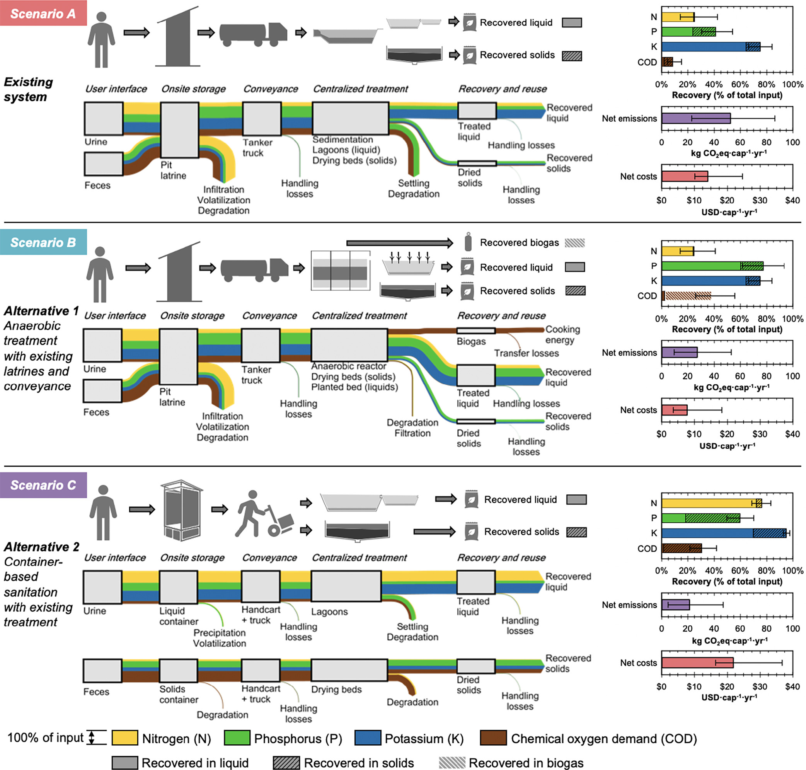

==================================================================
bwaise: Sanitation Alternatives in Bwaise, Uganda (In Development)
==================================================================

Scenario summary and flows
--------------------------

   Figure created by John Trimmer for [1]_.

Systems included in this modules are based on Scenarios A-C as described in
Trimmer et al. [1]_. Previous scripts developed for modeling and analyses of
the systems can be found in another `repository 
<https://github.com/QSD-Group/Bwaise-sanitation-alternatives>`_.

Loading Systems
---------------
Documents coming...
    
    
Simulating and Analyses
-----------------------
Documents coming...

Modifying Systems
-----------------
Documents coming...

References
----------
.. [1] Trimmer et al., Navigating Multidimensional Social–Ecological System
    Trade-Offs across Sanitation Alternatives in an Urban Informal Settlement.
    Environ. Sci. Technol. 2020, 54 (19), 12641–12653.
    `<https://doi.org/10.1021/acs.est.0c03296>`_

    

