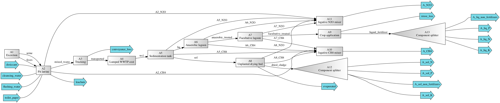
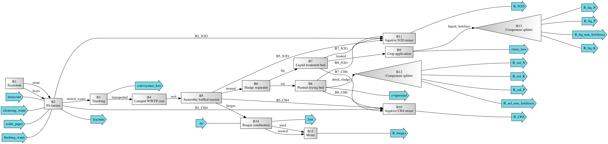
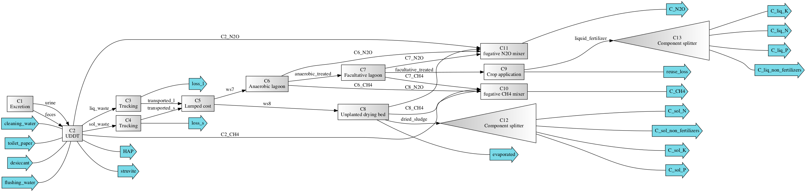

=================================================
bwaise: Sanitation Alternatives in Bwaise, Uganda
=================================================
Summary
-------
Systems included in this modules are based on Scenarios A-C as described in
Trimmer et al. [1]_ and named as "sysA", "sysB", and "sysC".
Previous scripts developed for modeling and analyses of
the systems can be found in another `repository 
<https://github.com/QSD-Group/Bwaise-sanitation-alternatives>`_.

    *Scenario A (sysA): pit latrine with existing treatment system*

    
    *Scenario B (sysB): pit latrine with anaerobic treatment*

    
    *Scenario C (sysC): containaer-based toilet with existing treatment system*

Loading systems
---------------
.. code-block:: python

    >>> # Import bwaise systems as modules
    >>> from qsdsan.systems import bwaise as bw
    >>> # You can repeat these for `sysB` and `sysC`
    >>> bw.sysA.show()
    System: sysA
    ins...
    [0] toilet_paper
        phase: 'l', T: 298.15 K, P: 101325 Pa
        flow (kmol/hr): Tissue  0.000282
    [1] flushing_water
        phase: 'l', T: 298.15 K, P: 101325 Pa
        flow (kmol/hr): H2O  0.0231
    [2] cleansing_water
        phase: 'l', T: 298.15 K, P: 101325 Pa
        flow: 0
    [3] desiccant
        phase: 'l', T: 298.15 K, P: 101325 Pa
        flow: 0
    outs...
    [0] A_CH4
        phase: 'g', T: 298.15 K, P: 101325 Pa
        flow (kmol/hr): CH4  4.37
    [1] A_N2O
        phase: 'g', T: 298.15 K, P: 101325 Pa
        flow (kmol/hr): N2O  0.000967
    [2] A_sol_N
        phase: 'l', T: 298.15 K, P: 101325 Pa
        flow (kmol/hr): NonNH3  0.13
    [3] A_sol_P
        phase: 'l', T: 298.15 K, P: 101325 Pa
        flow (kmol/hr): P  0.0984
    [4] A_sol_K
        phase: 'l', T: 298.15 K, P: 101325 Pa
        flow (kmol/hr): K  0.11
    [5] A_sol_non_fertilizers
        phase: 'l', T: 298.15 K, P: 101325 Pa
        flow (kmol/hr): Mg       0.0967
                        Ca       0.446
                        H2O      46.3
                        OtherSS  263
    [6] A_liq_N
        phase: 'l', T: 298.15 K, P: 101325 Pa
        flow (kmol/hr): NH3     1.21
                        NonNH3  1.82
    [7] A_liq_P
        phase: 'l', T: 298.15 K, P: 101325 Pa
        flow (kmol/hr): P  0.159
    [8] A_liq_K
        phase: 'l', T: 298.15 K, P: 101325 Pa
        flow (kmol/hr): K  0.723
    [9] A_liq_non_fertilizers
        phase: 'l', T: 298.15 K, P: 101325 Pa
        flow (kmol/hr): Mg       0.244
                        Ca       0.557
                        H2O      615
                        OtherSS  42.7
                        Tissue   126
    [10] leachate
        phase: 'l', T: 298.15 K, P: 101325 Pa
        flow (kmol/hr): NH3  0.995
                        P    0.113
                        K    0.23
                        H2O  2.56e+03
    [11] conveyance_loss
        phase: 'l', T: 298.15 K, P: 101325 Pa
        flow (kmol/hr): NH3      0.0275
                        NonNH3   0.0424
                        P        0.0103
                        K        0.0173
                        Mg       0.00705
                        Ca       0.0207
                        H2O      14.2
                        ...
    [12] evaporated
        phase: 'g', T: 298.15 K, P: 101325 Pa
        flow (kmol/hr): H2O  36.2
    [13] reuse_loss
        phase: 'l', T: 298.15 K, P: 101325 Pa
        flow (kmol/hr): NH3     0.0637
                        NonNH3  0.0371
                        P       0.00325
                        K       0.0147
                        Mg      0.00497
                        Ca      0.0114
    >>> # You can check out all of the components in these systems
    >>> bw.cmps.show()    
    CompiledComponents([NH3, NonNH3, P, K, Mg, Ca, H2O, OtherSS, N2O, CH4, O2, N2, CO2, P4O10, Tissue, WoodAsh, Struvite, HAP])
    >>> bw.cmps.NH3.show()
    Component: NH3 (phase_ref='g') at phase='l'
    Component-specific properties:
    [Others] measured_as: N
             description: None
             particle_size: Soluble
             degradability: Undegradable
             organic: False
             i_C: 0 g C/g N
             i_N: 1 g N/g N
             i_P: 0 g P/g N
             i_K: 0 g K/g N
             i_Mg: 0 g Mg/g N
             i_Ca: 0 g Ca/g N
             i_mass: 1.2159 g mass/g N
             i_charge: 0 mol +/g N
             i_COD: 0 g COD/g N
             i_NOD: 4.5691 g NOD/g N
             f_BOD5_COD: 0
             f_uBOD_COD: 0
             f_Vmass_Totmass: 0
    >>> # You can look at individual units
    >>> bw.A1.show()
    Excretion: A1
    ins...
    outs...
    [0] urine  to  PitLatrine-A2
        phase: 'l', T: 298.15 K, P: 101325 Pa
        flow (g/hr): NH3      0.213
                     NonNH3   0.0377
                     P        0.026
                     K        0.0694
                     Mg       0.00833
                     Ca       0.0117
                     H2O      55.4
                     OtherSS  2.55
    
        WasteStream-specific properties:
         pH         : 7.0
         Alkalinity : 2.5 mg/L
         COD        : 5146.0 mg/L
         TN         : 4273.6 mg/L
         TKN        : 4273.6 mg/L
         TP         : 442.4 mg/L
         TK         : 1180.3 mg/L
    
    [1] feces  to  PitLatrine-A2
        phase: 'l', T: 298.15 K, P: 101325 Pa
        flow (g/hr): NH3      0.00685
                     NonNH3   0.0274
                     P        0.0166
                     K        0.0244
                     Mg       0.0104
                     Ca       0.0792
                     H2O      8.85
                     OtherSS  1.4
    
        WasteStream-specific properties:
         pH         : 7.0
         Alkalinity : 2.5 mg/L
         COD        : 120065.3 mg/L
         TN         : 3189.4 mg/L
         TKN        : 3189.4 mg/L
         TP         : 1547.9 mg/L
         TK         : 2269.6 mg/L

Techno-economic analysis and life cycle assessment (TEA/LCA)
------------------------------------------------------------
TEA and LCA are performed through :class:`biosteam.TEA` and :class:`LCA` objects and named as "teaA", "lcaA", etc.
Results from the original paper [1]_ are saved in the "/results/original_results" folder for comparison.

.. code-block:: python

    >>> # Check the results for `sysA`
    >>> bw.teaA.show()
    SimpleTEA: sysA
    NPV  : -22,649,167 USD at 5.0% discount rate
    EAC  : 3,827,113 USD/yr
    CAPEX: 12,815,667 USD (annualized to 1,982,863 USD/yr)
    AOC  : 1,844,250 USD/yr
    >>> # There are also handy functions to allow you quickly see important results
    >>> bw.print_summaries(bw.sysA)
    
    ---------- Summary for sysA ----------
    
    SimpleTEA: sysA
    NPV  : -22,649,167 USD at 5.0% discount rate
    EAC  : 3,827,113 USD/yr
    CAPEX: 12,815,667 USD (annualized to 1,982,863 USD/yr)
    AOC  : 1,844,250 USD/yr
    
    
    LCA: sysA (lifetime 8 yr)
    Impacts:
                               Construction  Transportation  WasteStream   Others    Total
    GlobalWarming (kg CO2-eq)      3.13e+07        9.57e+05     1.14e+08 6.85e+04 1.46e+08
    
    Net cost: 8.4 USD/cap/yr.
    Capital: 4.3 USD/cap/yr.
    Operating: 4.0 USD/cap/yr.
    
    Net emission: 40.1 kg CO2-eq/cap/yr.
    Construction: 8.6 kg CO2-eq/cap/yr.
    Transportation: 0.3 kg CO2-eq/cap/yr.
    Direct emission: 37.9 kg CO2-eq/cap/yr.
    Offset: -6.6 kg CO2-eq/cap/yr.
    Other: 0.02 kg CO2-eq/cap/yr.
    
    Total COD recovery is 16.9%, 2.4% in liquid, 14.6% in solid, 0.0% in gas.
    Total N recovery is 36.8%, 35.4% in liquid, 1.4% in solid, 0.0% in gas.
    Total P recovery is 41.0%, 25.4% in liquid, 15.7% in solid, 0.0% in gas.
    Total K recovery is 76.1%, 66.0% in liquid, 10.1% in solid, 0.0% in gas.
    >>> # You can save reports in the "/results" folder with default names
    >>> # Note that system information (e.g., flows, designs) and TEA results
    >>> # will be saved together, but LCA result will be saved in an individual Excel file
    >>> bw.save_all_reports()
    >>> # Alternatively, you can save individual reports at other places
    >>> bw.sysA.save_report('sysA.xlsx')

Uncertainty and sensitivity analyses
------------------------------------
These analyses are performed through :class:`biosteam.Model` objects, three models
(``modelA``, ``modelB``, ``modelC`` for ``sysA``, ``sysB``, and ``sysC``, respectively)
have been added with all the uncertainty parameters and ranges according to
Trimmer et al. [1]_.

You can make changes (e.g., add or remove parameters, change uncertainty ranges)
to these models or construct your own ones.

.. code-block:: python

    >>> # Run the default model for `sysA`
    >>> models = bw.models
    >>> # Try use larger samples, here is just to get a quick demo result
    >>> models.run_uncertainty(models.modelA, N=10)
    >>> # Your results will be cached in `result_dct['sysA']`
    >>> # You can organize the results as you like,
    >>> # but you can also save them using the default organized data
    >>> models.save_uncertainty_results(models.modelA)

``QSDsan`` also have built-in functions for advanced global sensitivity analyses
and plotting functions, refer to the `stats <https://qsdsan.readthedocs.io/en/latest/stats.html>`_ module for examples.
    

Coming soon
-----------
- Comparison figure for results between ``QSDsan`` and [1]_.

References
----------
.. [1] Trimmer et al., Navigating Multidimensional Social–Ecological System
    Trade-Offs across Sanitation Alternatives in an Urban Informal Settlement.
    Environ. Sci. Technol. 2020, 54 (19), 12641–12653.
    `<https://doi.org/10.1021/acs.est.0c03296>`_

    

