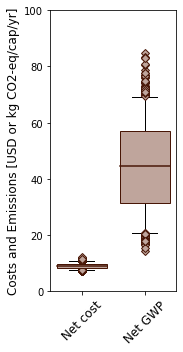

=================================================
bwaise: Sanitation Alternatives in Bwaise, Uganda
=================================================
Summary
-------
Systems included in this modules are based on Scenarios A-C as described in
Trimmer et al. [1]_ and named as "sysA", "sysB", and "sysC".
Previous scripts developed for modeling and analyses of
the systems can be found in another `repository 
<https://github.com/QSD-Group/Bwaise-sanitation-alternatives>`_.

.. figure:: ./figures/sysA.png

    *Scenario A (sysA): pit latrine with existing treatment system*

.. figure:: ./figures/sysB.png
    
    *Scenario B (sysB): pit latrine with anaerobic treatment*

.. figure:: ./figures/sysC.png
    
    *Scenario C (sysC): containaer-based toilet with existing treatment system*

Loading systems
---------------
.. code-block:: python

    >>> # Import bwaise systems as modules
    >>> from qsdsan.systems import bwaise as bw
    >>> # You can repeat these for ``sysB`` and ``sysC``
    >>> bw.sysA.show()
    System: sysA
     path: (A1, A2, A3, treatA, A9, A10, A11,
            A12, A13)
    >>> # You can check out all of the components in these systems
    >>> bw.cmps.show()    
    CompiledComponents([NH3, NonNH3, P, K, Mg, Ca, H2O, OtherSS, N2O, CH4, O2, N2, CO2, P4O10, Tissue, WoodAsh, Struvite, HAP])
    >>> bw.cmps.NH3.show()
    Component: NH3 (phase_ref='g') at phase='l'
    Component-specific properties:
    [Others] i_C: 0 g C/g N
             i_N: 1 g N/g N
             i_P: 0 g P/g N
             i_K: 0 g K/g N
             i_Mg: 0 g Mg/g N
             i_Ca: 0 g Ca/g N
             i_mass: 1.2159 g mass/g N
             i_charge: 0 mol +/g N
             f_BOD5_COD: 0
             f_uBOD_COD: 0
             f_Vmass_Totmass: 0
             particle_size: Soluble
             degradability: Undegradable
             organic: False
             measured_as: N
             description: None
    >>> # You can look at individual units
    Excretion: A1
    ins...
    outs...
    [0] urine  to  PitLatrine-A2
        phase: 'l', T: 298.15 K, P: 101325 Pa
        flow (g/hr): NH3      0.213
                     NonNH3   0.0377
                     P        0.026
                     K        0.0694
                     Mg       0.00833
                     Ca       0.0117
                     H2O      55.4
                     OtherSS  2.55
    
        WasteStream-specific properties:
         pH         : 7.0
         Alkalinity : 2.5 mg/L
         COD        : 5156.7 mg/L
         TN         : 4282.5 mg/L
         TKN        : 4282.5 mg/L
         TP         : 443.3 mg/L
         TK         : 1182.8 mg/L
    
    [1] feces  to  PitLatrine-A2
        phase: 'l', T: 298.15 K, P: 101325 Pa
        flow (g/hr): NH3      0.00685
                     NonNH3   0.0274
                     P        0.0166
                     K        0.0244
                     Mg       0.0104
                     Ca       0.0792
                     H2O      8.85
                     OtherSS  1.4
    
        WasteStream-specific properties:
         pH         : 7.0
         Alkalinity : 2.5 mg/L
         COD        : 120814.2 mg/L
         TN         : 3209.3 mg/L
         TKN        : 3209.3 mg/L
         TP         : 1557.5 mg/L
         TK         : 2283.8 mg/L

Techno-economic analysis and life cycle assessment (TEA/LCA)
------------------------------------------------------------
TEA and LCA are performed through ``biosteam.TEA`` and ``qsdsan.LCA`` objects and named as "teaA", "lcaA", etc.
Results from the original paper [1]_ are saved in the "/results/original_results" folder for comparison.

.. code-block:: python

    >>> # Check the results for ``sysA``
    >>> bw.teaA.show()
    SimpleTEA: sysA
    NPV  : -22,846,600 USD at 5.0% discount rate
    EAC  : 3,824,572 USD/yr
    CAPEX: 12,815,218 USD (annualized to 1,982,794 USD/yr)
    AOC  : 1,841,778 USD/yr
    >>> # There are also handy functions to allow you quickly see important results
    >>> bw.print_summaries(bw.sysA)
    
    ---------- Summary for sysA ----------
    
    SimpleTEA: sysA
    NPV  : -22,846,600 USD at 5.0% discount rate
    EAC  : 3,824,572 USD/yr
    CAPEX: 12,815,218 USD (annualized to 1,982,794 USD/yr)
    AOC  : 1,841,778 USD/yr
    
    
    LCA: sysA (lifetime 8 yr)
    Impacts:
                               Construction  Transportation  WasteStream   Others    Total
    GlobalWarming (kg CO2-eq)      3.13e+07        9.57e+05     1.23e+08 6.85e+04 1.55e+08
    
    Net cost: 8.4 USD/cap/yr.
    Capital: 4.3 USD/cap/yr.
    Operating: 4.0 USD/cap/yr.
    
    Net emission: 42.5 kg CO2-eq/cap/yr.
    Construction: 8.6 kg CO2-eq/cap/yr.
    Transportation: 0.3 kg CO2-eq/cap/yr.
    Direct emission: 39.2 kg CO2-eq/cap/yr.
    Offset: -5.6 kg CO2-eq/cap/yr.
    Other: 0.02 kg CO2-eq/cap/yr.
    
    Total COD recovery is 16.9%, 2.4% in liquid, 14.6% in solid, 0.0% in gas.
    Total N recovery is 29.1%, 27.7% in liquid, 1.4% in solid, 0.0% in gas.
    Total P recovery is 41.0%, 25.4% in liquid, 15.7% in solid, 0.0% in gas.
    Total K recovery is 76.1%, 66.0% in liquid, 10.1% in solid, 0.0% in gas.
    >>> # You can save reports in the "/results" folder with default names
    >>> # Note that system information (e.g., flows, designs) and TEA results
    >>> # will be saved together, but LCA result will be saved in an individual Excel file
    >>> bw.save_all_reports()
    >>> # Alternatively, you can save individual reports at other places
    >>> bw.sysA.save_report('sysA.xlsx')

Uncertainty and sensitivity analyses
------------------------------------
These analyses are performed through ``biosteam.Model`` objects, a demonstrative
model (``modelA``) for ``sysA`` has been added, you can make changes (e.g.,
add or remove parameters, change uncertainty ranges) or construct similar models
for other systems accordingly.

.. code-block:: python

    >>> # Run the default model for ``sysA``
    >>> models = bw.models
    >>> # Try use larger samples, here is just to get a quick demo result
    >>> models.run_uncertainty(models.modelA, N_sample=10)
    >>> # Your results will be cached in ``result_dct['sysA']``
    >>> # You can organize the results as you like,
    >>> # but you can also save them using the default organized data
    >>> models.save_uncertainty_results(models.modelA)
    >>> # You can also ge quick box plots of uncertainty results
    >>> models.plot_cost_emission(models.modelA)
    >>> # You can change "COD" to any of "N", "P", or "K"
    >>> models.plot_recovery(models.modelA, 'COD')

    
    *Uncertainty plots from the demonstrative ``modelA``*

Coming soon
-----------
A figure will be added to compare the results (baseline and uncertainty/sensitivity)
from ``QSDsan`` with those in [1]_ for all three scenarios.

References
----------
.. [1] Trimmer et al., Navigating Multidimensional Social–Ecological System
    Trade-Offs across Sanitation Alternatives in an Urban Informal Settlement.
    Environ. Sci. Technol. 2020, 54 (19), 12641–12653.
    `<https://doi.org/10.1021/acs.est.0c03296>`_

    

